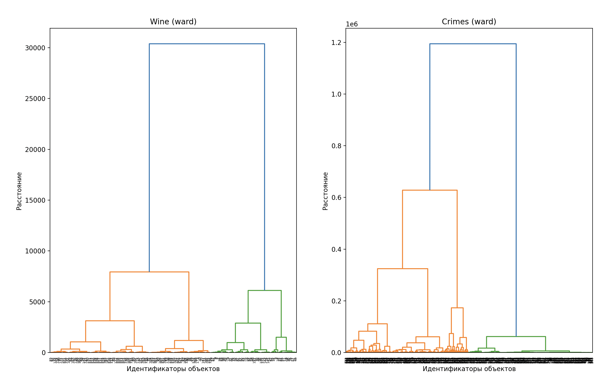
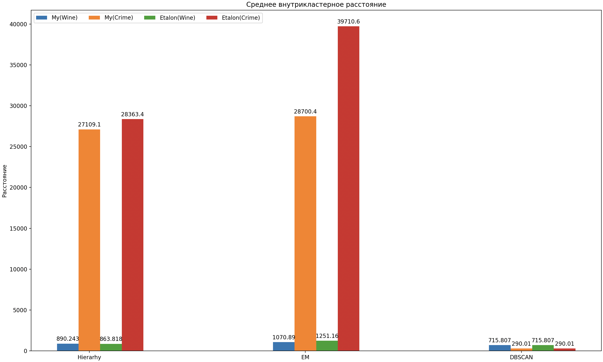

## Lab 1

В папке [source/datasets](./source/datasets/) лежат файлы датасетов в формате csv.

### Задание 1
#### [Датасет 1](https://www.kaggle.com/datasets/harrywang/wine-dataset-for-clustering)
* Тип: С перемычками
* Кол-во кластеров: 3

Скрипт чтения и визуализации: [read_wine.py](./source/read_wine.py)

#### [Датасет 2](https://www.kaggle.com/datasets/balajivaraprasad/crimes-against-women-in-india-2001-2021)
* Тип: Ленточные 
* Кол-во кластеров: 5

Скрипт чтения и визуализации: [read_crime.py](./source/read_crimes.py)

### Задание 2
Скрипт [hierarhy.py](./source/hierarhy.py) реализует иерархический алгоритм.

Функция hierarhy_alg принимает аргументами `data` - DataFrame с данными, `count_clusters` - ожидаемое количество кластеров, `method` - метод определение расстояния от кластера к кластеру, соответствует следующим методам:
* Расстояние ближайшего соседа - `min`
* Расстояние дальнего соседа - `max`
* Групповое среднее расстояние - `mean`
* Расстояние между центрами - `center`
* Расстояние Уорда - `ward`

также можно передать флаг `dendr`, для построения дендрограммы (выдает вместо кластеров, историю флагов)

Данная функция возвращает `clusters` - список кластеров, один кластер - список точек из `data`.

Программа выводит результаты кластеризации для двух датасетов. Слева - для первого датасета (wine), справа - для второго датасета (Crimes). Также в subplots выведены результаты кластеризации с различными расстояниями (см. `method`).

#### 2.1 Построить дендрограмму для каждого датасета
Скрипт [dendr.py](./source/dendr.py) строит дендрограмму каждого датасета и выводит их в subplot

#### 2.2 Определить оптимальное число кластеров для каждого датасета
Wine: 2

Crimes: 2

### Задание 3
#### EM-алгоритм
Скрипт [em.py](./source/em.py) реализует EM-алгоритм.

Функция `em` принимает аргументами `data` - DataFrame с данными, `count_clusters` - ожидаемое количество кластеров, `max_iter` - максимальное количество итераций алгоритма (по умолчанию 100), возвращает `clusters` - список кластеров, один кластер - список точек из `data`.

Программа выводит результаты кластеризации для двух датасетов. Слева - для первого датасета (wine), справа - для второго датасета (Crimes).

#### DBSCAN
Скрипт [dbscan.py](./source/dbscan.py) реализует алгоритм DBSCAN.

Функция `dbscan` принимает аргументами `data` - DataFrame с данными, `eps` - радиус в котором нужно находить соседние точки, `m` - кол-во точек для того чтобы точка считалась корневой, возвращает `clusters` - список кластеров, один кластер - список точек из `data`.

Программа выводит результаты кластеризации для двух датасетов. Слева - для первого датасета (wine), справа - для второго датасета (Crimes). В верхних графиках показана визуализация всех точек (в том числе шумовых), снизу показаны только точки, относящиеся к какому-либо кластеру.

### Задание 4
Метрики считаются с помощью скрипта [metrics.py](./source/metrics.py)

Результаты измерения следующие:

### Задание 5
Метрики считаются с помощью скрипта [metrics.py](./source/metrics.py)

Результаты измерения следующие:

### Задание 6
Метрики визуализируются с помощью скрипта [metrics.py](./source/metrics.py). Сравнение происходило на одних и тех же входных параметрах.

#### Сравнение времени

Как видно, иерархический алгоритм, разработанный мною, сильно медленне чем эталонный. Однако, EM работает быстрее, чем эталонные. DBSCAN медленнее, чем эталонный.

ПРИМЕЧАНИЕ: время для эталонных алгоритмов замерялось с учетом преобразования лэйблов в кластеры (как выдают мои реализации)

#### Сравнение среднего внутрикластерного расстояния

Иерархический датасет wine: расстояние больше чем у эталонного, на crime расстоние меньше чем эталонное.

Em выдал расстояние меньше, чем эталон

DBSCAN идентичен эталону.

Em датасет 
#### Сравнение среднего межкластерного расстояния

Иерархический на обоих датасетах выдает расстояние меньше, чем на эталонном. 

Em на wine больше, на crime меньше.

DBSCAN идентичен эталонному.