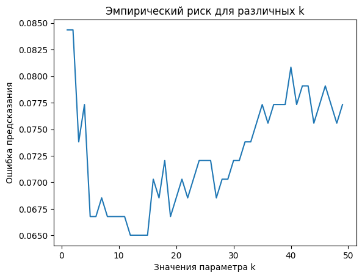

# Лабораторная работа 2

В данной лабораторной работе были разработаны и реализованы следующие компоненты:

1. **KNN с окном Парзена переменной ширины (ядро — Гаусс)**  
   Реализован в файле `knn.py`.

2. **Метод скользящего контроля для расчета эмпирического риска *— Leave-One-Out (LOO)*, для различных значений параметра k**  
   Оптимальное значение параметра k = 12.

## Используемые Датасеты

Для тестирования и оценки работы алгоритмов был использован следующий датасет:

- **Kaggle - KNN Algorithm Dataset**  
  [Ссылка на датасет](https://www.kaggle.com/datasets/gkalpolukcu/knn-algorithm-dataset)

### Метрики

| Параметр              | Собственная реализация          | Эталонная реализация           |
|-----------------------|---------------------------------|--------------------------------|
| **Время исполнения, с** | 0.049                         | 0.096                          |
| **Accuracy**          | 0.982                           | 0.974                          |
| **Precision (0)**     | 0.97                            | 0.96                           |
| **Recall (0)**        | 1.00                            | 1.00                           |
| **F1-score (0)**      | 0.99                            | 0.98                           |
| **Precision (1)**     | 1.00                            | 1.00                           |
| **Recall (1)**        | 0.95                            | 0.93                           |
| **F1-score (1)**      | 0.98                            | 0.96                           |

## Результаты

В результате сравнения с эталонной реализацией, метрики качества показали схожие значения, хотя собственная реализация показала более высокие матрики качества, а также лучше по производительности.