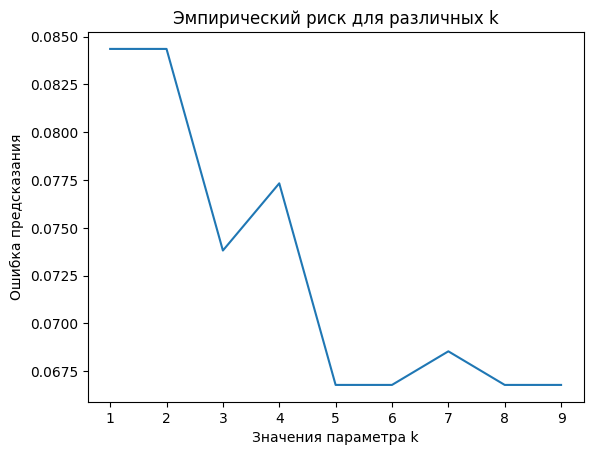

# Лабораторная работа 2

В данной лабораторной работе были разработаны и реализованы следующие компоненты:

1. **KNN с окном Парзена переменной ширины (ядро — Гаусс)**  
   Реализован в файле `knn.py`.

2. **Метод скользящего контроля — Leave-One-Out (LOO)**  
   Реализован в файле `knn.py`.  

3. **Эмпирический риск для различных значений параметра k**

## Используемые Датасеты

Для тестирования и оценки работы алгоритмов был использован следующий датасет:

- **Kaggle - KNN Algorithm Dataset**  
  [Ссылка на датасет](https://www.kaggle.com/datasets/gkalpolukcu/knn-algorithm-dataset)

### Метрики

|                        | Время исполнения, с | Accuracy | Precision | Recall | F1-score | Precision | Recall | F1-score|
|------------------------|---------------------|----------|---------------|------------|--------------|---------------|------------|--------------|
| **Эталонная реализация**   | 12.189            | 0.9561   | 0.93          | 1.00       | 0.97         | 1.00          | 0.88       | 0.94         |
| **Собственная реализация** | 0.004             | 0.9561   | 0.93          | 1.00       | 0.97         | 1.00          | 0.88       | 0.94         |

## Результаты

В результате сравнения с эталонной реализацией, метрики качества показали идентичные значения. Это подтверждает корректность разработки реализованных методов.
