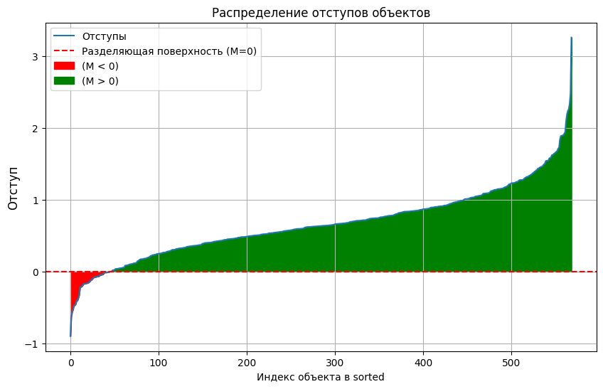

# Лабораторная 4 ** Линейная классификация **

1. **Линейная классификация**  
    Реализован в файле `Log_class.py`.

2. **Визуализация отступов** 

## Используемые Датасеты

Для тестирования и оценки работы алгоритмов был использован следующий датасет:

 - **Kaggle - Breast Cancer Wisconsin**  
   [Ссылка на датасет](https://www.kaggle.com/datasets/uciml/breast-cancer-wisconsin-data)

   

## Метрики
Ниже представлена таблица, оставляющая только полное время выполнения (total) и точность:

| Метод                                         | Total CPU time (s) | Точность (Accuracy)   |
|------------------------------------------------|--------------------|-----------------------|
| Long_cl class (weights_type="random")          | 1.07 s             | 0.9090909090909091    |
| Long_cl class (weights_type="corr")            | 1.16 s             | 0.9370629370629371    |
| Long_cl class (weights_type="multi")           | 1.49 s             | 0.9230769230769231    |
| SGDClassifier(...)                             | 1.48 s             | 0.9371                |