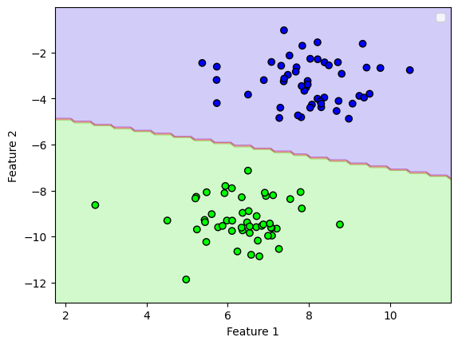
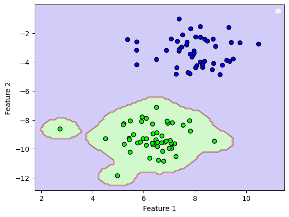

# Лабораторная 5 **SVM**

1. **Линейная классификация**  
    Реализован в файле `SVM.py`.

## Используемые Датасеты

Для тестирования и оценки работы алгоритмов был использован следующий датасет:

 - **Kaggle - Breast Cancer Wisconsin**  
   [Ссылка на датасет](https://www.kaggle.com/datasets/uciml/breast-cancer-wisconsin-data)

   

## Метрики

| Implementation                      | Kernel Type  | Parameters                      | Accuracy       | CPU Time (User + Sys) | Wall Time    |
|-------------------------------------|--------------|----------------------------------|----------------|-----------------------|--------------|
| **Собественный SVC**          | RBF          | C=2, gamma=1e-5                 | 0.916083916083916 | 7.57 s               | 5.05 s       |
| **sklearn SVC**                    | RBF          | kernel='rbf', C=1, gamma=1e-5   | 0.951048951048951 | 604 ms               | 60.6 ms      |
| **Собественный SVC**          | Linear       | C=1                             | 0.9440559440559441 | 52.3 s               | 50.6 s       |
| **sklearn SVC**                    | Linear       | kernel='linear', C=1            | 0.958041958041958 | 3.45 s               | 805 ms       |
| **Собественный SVC**          | Polynomial   | C=100, d=2                      | 0.9090909090909091 | 23.9 s               | 21.8 s       |
| **sklearn SVC**                    | Polynomial   | kernel='poly', C=100, degree=2  | 0.965034965034965 | 4.02 ms              | 3.2 ms       |

---

## Визуализация 

