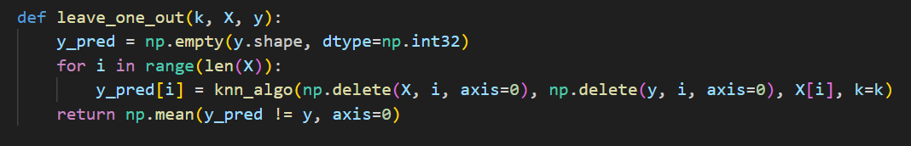
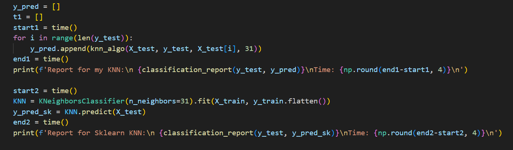
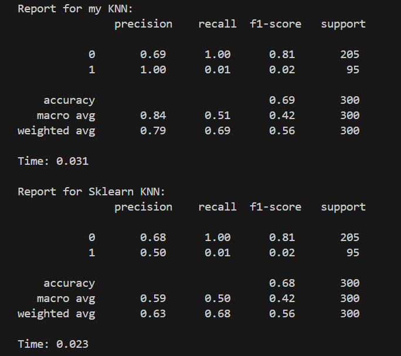
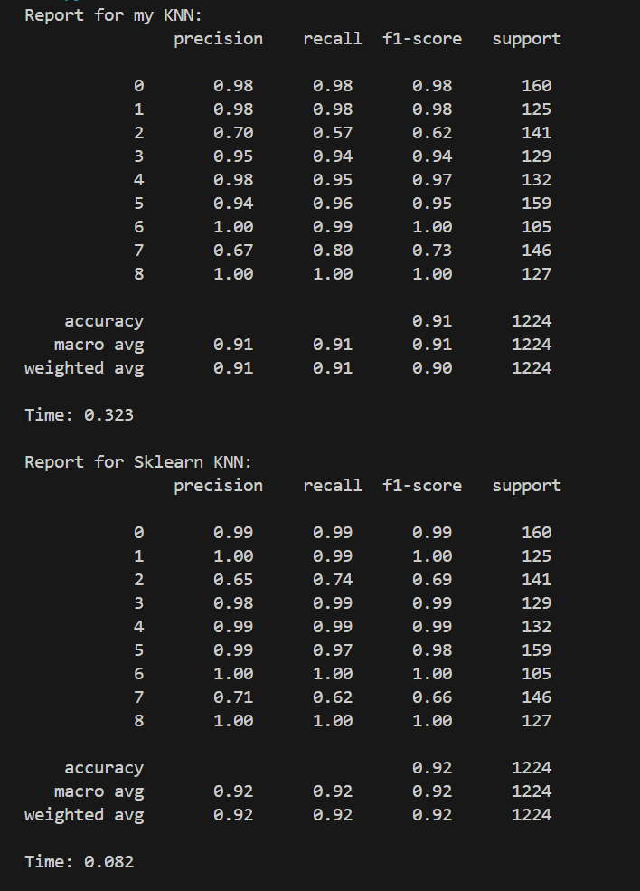

## Лабораторная работа 2

### Датасет

Датасет для классификации станков по уязвимости к поломке по температуре, вибрации, потреблению энергии, влажности и типу станка: https://www.kaggle.com/datasets/mujtabamatin/dataset-for-machine-failure-detection

### KNN

В [knn.py](./source/knn.py) реализован алгоритм K-ближайших соседей с окном Парзена переменной ширины (с ядром Гаусса).

### Подбор параметров

Параметр k подбирается скользящим контролем, реализованным в функции loo в файле knn.py. По визуализации частоты ошибок при различных значениях k видно, что лучшее значение параметра ~ 31.
График: 

### Сравнение с эталонной реализацией

Кастомный алгоритм оказался чуть точнее и незначительно медленнее. Тем не менее, на данном датасете оба алгоритма отработали посредственно ввиду несбалансированности классов (700:300).

При сокращении элементов преобладающего класса и достижении классовой сбалансированности (300:300) датасет становится совсем небольшим и результат реализации sklearn ощутимо ухудшается. Тем не менее, и кастомная реализация не выдает выше 0.63

При тестировании же алгоритмов на датасете для классификации рыб реализация sklearn оказалась чуть точнее и значительно быстрее, что подчеркивает ее лучшую оптимизированность к большим наборам данных. Кастомный алгоритм и реализация sklearn показали 0.91 и 0.92 accuracy соответственно.

