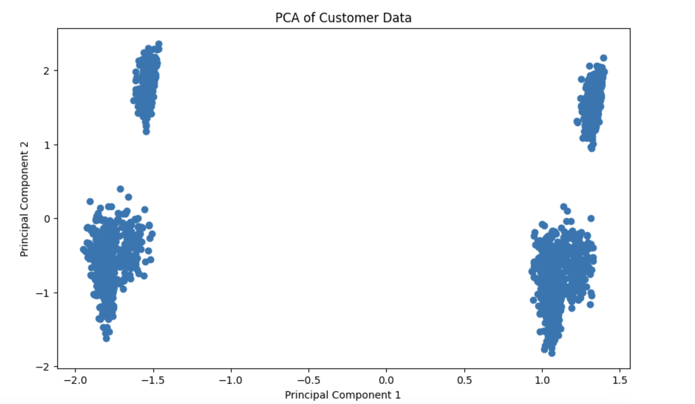
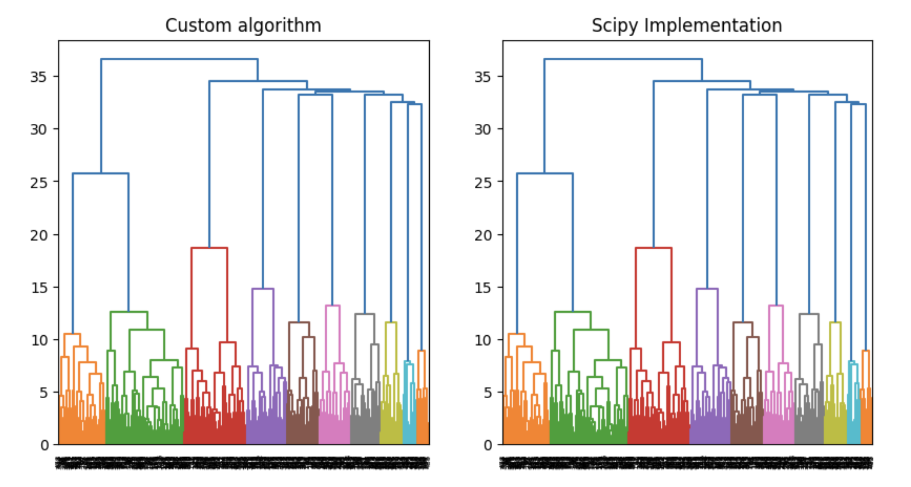
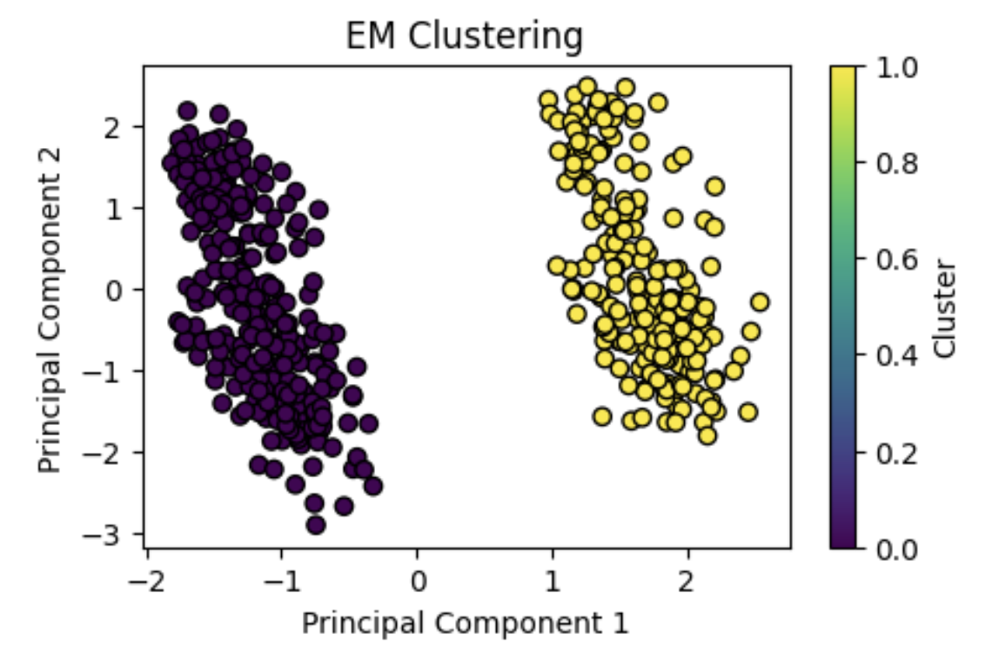
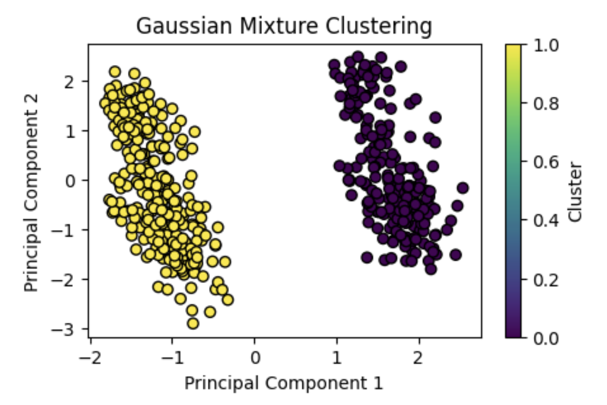
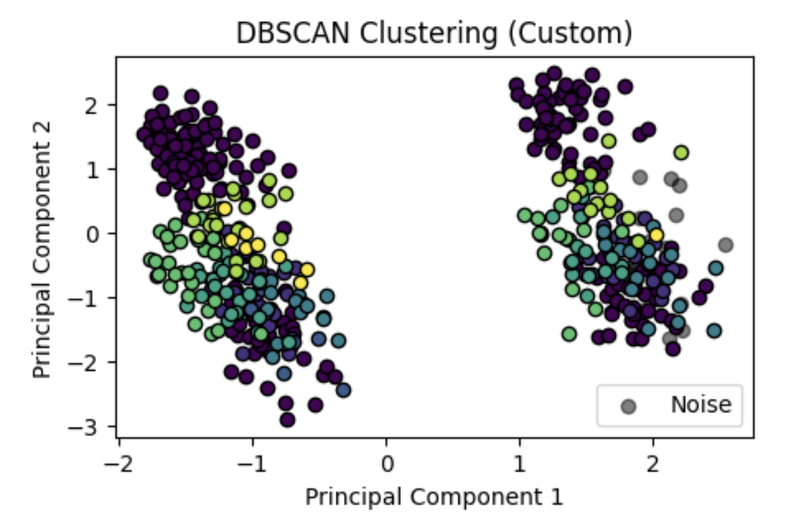
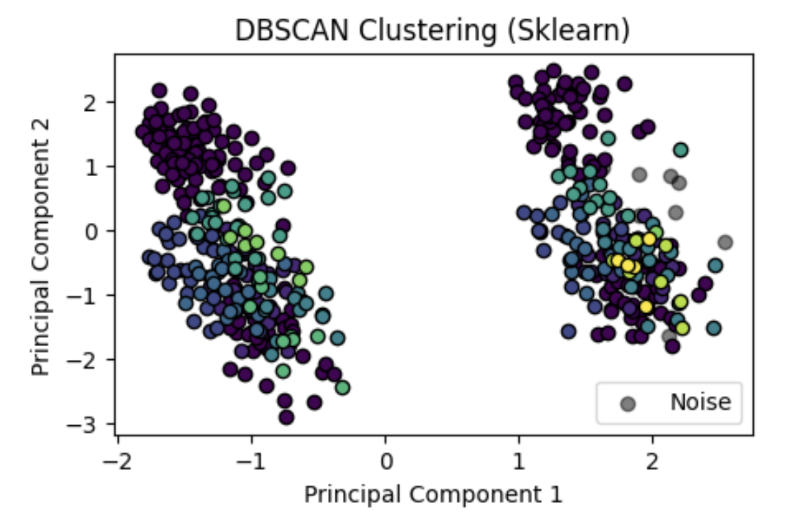

# Лабораторная работа 1

## Обзор набора данных

Набор данных содержит информацию о клиентах, включая их пол, возраст, годовой доход, баллы, профессию, опыт работы и размер семьи.

Всего **500** объектов.

| CustomerID | Gender | Age | Annual Income ($) | Spending Score (1-100) | Profession | Work Experience | Family Size |
|------------|--------|-----|------------------|----------------------|------------|-----------------|-------------|
| 1 | Male | 19 | 15000 | 39 | Healthcare | 1 | 4 |
| 2 | Male | 21 | 35000 | 81 | Engineer | 3 | 3 |
| 3 | Female | 20 | 86000 | 6 | Engineer | 1 | 1 |
| 4 | Female | 23 | 59000 | 77 | Lawyer | 0 | 2 |
| 5 | Female | 31 | 38000 | 40 | Entertainment | 2 | 6 |

## Делаем PCA



Можно выдвинуть гипотезу, что данные можно разделить на 4 кластера.

## Иерархическая кластеризация

Иерархическая кластеризация - это метод кластерного анализа, который строит иерархию кластеров "снизу вверх". Изначально каждый объект представляет собой отдельный кластер. Затем алгоритм последовательно объединяет самые близкие кластеры, пока все объекты не окажутся в одном кластере.

На каждом шаге:
1. Находятся два ближайших кластера
2. Эти кластеры объединяются в один новый кластер
3. Пересчитываются расстояния от нового кластера до всех остальных

Результат работы алгоритма можно представить в виде дендрограммы - древовидной диаграммы, которая показывает последовательность объединения кластеров и расстояния между ними.

### Реализация через numpy

```python
def hierarchy(distances) -> tuple[dict, dict]:
    """
    Perform hierarchical clustering on a distance matrix.

    Args:
        distances (np.ndarray): A square matrix of pairwise distances between objects.

    Returns:
        tuple: A tuple containing:
            - pairwise_distances (dict): Distances between merged clusters.
            - clusters_power (dict): The size (power) of each cluster.
    """
    num_objects = len(distances)

    # All clusters have only one object initially
    powers = list(np.ones(num_objects, dtype=np.int64))

    # Initialize cluster IDs
    cluster_ids = list(range(num_objects))

    # Store distances between merged clusters
    pairwise_distances = {}

    # Store cluster sizes
    clusters_power = {id: p for id, p in zip(cluster_ids, powers)}

    while num_objects > 2:
        # Set diagonal to infinity to prevent self-clustering
        np.fill_diagonal(distances, np.inf)

        # Find the closest pair of clusters
        idx_ = np.argmin(distances)
        idx_i, idx_j = np.unravel_index(idx_, distances.shape)

        if idx_i == idx_j:
            raise ValueError("idx_i == idx_j == {}".format(idx_i))

        # Get cluster powers
        i_p = powers[idx_i]
        j_p = powers[idx_j]

        # R(u, v): distance between clusters to be merged
        d = distances[idx_i, idx_j]
        pairwise_distances[(cluster_ids[idx_i], cluster_ids[idx_j])] = d

        # Remove merged clusters
        # Remember max_cluster_id to assign new cluster id in the end of the iteration
        max_cluster_id = max(cluster_ids)
        for idx in sorted([idx_i, idx_j], reverse=True):
            del powers[idx]
            del cluster_ids[idx]

        # Calculate coefficients for updating distances
        total_power = np.array(powers) + i_p + j_p  # (num_objects - 2)
        alpha_u = (np.array(powers) + i_p) / total_power  # (num_objects - 2)
        alpha_v = (np.array(powers) + j_p) / total_power  # (num_objects - 2)
        beta = -np.array(powers) / total_power  # (num_objects - 2)

        # Remove rows of merged clusters
        distances = np.delete(distances, [idx_i, idx_j], axis=0)

        # Calculate new distances using Ward's method formula:
        # d^2(u,v),k = α_u * d^2(i,k) + α_v * d^2(j,k) + β * d^2(i,j)
        # where:
        # - α_u, α_v are coefficients based on cluster sizes
        # - β is coefficient for original distance between merged clusters
        # - Square root is taken to get actual distance

        # new_cluster_distances is a vector of new distances to the newly created cluster
        new_cluster_distances = np.sqrt(
            alpha_u * np.square(distances[:, idx_i])
            + alpha_v * np.square(distances[:, idx_j])
            + beta * (d**2)
        )

        # Remove columns of merged clusters
        distances = np.delete(distances, [idx_i, idx_j], axis=1)

        # Create new distance matrix
        distances = np.pad(
            distances, ((0, 1), (0, 1)), mode="constant", constant_values=np.inf
        )
        distances[-1, :-1] = new_cluster_distances
        distances[:-1, -1] = new_cluster_distances

        # Update cluster information
        powers.append(i_p + j_p)
        cluster_ids.append(max_cluster_id + 1)
        clusters_power[max_cluster_id + 1] = i_p + j_p
        num_objects -= 1

    # Handle the last merge
    distances = np.min(distances).reshape((1, 1))
    pairwise_distances[(cluster_ids[0], cluster_ids[1])] = distances[0, 0]
    return pairwise_distances, clusters_power
```

| Реализация    | Время (мс) |
|------------------|-----------|
| Моя реализация   | 158.00    |
| Библиотечная реализация  | 2.41      |



Оптимальное число кластеров определяется по максимуму $|R_{t+1} - R_t|$, тогда результирующее множество кластеров: $C_t$.

Применяется расстояние Уорда, оно является редуктивным и растягивающим.
1. Редуктивность означает, что расстояние между новым кластером и любым существующим кластером не меньше минимального расстояния между объединяемыми кластерами и существующими кластерами.

2. Растягивающее свойство гарантирует, что расстояние между новым кластером и любым другим кластером не превышает максимального расстояния между исходными кластерами и этим кластером.
Эти свойства обеспечивают хорошую сбалансированность кластеров и предотвращают как слишком тесное, так и слишком разреженное их расположение.

В моем случае – 11 кластеров.

## EM-алгоритм

EM-алгоритм - это итеративный алгоритм, который используется для кластеризации данных. Он основан на максимизации ожидания (expectation) и максимизации (maximization) (E-M).

На шаге expectation:
1. Инициализируются параметры модели (центры кластеров, ковариационные матрицы и веса кластеров)
2. Для каждого объекта вычисляется вероятность принадлежности к каждому кластеру

На шаге maximization:
1. Обновляются параметры модели (центры кластеров, ковариационные матрицы и веса кластеров) для максимизации вероятности принадлежности объектов к кластерам

### Реализация через numpy

```python
def em_clustering(
    objects: np.ndarray,
    num_features: int,
    num_clusters: int,
    max_step: int = 30,
) -> np.ndarray:
    """
    EM clustering algorithm.

    Returns:
        np.ndarray: shape (N, )
    """
    num_objects = len(objects)

    # Initialize cluster centers randomly
    centers = np.array([random.choice(objects) for _ in range(num_clusters)])
    sigmas = np.empty((num_clusters, num_features))

    # Initialize covariance matrices
    for k in range(num_clusters):
        diff = objects - centers[k]
        sigmas[k] = np.diag(np.dot(diff.T, diff)) / num_objects  # sigma**2

    # Initialize cluster weights uniformly
    weights = 1 / num_clusters * np.ones((num_clusters, 1))

    y_prev = None
    for _ in range(max_step):
        # Calculate probabilities for each object belonging to each cluster
        probs = []
        for i in range(num_clusters):
            # (x-μ)ᵀΣ⁻¹(x-μ)
            ro_sq = np.sum((objects[:, :] - centers[i]) ** 2 / sigmas[i], axis=1)
            probs += [
                # (2π)^(-d/2)
                np.power((2 * np.pi), -num_features / 2)
                # Σ⁻¹
                / np.prod(np.sqrt(sigmas[i]))
                # exp(-ro_sq / 2)
                * np.exp(-ro_sq / 2)
            ]
        probs = np.array(probs, dtype=np.float32).T  # (N, K)

        # Expectation step: Calculate responsibilities
        # gᵢⱼ = wⱼ * p(xᵢ | μⱼ, Σⱼ)
        g = weights.T * probs  # (K, N)
        # gᵢⱼ /= Σ_j gᵢⱼ
        g /= g.sum(axis=1)[:, np.newaxis]  # (K, N)

        # Maximization step: Update parameters
        # wⱼ = 1/N * Σ_i gᵢⱼ
        weights = 1 / num_objects * np.sum(g, axis=0)  # (K, )

        # μⱼ = Σ_i gᵢⱼ * xᵢ / Σ_i gᵢⱼ
        centers = (
            g.T @ objects / weights[:, np.newaxis] / num_objects
        )  # (K, N_features)

        # Σⱼ = Σ_i gᵢⱼ * (xᵢ - μⱼ)ᵀ(xᵢ - μⱼ) / Σ_i gᵢⱼ
        sigmas = np.empty((num_clusters, num_features))
        for k in range(num_clusters):
            sigmas[k] = g[:, k] @ (objects - centers[k]) ** 2
        sigmas /= weights[:, np.newaxis]
        sigmas /= num_objects

        # Assign objects to clusters
        # Assigns each data point to the cluster for which it has the highest responsibility (probability)
        y = np.argmax(g, axis=1)  # (N, )

        # Check for convergence
        if y_prev is not None and np.array_equal(y, y_prev):
            return y

        y_prev = y
    return y
```

| Реализация    | Время (мс) |
|------------------|-----------|
| Моя реализация   | 2    |
| Библиотечная реализация  | 3      |

<div style="display: flex; justify-content: space-between;">
    
    
</div>

## DBSCAN

### Реализация через numpy

```python
NOISE_ROLE = -1
CORE_POINT_ROLE = 1
BORDER_POINT_ROLE = 0


def dbscan_clustering(
    objects: np.ndarray,
    epsilon: float,
    min_samples: int,
    max_iter: int = 500,
) -> tuple[np.ndarray, np.ndarray]:
    """
    Perform DBSCAN clustering on the input objects.

    Args:
        objects (np.ndarray): Input data points.
        epsilon (float): Maximum distance between two samples for one to be considered as in the neighborhood of the other.
        min_samples (int): Minimum number of samples in a neighborhood for a point to be considered as a core point.
        max_iter (int): Maximum number of iterations for the algorithm.

    Returns:
        tuple[np.ndarray, np.ndarray]: Roles and cluster assignments for each object.
    """
    # Calculate pairwise distances between objects
    distances = cdist(objects, objects)
    np.fill_diagonal(distances, np.inf)

    N = len(objects)

    clusters = np.empty((N,))
    clusters[:] = np.nan
    roles = clusters.copy()

    current_cluster_id = 0
    iter_counter = 0

    idxs_range = np.arange(N, dtype=np.uint32)

    while np.any(np.isnan(roles)):
        unassigned_idxs = np.argwhere(np.isnan(clusters)).reshape((-1,))
        random_idx = random.choice(unassigned_idxs)

        neighbors = idxs_range[distances[random_idx] < epsilon]
        if len(neighbors) < min_samples:
            roles[random_idx] = NOISE_ROLE
            K = [random_idx]
        else:
            roles[random_idx] = CORE_POINT_ROLE
            clusters[random_idx] = current_cluster_id

            K = np.append(neighbors, random_idx)
            while np.any(np.isnan(clusters[K])):
                idx2check = K[np.isnan(clusters[K])]
                idx = random.choice(idx2check)
                k_n = idxs_range[distances[idx] < epsilon]
                if len(k_n) >= min_samples:
                    roles[idx] = CORE_POINT_ROLE
                    K = np.union1d(K, k_n)
                else:
                    roles[idx] = BORDER_POINT_ROLE
                clusters[idx] = current_cluster_id
            current_cluster_id += 1

        distances[K] = np.inf

        iter_counter += 1
        if iter_counter == max_iter:
            break

    clusters[np.isnan(clusters)] = -1
    return roles, clusters
```

| Реализация    | Время (мс) |
|------------------|-----------|
| Моя реализация   | 9.19   |
| Библиотечная реализация  | 2.94      |

<div style="display: flex; justify-content: space-between;">
    
    
</div>

