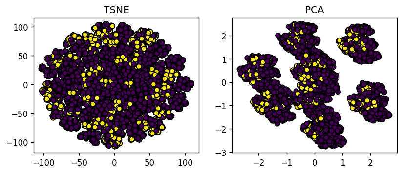
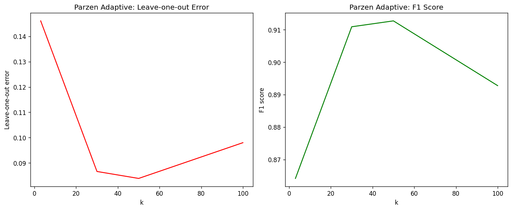

# KNN

KNN – это алгоритм классификации, который основан на принципе "ближайших соседей". Он относится к семейству методов, которые используют принцип близости между объектами для классификации.

## Набор данных

https://www.kaggle.com/datasets/jahnavipaliwal/mountains-vs-beaches-preference

Этот набор данных направлен на анализ предпочтений людей между двумя популярными типами отдыха: горами и пляжами. Он предоставляет информацию о различных демографических и lifestyle-факторах, которые могут влиять на эти предпочтения. Исследуя этот набор данных, можно применять различные методы машинного обучения для предсказания того, предпочитают ли люди горы или пляжи на основе их характеристик.

Структура набора данных:

- Количество экземпляров: 52444
- Количество признаков: 13

**Целевой признак:** `preference` – предпочтение (горы или пляжи, бинарный).

### TSNE & PCA



Можно заметить, что данные неплохо разделяются в пространстве признаков, хоть и не идеально.

## Реализация алгоритма KNN

Алгоритм KNN (k-ближайших соседей) классифицирует объекты путем голосования среди k ближайших соседей в пространстве признаков. Основная идея заключается в том, что объекты, близкие друг к другу в пространстве признаков, с большей вероятностью принадлежат к одному классу.

Процесс классификации состоит из следующих шагов:
1. Для каждого тестового объекта находятся k ближайших соседей из обучающей выборки
2. Каждый сосед "голосует" за принадлежность объекта к определенному классу
3. Объект относится к классу, набравшему большинство голосов

В данной реализации помимо простого голосования используется метод окна Парзена (Parzen window), который позволяет учитывать вклад каждого соседа с весом, зависящим от расстояния до классифицируемого объекта.

### Окно Парзена

Окно Парзена - это метод непараметрической оценки плотности вероятности, который можно использовать для взвешенного голосования в KNN. Основная идея заключается в том, что более близкие соседи должны иметь больший вес при голосовании.

В качестве функции окна используется гауссово ядро:
$K(u) = \frac{1}{\sqrt{2\pi}} \exp(-\frac{u^2}{2})$

где $u = \frac{d}{h}$, $d$ - расстояние до соседа, $h$ - ширина окна (bandwidth).

Реализованы два варианта:
1. Fixed - с фиксированной шириной окна $h$
2. Adaptive - адаптивная ширина окна, равная расстоянию до k-го соседа

Теоретическое обоснование:
- При $h \to 0$ оценка становится более локальной, но может быть неустойчивой
- При $h \to \infty$ оценка становится более гладкой, но может потерять локальные особенности данных
- Адаптивная ширина окна позволяет автоматически подстраиваться под локальную плотность данных


```python
class KNN:
    def __init__(
        self,
        k: int,
        num_classes: int,
        mode: Simple | ParzenFixed | ParzenAdaptive,
    ):
        """
        Initialize KNN classifier

        Args:
            k: number of nearest neighbors
            num_classes: number of classes
            mode: mode of prediction
        """
        self.k: int = k
        self.num_classes: int = num_classes
        self.mode: Simple | ParzenFixed | ParzenAdaptive = mode
        self.X: np.ndarray | None = None
        self.y: np.ndarray | None = None

    def fit(self, X: np.ndarray, y: np.ndarray):
        """
        Fit the classifier with training data

        Args:
            X: training samples, shape (N_samples, N_features)
            y: training labels, shape (N_samples,)
        """
        self.X = X
        self.y = y
        return self

    def predict(self, X: np.ndarray) -> np.ndarray:
        """
        Predict labels for input samples

        Args:
            X: input samples to predict, shape (N_samples, N_features)
        Returns:
            Predicted labels, shape (N_samples,)
        """
        if self.X is None or self.y is None:
            raise ValueError("Classifier must be fitted before making predictions")

        # Initialize array to store predictions for each input sample
        predictions = np.empty(len(X), dtype=np.int32)

        # Iterate through each input sample
        for i, x in enumerate(X):
            # Calculate distances between the input sample and all training samples
            d = cdist(self.X, x.reshape((1, -1)))

            # Get indices of k nearest neighbors
            topk_idxs = np.argsort(d, axis=0)[:self.k]

            # Get distances and labels of k nearest neighbors
            topk = d[topk_idxs].flatten()
            lbls = self.y[topk_idxs].flatten()

            # Initialize vote matrix (k neighbors x num_classes)
            v = np.zeros((self.k, self.num_classes))

            # Apply weighting based on the selected mode
            match self.mode:
                case Simple():
                    # Simple mode: equal weights for all neighbors
                    topk = np.ones((self.k,))
                case ParzenFixed(h=h):
                    # Fixed Parzen window: Gaussian kernel with fixed bandwidth
                    topk = 1 / np.sqrt(2 * np.pi) * np.exp(-0.5 * (topk / h) ** 2)
                case ParzenAdaptive():
                    # Adaptive Parzen window: Gaussian kernel with adaptive bandwidth
                    h = np.sort(d, axis=0)[self.k]  # Use distance to k-th neighbor as bandwidth
                    topk = 1 / np.sqrt(2 * np.pi) * np.exp(-0.5 * (topk / h) ** 2)

            # Assign weights to corresponding labels in the vote matrix
            v[np.arange(self.k), lbls] = topk

            # Predict the class with the highest total vote
            predictions[i] = np.argmax(np.sum(v, axis=0))

        return predictions

    def leave_one_out(self) -> float:
        """
        Calculate leave-one-out error
        """
        y_pred = np.empty(self.y.shape, dtype=np.int32)
        for i in range(len(self.X)):
            y_pred[i] = (
                KNN(k=self.k, mode=self.mode, num_classes=self.num_classes)
                .fit(np.delete(self.X, i, axis=0), np.delete(self.y, i))
                .predict(self.X[i].reshape((1, -1)))
            )
        return np.sum(y_pred != self.y) / len(self.y)

```

## Оценка качества классификации

| k | mode | accuracy | f1 | leave-one-out error |
| --- | --- | --- | --- | --- |
| 30 | Simple | 0.90 | 0.90 | 0.10 |
| 30 | ParzenFixed(h=0.5) | 0.85 | 0.85 | 0.17 |
| 30 | ParzenAdaptive | 0.91 | 0.91 | 0.09 |
| 50 | Simple | 0.91 | 0.90 | 0.09 |
| 50 | ParzenFixed(h=0.5) | 0.85 | 0.85 | 0.17 |
| 50 | ParzenAdaptive | 0.92 | 0.91 | 0.08 |
| 100 | Simple | 0.90 | 0.89 | 0.10 |
| 100 | ParzenFixed(h=0.5) | 0.85 | 0.85 | 0.17 |
| 100 | ParzenAdaptive | 0.90 | 0.89 | 0.10 |



## Сравнение с реализацией sklearn

| k | sklearn time (s) | custom time (s) | sklearn accuracy | custom accuracy |
|---|-----------------|-----------------|------------------|-----------------|
| 3 | 0.019 | 1.598 | 0.865 | 0.865 |
| 30 | 0.030 | 1.557 | 0.903 | 0.914 |
| 50 | 0.035 | 1.548 | 0.909 | 0.917 |
