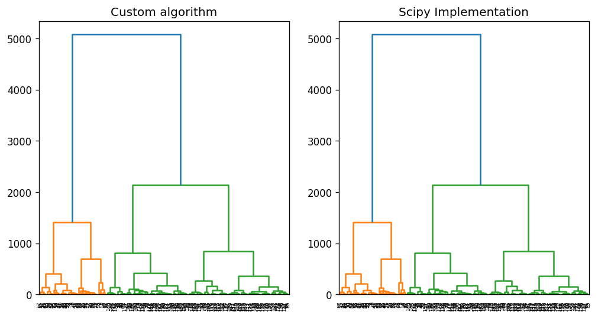
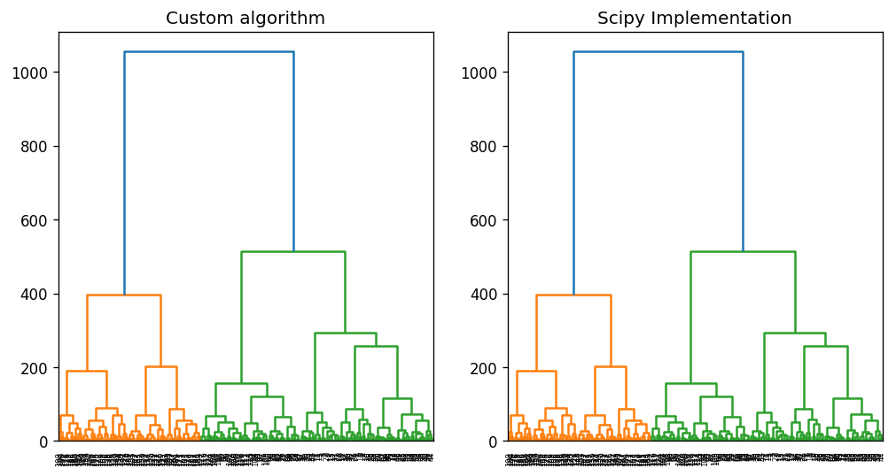

# Лабораторная работа №1

## Датасет 1: Wine Clustering
Визуализация данных:

**Гипотеза**: алгоритмы должны выделить 4 кластера. PCA не справился с визуализацией, так как данные могут быть разделимы нелинейно.
Также видны промежутки в крупных кластерах, а значит, будет дальнейшее разделение на более мелкие кластеры.

Видно, что дендрограммы, построенные разработанным алгоритм и его реализацией в scipy аналогичны.

## Датасет 2: Mall Customers
Визуализация данных:

**Гипотеза**: алгоритмы должны выделить 5 кластеров. И PCA, и TSNE справились с визуализацией, у TSNE получились менее выделенные результаты. Данные линейно разделимы, так как кластеры успешно выделены алгоритмом PCA. 

Видно, что дендрограммы, построенные разработанным алгоритм и его реализацией в scipy аналогичны.