# Лабораторная работа №1

# Визуализация данных
### Датасет 1: Wine Clustering
[Ссылка на датасет](https://www.kaggle.com/datasets/harrywang/wine-dataset-for-clustering)

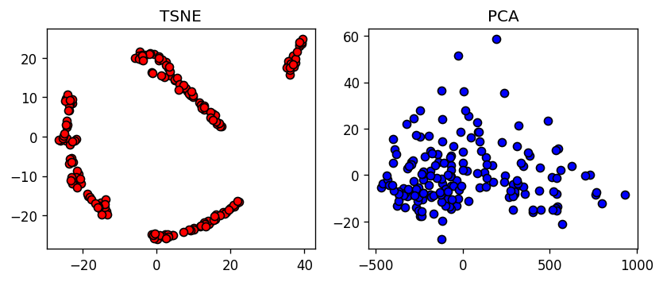

**Гипотеза**: судя по рисунку, алгоритмы должны выделять 3-4 кластера. PCA не справился с визуализацией, так как данные могут быть разделимы нелинейно. Также видны промежутки в крупных кластерах, а значит, будет дальнейшее разделение на более мелкие кластеры.

### Датасет 2: Mall Customers 
[Ссылка на датасет](https://www.kaggle.com/datasets/vjchoudhary7/customer-segmentation-tutorial-in-python)

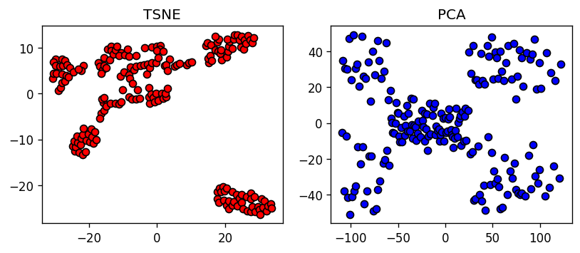

**Гипотеза**: алгоритмы должны выделять 4-5 кластеров. И PCA, и TSNE справились с визуализацией, у TSNE получились менее выделенные результаты. Данные линейно разделимы, так как кластеры успешно выделены алгоритмом PCA. 

# Иерархический алгоритм и дендрограмма
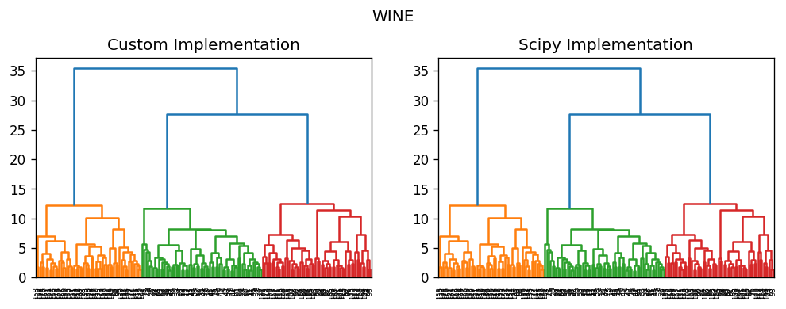
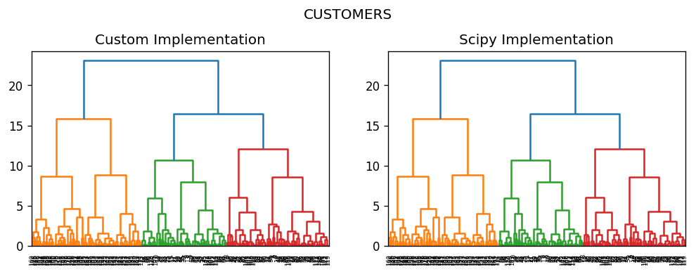

Видно, что дендрограммы, построенные разработанным алгоритмом и его реализацией в scipy аналогичны. 

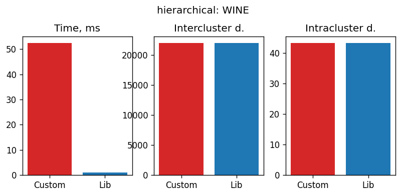

По графикам видно, что среднее растояние между кластерами и внутри них совпадают, а значит, алгоритмы работают одинаково. Наибольшая разница в времени исполения - реализованный алгоритм значительно медленнее.

По дендрограммам можно определить оптимальное число кластеров: для WineClustering - 3 кластера, для Customers - тоже 2.

# EM-алгоритм
### Wine Clustering
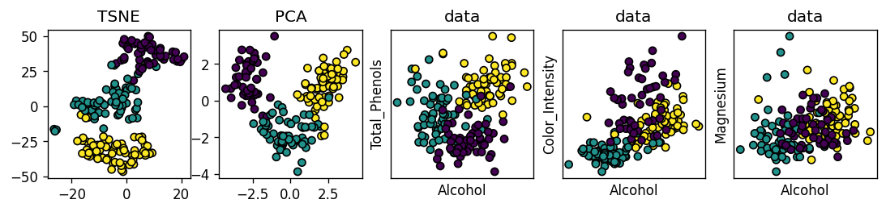

На рисунке показано распределение меток на построенных данных. Данные были преобразованы к стандартному распределению при помощи `StandardScaler` из библиотеки `sklearn`. TSNE и PCA были применены к обработанным данным.

Видно, что на преобразованных данных гораздо более очевидна кластерная струкрура. На TSNE и PCA видно, что как кластеры отрисованы, так их нашел алгоритм. При построении отдельных признаков на осях это менее очевидно и сильно зависит от переменных. Так, признаки `alcohol` и `total_phenols` могут быть визуально поделены на группы, а вот способы разделения на группы зависимостей `color_intensity` и `magnesium` от того же `alcohol` неочевидны.

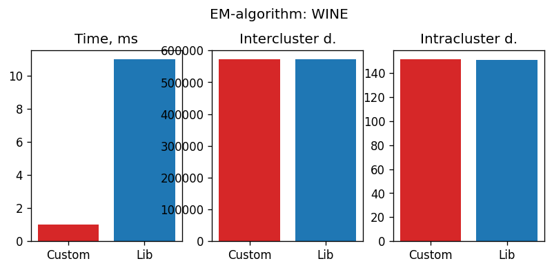

На рисунке показаны метрики. По времени реализованный алгоритм отрабатывает чуть быстрее (зависит от числа кластеров и параметров), расстояния между и внутри кластеров совпадают.

### Customers
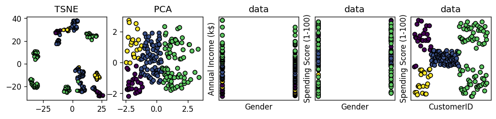

На рисунке показано распределение меток на построенных данных. Видно, что TSNE при сжатии сформировал много кластеров, и метки алгоритма этому не противоречат. Наиболее очевидна корректность распределения по последней картинке - зависимости параметра `spending_score` от id покупателя. Алгоритм выделил 4 кластера, которые соответствуют группам покупателей.

Моя реализация алгоритма может периодически выдавать ошибку - это связано с тем, что центры кластеров выбираются рандомно и в том случае, если они оказываются слишком близко друг к другу, то алгоритм не сходится. 

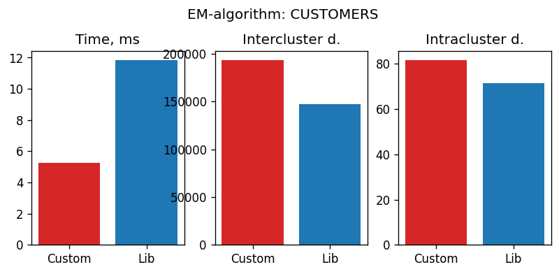

На рисунке показаны метрики. По времени реализованный алгоритм отрабатывает чуть быстрее. При реализации через `sklearn` классы более сжатые - внутрикластерное расстояние и расстояние между кластерами чуть меньше.

# DBSCAN
### Wine
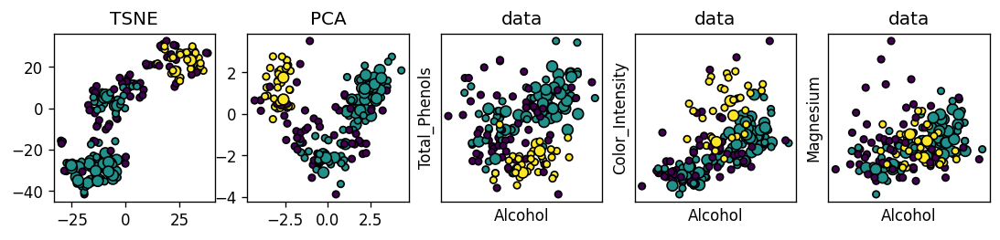

На рисунке показано распределение меток на построенных данных. Здесь `min_samples=15`, `epsilon=2.5`. При таком подборе параметров алгоритм выделяет два кластера. Это не вполне корректно, так как исходя из построения данных кластеров должно быть больше.

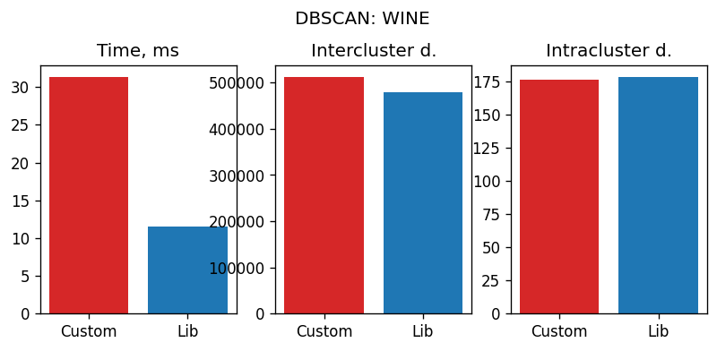

Метрики совпадают, по времени реализация через `sklearn` быстрее.

### Customers
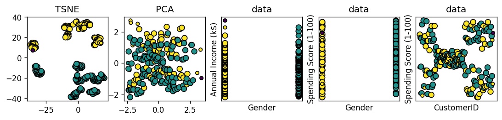

На рисунке показано распределение меток на построенных данных. Здесь `min_samples=5`, `epsilon=1.5`. При таком подборе параметров алгоритм также выделяет два кластера. Кажется, что можно разделить по другой логике, но по графикам зависимости параметров `annual_income` и `spending score` от параметра `gender` - пол покупателя, видно, что кластеры разделились по этому параметру. Также выделились части кластеров TSNE, которые соответствуют полу покупателя. Две группы выделены корректно. По построению результатов алгоритма PCA кластеры не так хорошо видны.

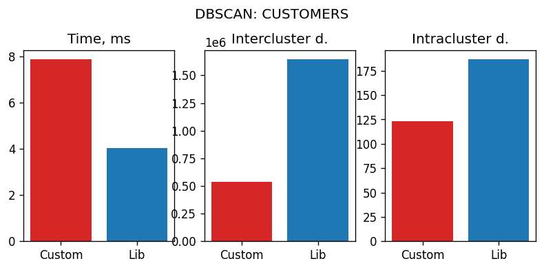

Метрики совпадают, по времени реализация через `sklearn` быстрее.
