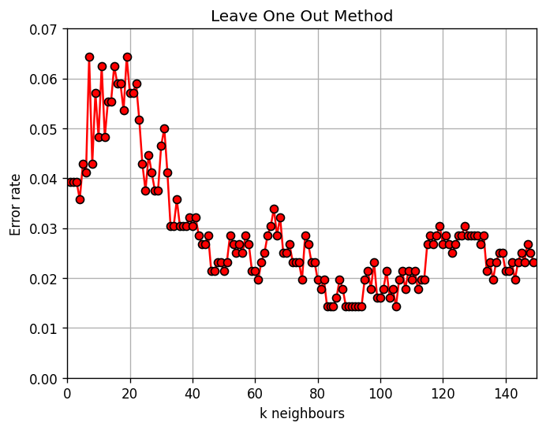
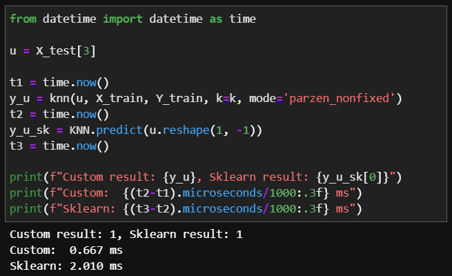
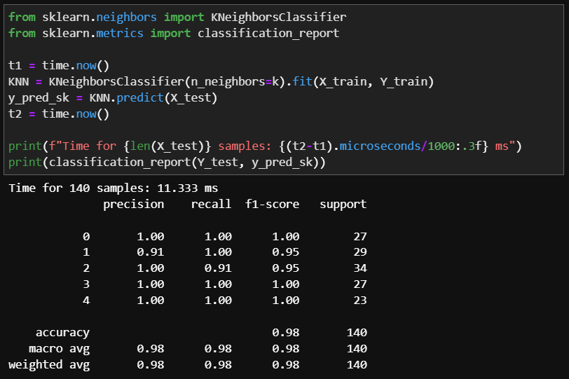

# Лабораторная работа №2

# Данные и визуализация
Выбран датасет по классификации пользователей мобильными устройствами на 5 классов. Перед визуализацией была сделана обработка: строковые значения были закодированы при помощи `LabelEncoder`, а затем весь датасет был нормирован через `StandardScaler`.

[Ссылка на датасет](https://www.kaggle.com/datasets/valakhorasani/mobile-device-usage-and-user-behavior-dataset/)

# Решение

Был реализован алгоритм KNN с методом окна Парзена переменной ширины. В качестве ядра использзуется Гауссово ядро.

## Подбор параметров
Для различных значений параметров `k` (от 1 до 150 с шагом 1) был посчитан процент ошибок при обучении методом Leave-One-Out. Если построить процент ошибок, то получается следующий график. По нему можно понять, что оптимальные значения лежат в диапазоне от 80 до 100. Для дальнейшей работы выбрано значение 90.

## Сравнение результатов

Выполнение алгоритма на одном векторе показывает одинаковый результат, по времени выигрывает кастомный алгоритм. 

Если провалидировать оба алгоритма на полном тестовом датасете, то получены следующие результаты.
Кастомный алгоритм с использованием окна Парзена показывает среднюю точность 0.99, а реализация `sklearn` достигает 0.98. По времени выигрывает реализация `sklearn`, на 140 сэмплах показывает 11.333 мс против 22.104 мс. Реализация `sklearn` лучше оптимизирована для классификации большого объема данных.

