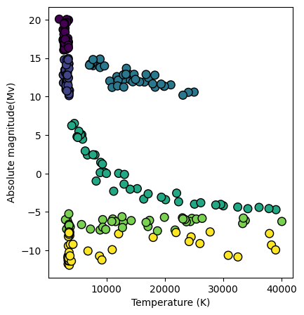
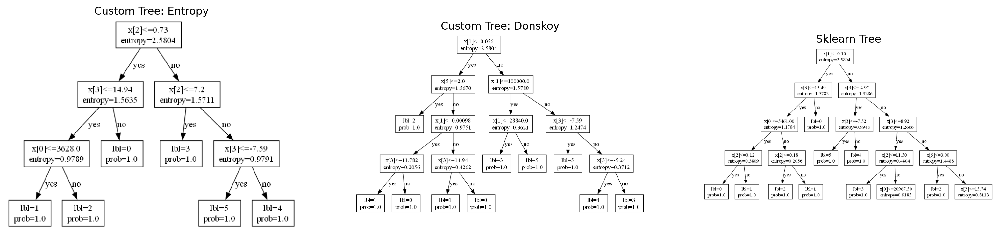
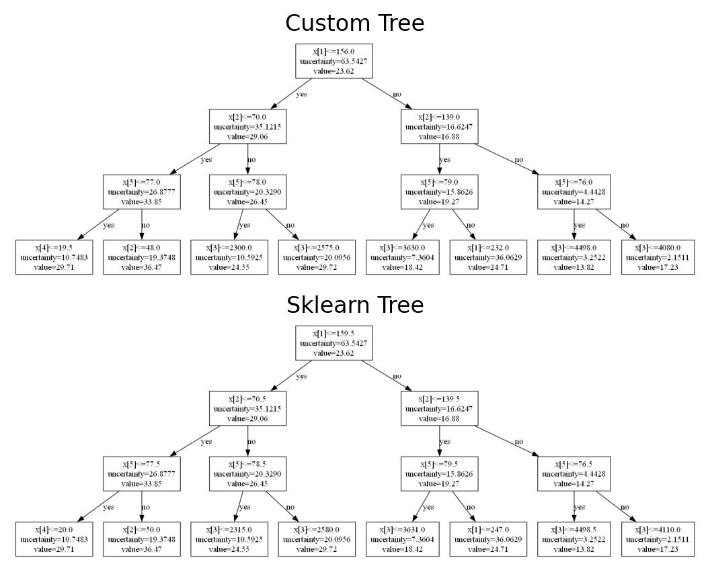
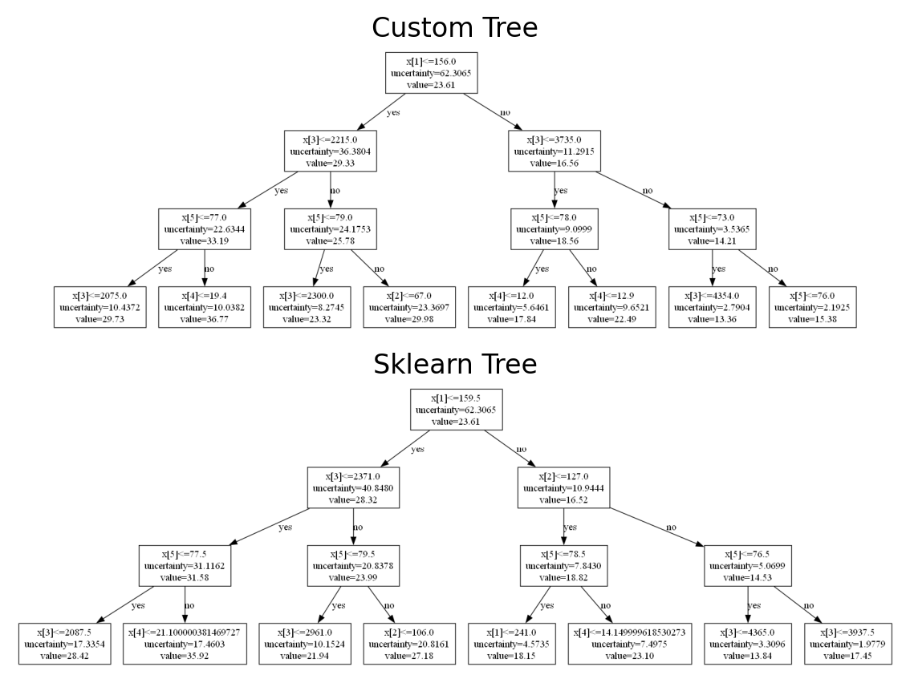
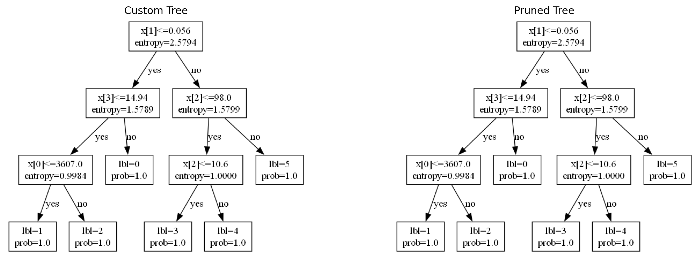
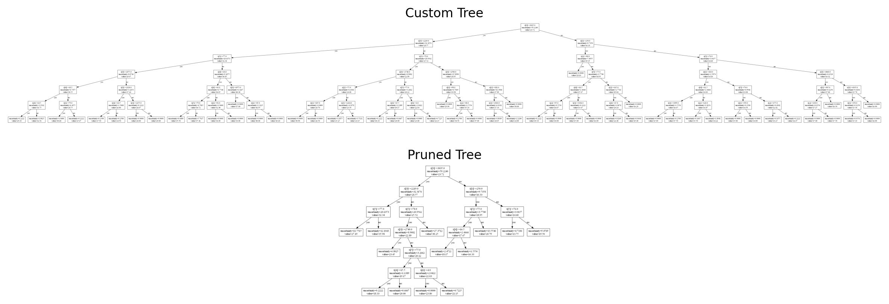

# Лабораторная работа № 3

# Задача классификации
## Данные
Для задачи классификации выбран датасет для классификации типов звезд (доступен по [ссылке](https://www.kaggle.com/datasets/deepu1109/star-dataset)). По температуре, относительной освещенности, относительному радиусу, абсолютной величине, цвету и спектральному классу определить тип звезды (один из следующих классов: *Brown Dwarf*, *Red Dwarf*, *White Dwarf*, *Main Sequence*, *Supergiant* и *Hypergiant*).

Построен график зависимости абсолютной величины от температуры, цвет точки - тип звезды.



Данные содержат категориальные и количественные признаки, а для анализа пропусков они будут добавлены в коде.


## Решение

Задача построения дерева для классификации решена с разными критериями: используются  критерий Донского и многоклассовый энтропийный критерий.

1. **Критерий Донского**
```python
p = X > predicat_weight
I = np.sum((p[:, None] != p) & (y[:, None] != y)) # information gain
```
2. **Многоклассовый энтропийный критерий**
```python
p = sum(X > predicat_weight)
p_c = np.array([sum((y==y_lbl) * (X > predicat_weight)) for y_lbl in Y])
I = sum(h(P_c/l)) - p/l * sum(h(p_c/p)) - (l-p)/l * sum(h((P_c - p_c)/(l-p))) # information gain
```

### Датасет без пропусков
На датасете были построены деревья (максимальная глубина 4), их отрисовка выглядит следующим образом:


Построенные деревья отличаются, но итоговые листья содержат объекты одного класса - значит, классификация корректна. Разные виды деревьев связаны с простотой датасета - может быть несколько вариантов решения такой задачи.

#### Результаты
<details open>
<summary><b> Метрики </b></summary>

```
Custom Implementation with Entropy Criterion: 0 mcs
              precision    recall  f1-score   support

           0       0.62      1.00      0.77         5
           1       1.00      0.78      0.88         9
           2       0.89      0.80      0.84        10
           3       1.00      1.00      1.00        11
           4       1.00      1.00      1.00         4
           5       1.00      1.00      1.00         9

    accuracy                           0.92        48
   macro avg       0.92      0.93      0.91        48
weighted avg       0.94      0.92      0.92        48

Custom Implementation with Donskoy Criterion: 0 mcs
              precision    recall  f1-score   support

           0       0.62      1.00      0.77         5
           1       1.00      0.78      0.88         9
           2       0.89      0.80      0.84        10
           3       1.00      1.00      1.00        11
           4       1.00      1.00      1.00         4
           5       1.00      1.00      1.00         9

    accuracy                           0.92        48
   macro avg       0.92      0.93      0.91        48
weighted avg       0.94      0.92      0.92        48

Sklearn Implementation: 0 mcs
              precision    recall  f1-score   support

           0       1.00      1.00      1.00         5
           1       1.00      1.00      1.00         9
           2       1.00      1.00      1.00        10
           3       1.00      1.00      1.00        11
           4       1.00      1.00      1.00         4
           5       1.00      1.00      1.00         9

    accuracy                           1.00        48
   macro avg       1.00      1.00      1.00        48
weighted avg       1.00      1.00      1.00        48
```
</details>

Время работы везде меньше миллисекунды (таймер `datetime` меньше не засекает). Точность у кастомных алгоритмов равна 0.92, у реализации от Sklearn точность равна 1 на тестовом датасете.

### Датасет с пропусками
Пропуски были добавлены при помощи следующего фрагмента кода. 10% значений датасета заменены на `np.nan`.
```python
ix = [(row, col) for row in range(X.shape[0]) for col in range(X.shape[1])]
for row, col in random.sample(ix, int(round(.1*len(ix)))):
    X.iat[row, col] = np.nan
```

Получившиеся дерево (максимальная глубина установлена и равна 7):



#### Результаты

<details open>
<summary><b> Метрики </b></summary>

```
Custom Implementation with Entropy Criterion: 1000 mcs
              precision    recall  f1-score   support

           0       1.00      1.00      1.00         6
           1       1.00      0.73      0.84        11
           2       0.54      1.00      0.70         7
           3       1.00      0.50      0.67         6
           4       0.67      1.00      0.80         6
           5       1.00      0.75      0.86        12

    accuracy                           0.81        48
   macro avg       0.87      0.83      0.81        48
weighted avg       0.89      0.81      0.82        48

Custom Implementation with Donskoy Criterion: 0 mcs
              precision    recall  f1-score   support

           0       0.75      1.00      0.86         6
           1       0.75      0.55      0.63        11
           2       1.00      0.71      0.83         7
           3       0.60      1.00      0.75         6
           4       0.75      1.00      0.86         6
           5       1.00      0.75      0.86        12

    accuracy                           0.79        48
   macro avg       0.81      0.83      0.80        48
weighted avg       0.83      0.79      0.79        48

Sklearn Implementation: 999 mcs
              precision    recall  f1-score   support

           0       0.86      1.00      0.92         6
           1       0.91      0.91      0.91        11
           2       1.00      1.00      1.00         7
           3       1.00      0.83      0.91         6
           4       0.86      1.00      0.92         6
           5       1.00      0.92      0.96        12

    accuracy                           0.94        48
   macro avg       0.94      0.94      0.94        48
weighted avg       0.94      0.94      0.94        48
```
</details>


Время работы везде меньше или равно миллисекунде (таймер `datetime` меньше не засекает). Точность у кастомных алгоритмов равна 0.81 с многоклассовым энтропийным критерием, 0.79 у критерия Донского, у реализации от Sklearn точность равна 0.94 на тестовом датасете.


# Задача регрессии
## Данные
Для решения задачи регрессии используется датасет для предсказания расхода топлива в милях на галлон. Здесь [ссылка](https://www.kaggle.com/datasets/uciml/autompg-dataset) на датасет.

## Решение
Используется критерий Mean Square Error:
```python
def uncertainty_measure(Y):
    y = 1/len(Y) * np.sum(Y)
    return 1/len(Y) * np.sum((Y-y)**2)

idxs = X > predicat_weight
y_0 = y[idxs]
y_1 = y[~idxs]

I = uncertainty_measure(y) - len(y_0)/l * uncertainty_measure(y_0) - len(y_1)/l * uncertainty_measure(y_1)
```

### Датасет без пропусков
На датасете были построены деревья (максимальная глубина 5), их отрисовка выглядит следующим образом (до 3-го уровня):



Построенные деревья совпадают, немного отличаются лишь пороги.

#### Результаты
```
Custom Implementation: 0 mcs, r2-score=0.8466
Sklearn Implementation: 962 mcs, r2-score=0.7733
```

Время выполнения имеет такую же проблему, как и в задаче классификации - меньше миллисекунды таймер не отсчитывает. Кастомная реализация выдает `r2-score` равное 84.7%, а имплементация Sklearn - 77.3% на тестовом датасете.


### Датасет с пропусками
К исходному датасету были добавлены пропуски, в количестве 10%. На таком датасете были построены деревья (максимальная глубина 6), их отрисовка выглядит следующим образом:



Построенные деревья немного отличаются, только на первом уровне. Отрисовка происходит до 3 уровня.

#### Результаты
```
Custom Implementation: 1007 mcs, r2-score=0.6595
Sklearn Implementation: 0 mcs, r2-score=0.6414
```

Время выполнения имеет такую же проблему, как и в задаче классификации - меньше миллисекунды таймер не отсчитывает. Кастомная реализация выдает `r2-score` равное 66%, а имплементация Sklearn - 64.1% на тестовом датасете. Обе модели просели по качеству решения задачи.


# Редукция деревьев
Для обоих типов деревьев алгоритм рекурсивный. Датасеты используются без пропусков, для задачи классификации используется многоклассовый энтропийный критерий.

## Классификация


Поскольку датасет простой, никакой редукции не происходит. Соответственно нет и падения в метриках.

## Регрессия

Для наглядности было построено дерево глубины 7, оно отрисовывается полностью. По графику видно, что дерево значительно уменьшается.



R2-score на тестовом датасете: дерево без редукции 67%, дерево с редукцией - 76.2%. Такая разница в метриках связана с тем, что датасет небольшой и дерево большой глубины переобучается. Из-за этого метрики на тестовом датасете меньше, чем на тренировочной. Убирая часть вершин, модель лучше генерализуется на тестовой выборке.
