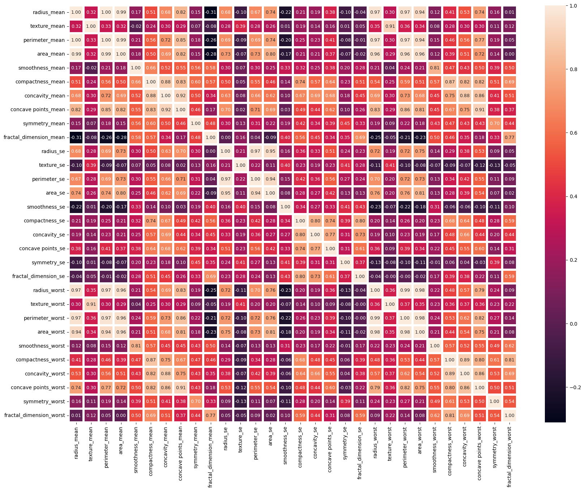
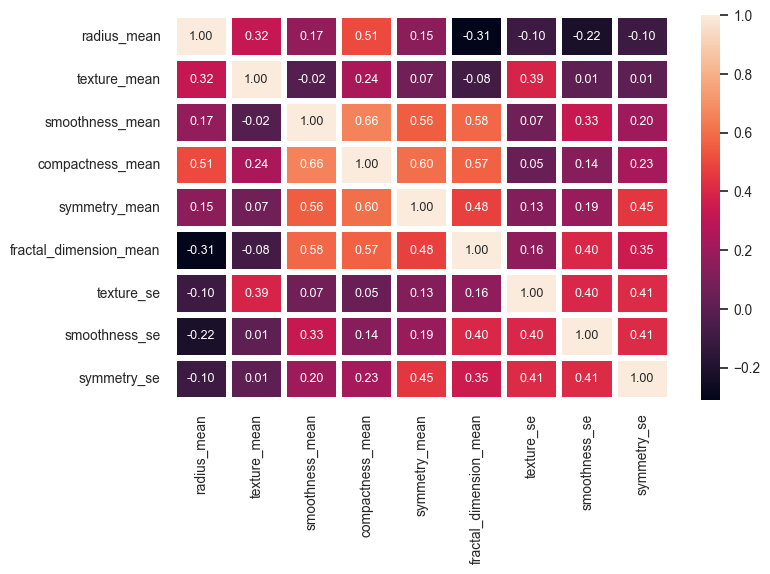
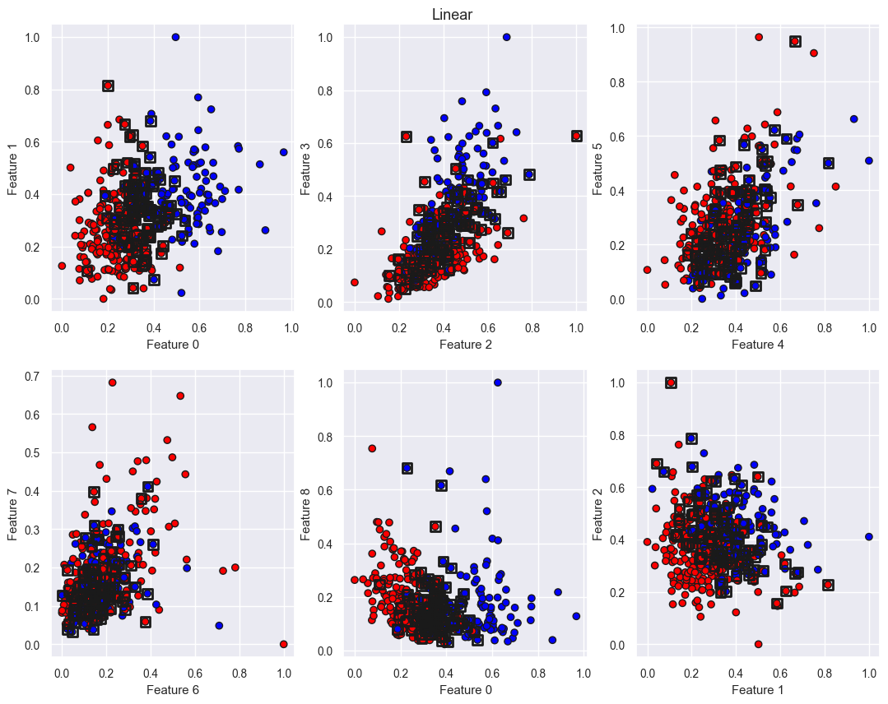
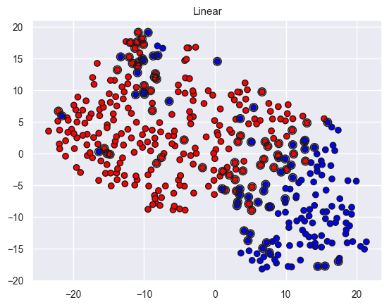
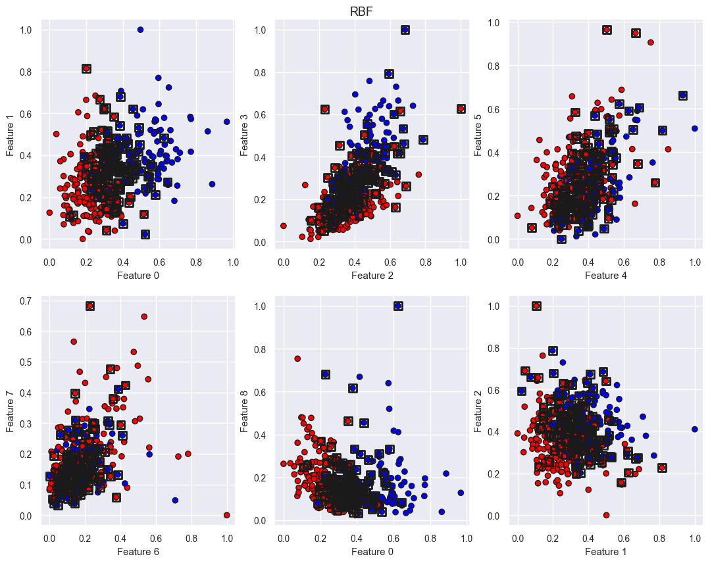
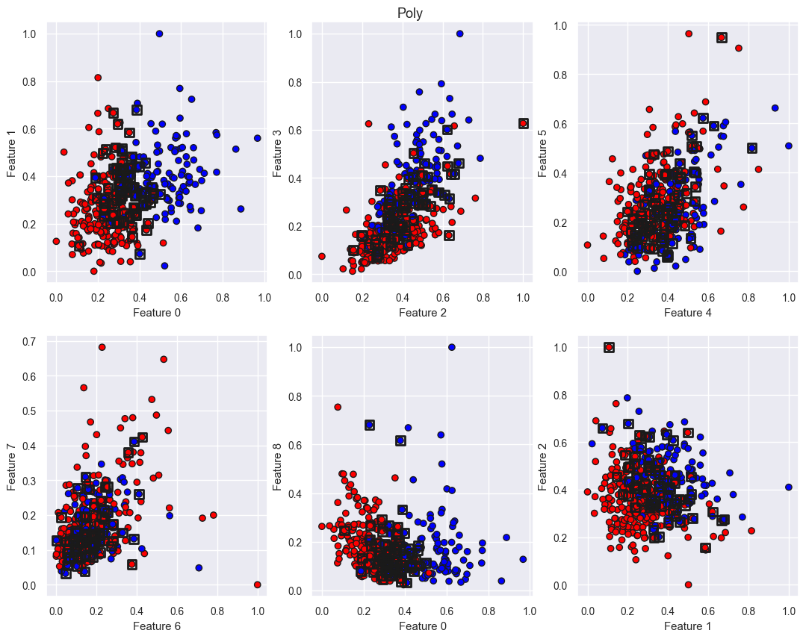

# Лабораторная работа №5

## Датасет
Для решения задачи SVM выбран датасет для предсказания рака груди (доступен по [ссылке](https://www.kaggle.com/datasets/mahnazarjmand/breast-cancer-data)).

Изначально данные были достаточно сильно коррелированы, поэтому часть признаков была удалена.

Матрица корреляций до очистки:



Матрица корреляций после очистки:




## Решение двойственной задачи
Для решения двойственной задачи необходимо минимизировать функцию Лагранжа. Для этого используется функция `minimize` из библиотеки `scipy`.

При создании SVM задается тип ядра (`kernel_type`), при необходимости параметры ядра (`gamma`, `d`) и параметр регуляризации (`C`). В зависимости от типа ядра создается соответствующая функция ядра (`kernel(X, X)`), которая используется для вычисления матрицы Грама.

При обучении вычисляется матрица Грама, затем вызывается функция `minimize` для решения двойственной задачи. В неё подаются функции Лагранжа и её производная по $\lambda$, ограничения и границы для $\lambda$.

```python
N = X.shape[0]

def Lagrangian(lambdas, G):
    return np.sum(lambdas) - 0.5 * lambdas.T @ G @ lambdas

def dL_dlambda(lambdas, G):
    return np.ones_like(lambdas) - lambdas @ G

I = np.eye(N)
constraints = ({'type': 'eq',   'fun': lambda l: l @ y, 'jac': lambda l: y},
                {'type': 'ineq', 'fun': lambda l: I @ l, 'jac': lambda l: I})

G = y[:, np.newaxis] * self.kernel(X, X) * y[:, np.newaxis].T

optRes = minimize(
    fun=lambda l: -Lagrangian(l, G),
    x0=np.zeros(N), 
    method='SLSQP', 
    jac=lambda l: -dL_dlambda(l, G),
    constraints=constraints,
    bounds=[(0, self.C) for _ in range(N)],
    options={"maxiter": 1000}
)
```
В том случае, если оптимизация сходится, то вычисляются коэффициенты $\lambda$ и сохраняются в классе. Также сохраняются X и Y, а также опорные векторы. Вычисляются веса и смещение.

## Построение линейного классификатора

Построение линейного классификатора выполняется через решение двойственной задачи. В функции `predict` вычисляется значение функции $M(x, y)$ для каждого объекта в тестовой выборке, которое затем пересчитывается в класс.

Для каждого типа ядра был создан классификатор, а также проведено сравнение с классификатором из библиотеки `sklearn`.

По времени в каждом случае значительно выигрывает реализация из библиотеки `sklearn`.

### Линейное ядро

По результатам обучения построены следующее распределение признаков и TSNE:





Сравнение метрик для каждого класса:

| Metric     | Custom  | Custom  | sklearn | sklearn |
|------------|---------|---------|---------|---------|
| Class      | -1      | +1      | -1      | +1      |
| Precision  | 0.88    | 0.99    | 0.89    | 0.96    |
| Recall     | 0.99    | 0.91    | 0.94    | 0.92    |
| F1-score   | 0.93    | 0.95    | 0.91    | 0.94    |


### Гауссово ядро
По результатам обучения построены следующее распределение признаков и TSNE:




Сравнение метрик для каждого класса:

| Metric     | Custom  | Custom  | sklearn | sklearn |
|------------|---------|---------|---------|---------|
| Class      | -1      | +1      | -1      | +1      |
| Precision  | 0.91    | 0.99    | 0.92    | 0.93    |
| Recall     | 0.99    | 0.93    | 0.90    | 0.95    |
| F1-score   | 0.94    | 0.96    | 0.91    | 0.94    |

### Полиномиальное ядро
По результатам обучения построены следующее распределение признаков и TSNE:




Сравнение метрик для каждого класса:

| Metric     | Custom  | Custom  | sklearn | sklearn |
|------------|---------|---------|---------|---------|
| Class      | -1      | +1      | -1      | +1      |
| Precision  | 0.91    | 0.99    | 0.90    | 0.94    |
| Recall     | 0.99    | 0.93    | 0.91    | 0.93    |
| F1-score   | 0.94    | 0.96    | 0.91    | 0.94    |


