# Лабораторная работа №1. Кластеризация

## Задание 1

### [Latitude and Longitude for Every Country and State](https://www.kaggle.com/datasets/paultimothymooney/latitude-and-longitude-for-every-country-and-state)

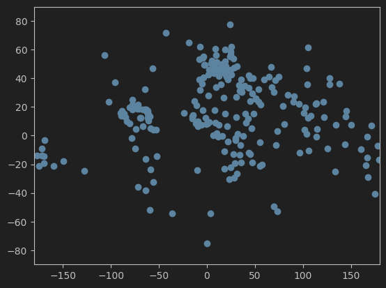

* Тип кластеров: внутрикластерные расстояния меньше межкластерных, с перемычками
* Количество кластеров: 5 (заселенные материки)

### [Mall Customer Segmentation Data](https://www.kaggle.com/datasets/vjchoudhary7/customer-segmentation-tutorial-in-python)

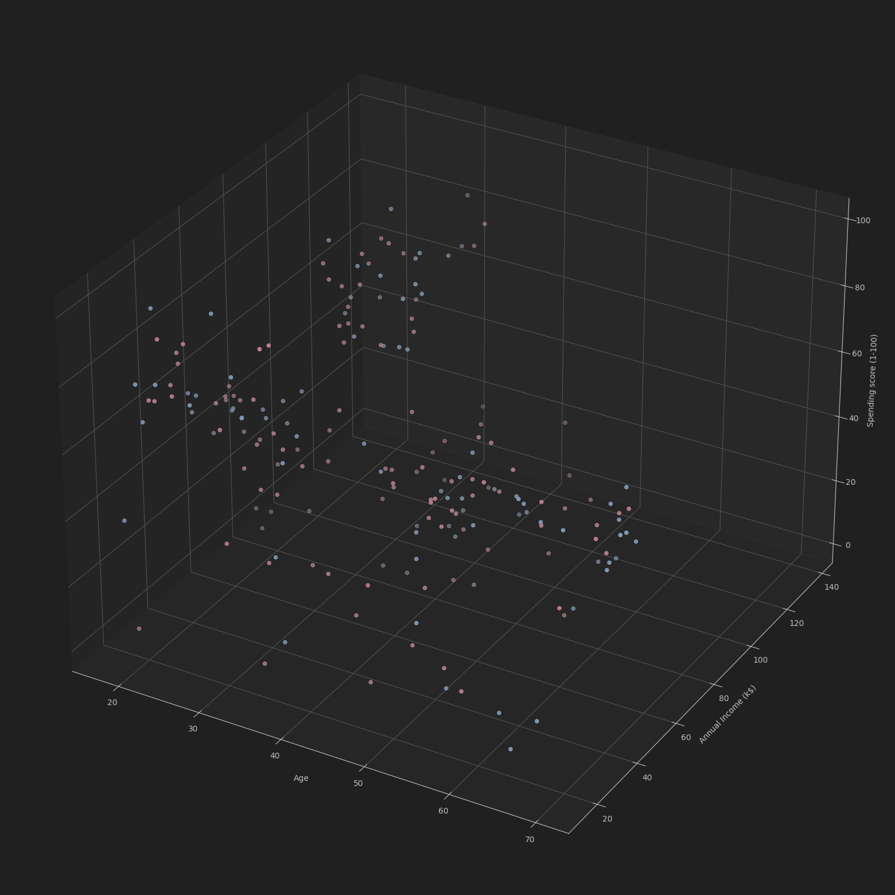

* Тип кластеров: накладывающиеся на разреженный фон из редко расположенных объектов
* Количество кластеров: 3 (ярко выраженные группы покупателей)

## Задание 2

* [Реализация иерархического алгоритма](source/agglomerative.py)

### Latitude and Longitude for Every Country and State

#### Дендрограмма

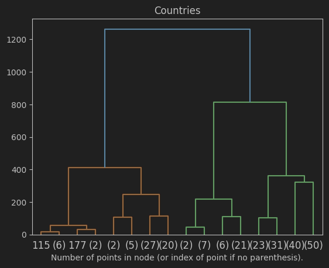

#### Оптимальное количество кластеров: 7

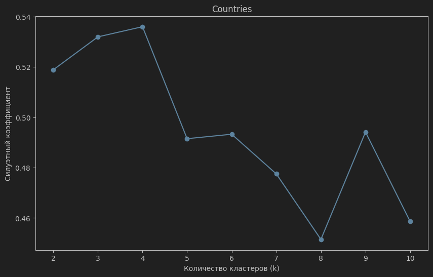

### Mall Customer Segmentation Data

#### Дендрограмма

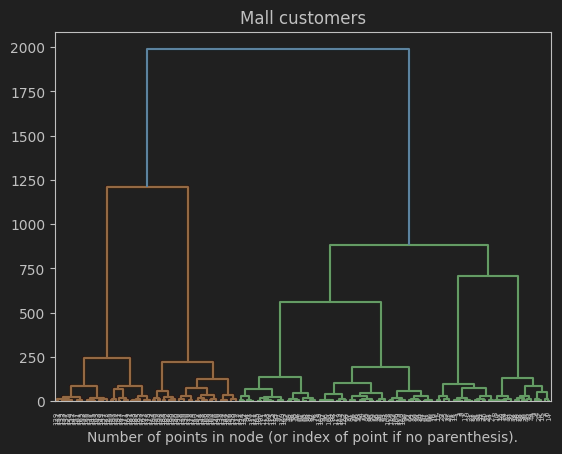

#### Оптимальное количество кластеров: 4

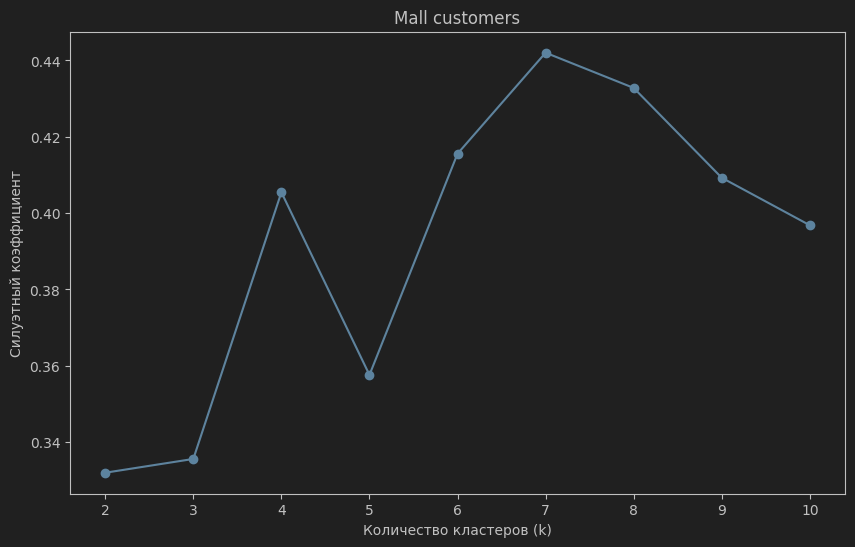

## Задание 3

* [Реализация EM-алгоритма](source/em.py)
* [Реализация DBSCAN](source/dbscan.py)

## Задания 4-6

### Latitude and Longitude for Every Country and State

#### Иерархическая кластеризация

##### Моя реализация


```
extra=165.1119238209271
mean_intra=36.06245563640347
fulfillment=[10, 36, 54, 144]
time=0.06016826629638672s
```

##### Реализация Sklearn 

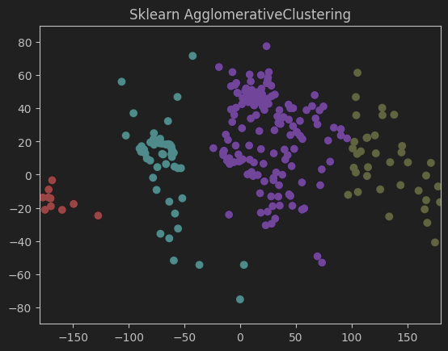

```
extra=165.1119238209271
mean_intra=36.06245563640347
fulfillment=[10, 36, 54, 144]
time=0.05825400352478027s
```

#### DBSCAN

##### Моя реализация

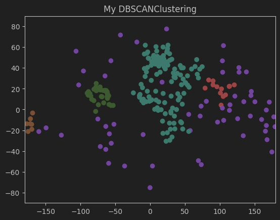

```
extra=135.7334907687077
mean_intra=41.69330392134238
fulfillment=[7, 13, 37, 59, 128]
time=0.7216331958770752s
```

##### Реализация Sklearn 

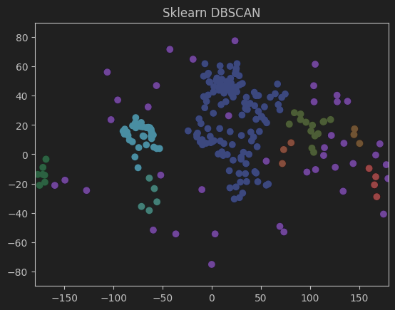

```
extra=136.45099216423125
mean_intra=29.037087531624422
fulfillment=[3, 3, 4, 5, 7, 14, 38, 41, 129]
time=0.05946493148803711s
```

#### EM

##### Моя реализация

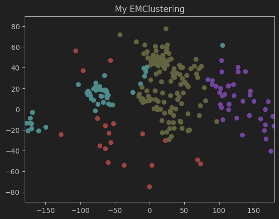

```
extra=119.92775837574982
mean_intra=55.33896072113337
fulfillment=[19, 38, 55, 132]
time=0.1329507827758789s
```

##### Реализация Sklearn 

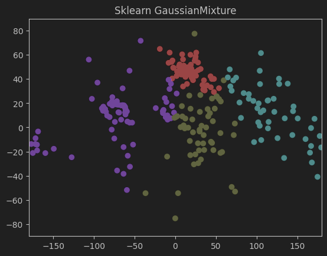

```
extra=104.69939276313657
mean_intra=42.641748618813445
fulfillment=[48, 57, 62, 77]
time=0.06617188453674316s
```

### Mall Customer Segmentation Data

#### Иерархическая кластеризация

##### Моя реализация

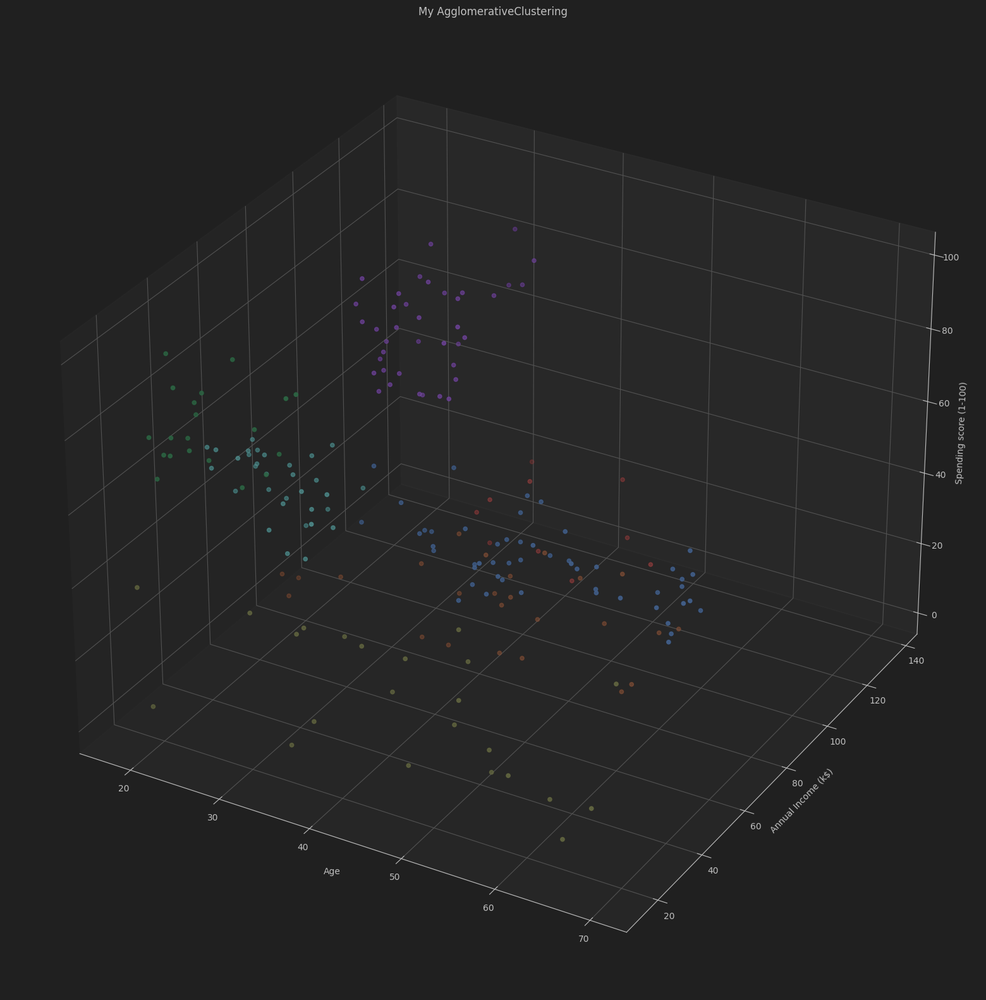

```
extra=58.443172293906294
mean_intra=21.553350050714272
fulfillment=[10, 20, 23, 25, 32, 39, 51]
time=0.2169189453125s
```

##### Реализация Sklearn 

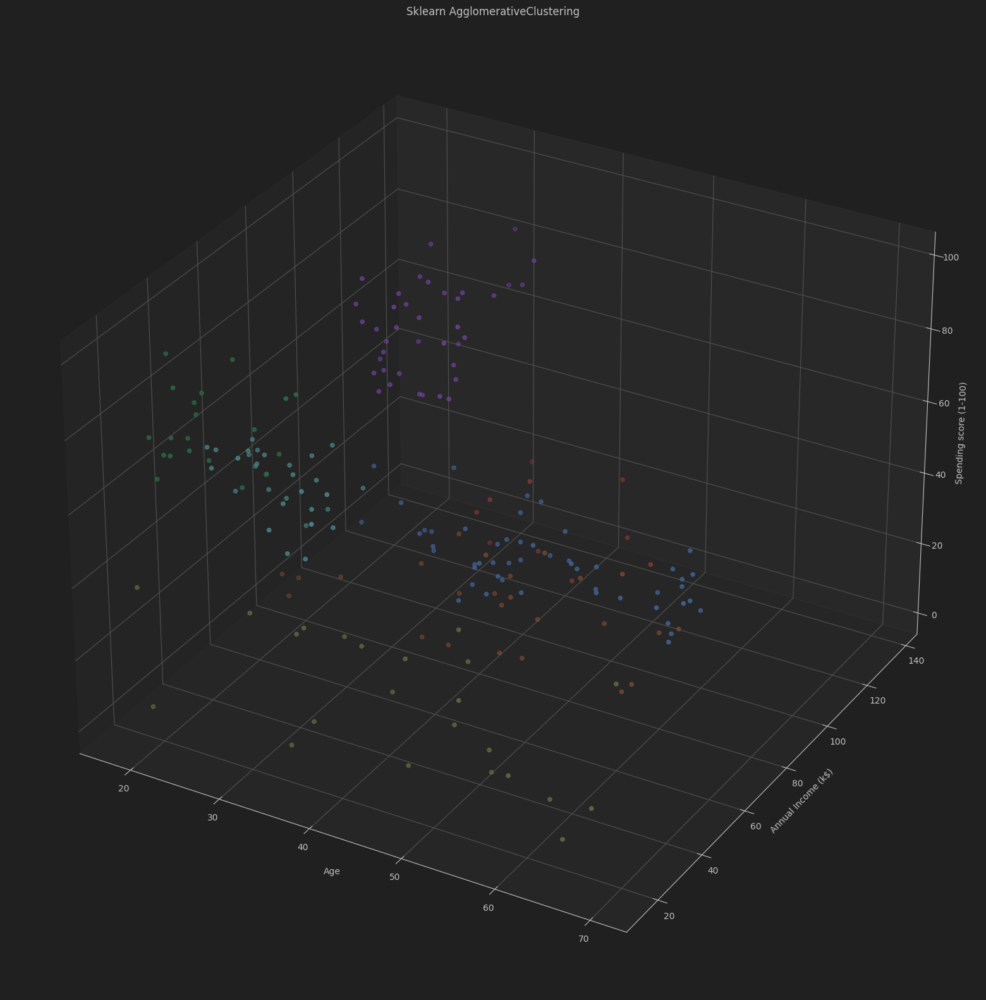

```
extra=58.443172293906294
mean_intra=21.553350050714272
fulfillment=[10, 20, 23, 25, 32, 39, 51]
time=0.22099709510803223s
```

#### DBSCAN

##### Моя реализация

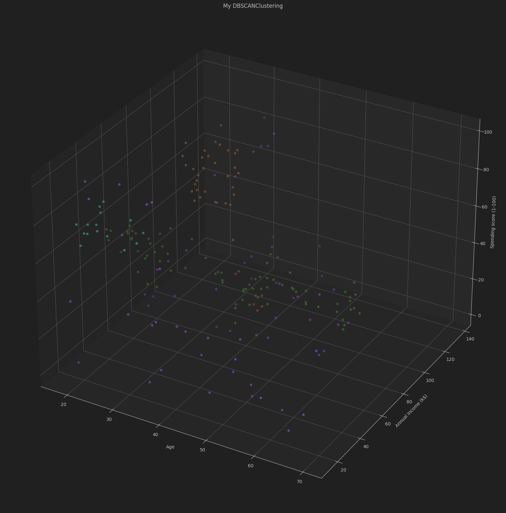

```
extra=49.572998552760865
mean_intra=25.140079132379828
fulfillment=[5, 15, 32, 69, 79]
time=0.8366782665252686s
```

##### Реализация Sklearn

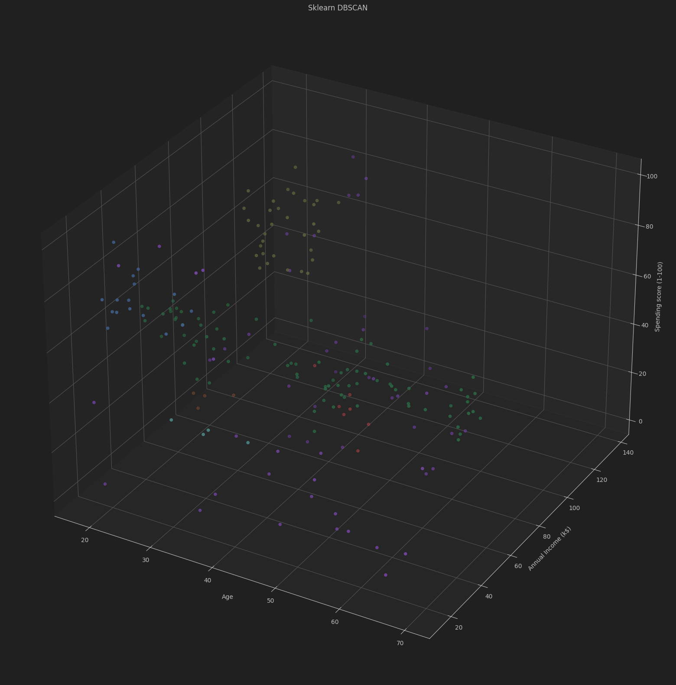

```
extra=52.09251544315682
mean_intra=21.082432809766562
fulfillment=[4, 4, 7, 16, 32, 56, 81]
time=0.22619009017944336s
```

#### EM

##### Моя реализация

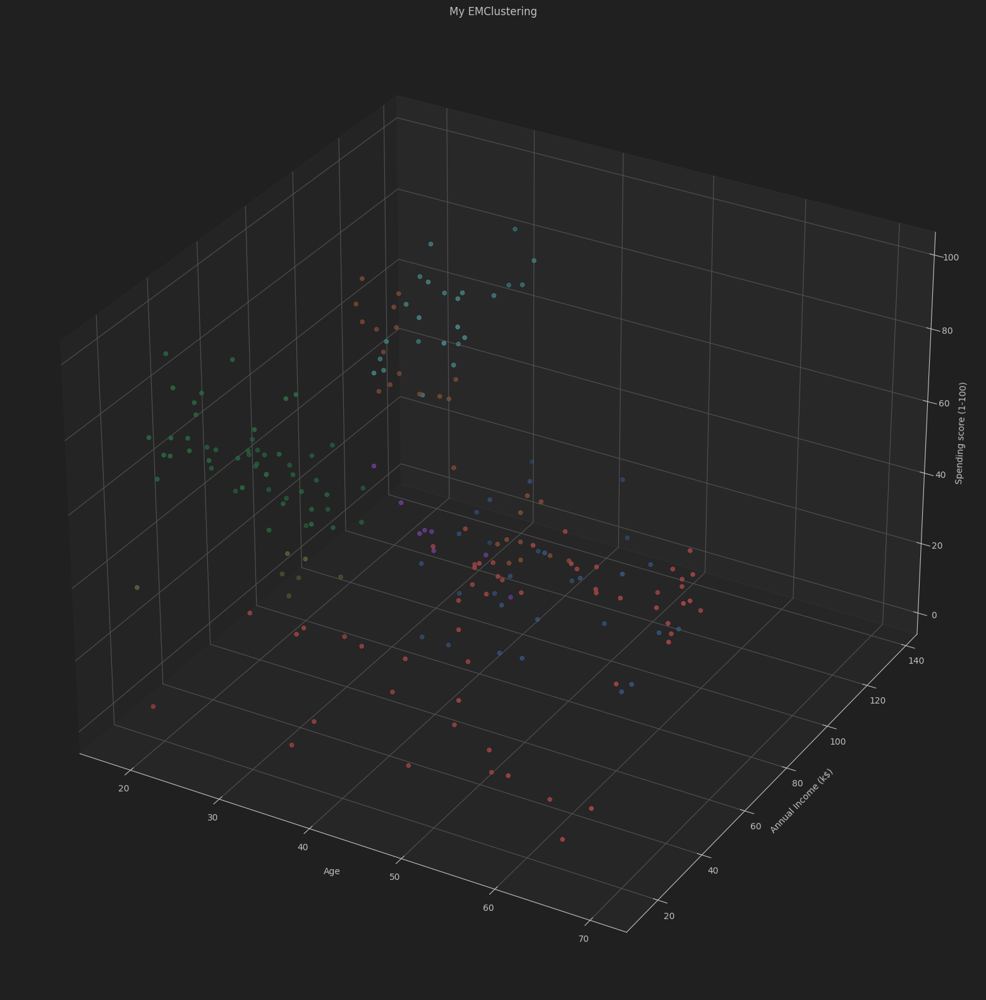

```
extra=45.248576533224046
mean_intra=28.16116720875565
fulfillment=[7, 8, 24, 26, 29, 51, 55]
time=0.23258590698242188s
```

##### Реализация Sklearn 

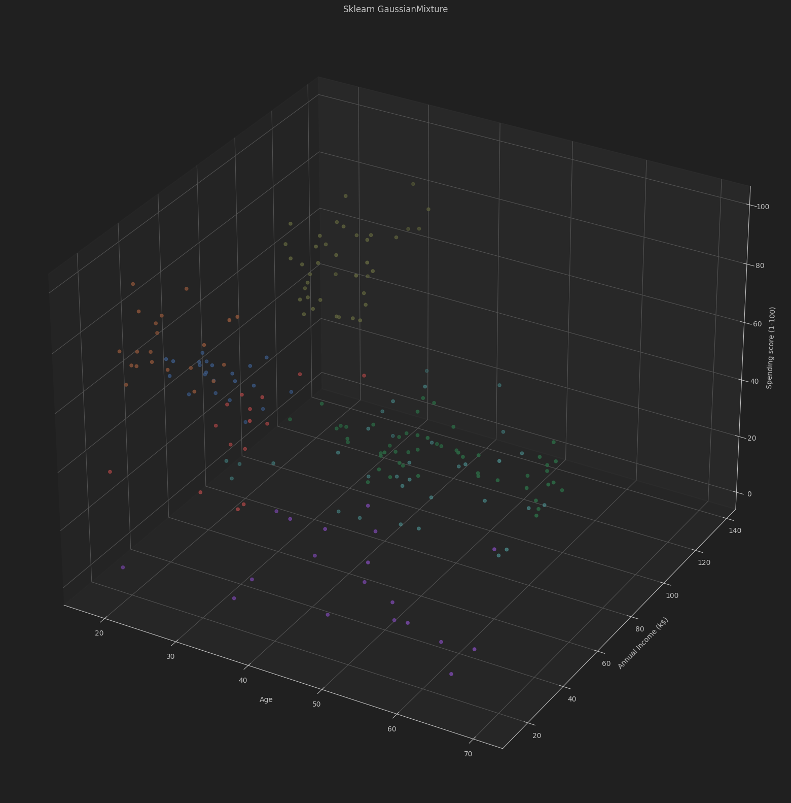

```
extra=52.22554059065145
mean_intra=21.444637658739563
fulfillment=[15, 19, 21, 22, 33, 39, 51]
time=0.23969197273254395s
```

### Сравнительная характеристика

`Моя метрика VS Метрика Sklearn`

* Latitude and Longitude for Every Country and State

| Алгоритм      | Внешнее расстояние | Внутреннее расстояние | Время работы   |
|---------------|--------------------|-----------------------|----------------|
| Иерархическая | 165.11 VS 165.11   | 36.06 VS 36.06        | 0.060 VS 0.058 |
| DBSCAN        | 135.73 VS 136.45   | 41.69 VS 29.03        | 0.721 VS 0.059 |
| EM            | 119.93 VS 104.70   | 55.33 VS 42.64        | 0.133 VS 0.066 |


* Mall Customer Segmentation Data

| Алгоритм      | Внешнее расстояние | Внутреннее расстояние | Время работы   |
|---------------|--------------------|-----------------------|----------------|
| Иерархическая | 58.44 VS 58.44     | 21.55 VS 21.55        | 0.217 VS 0.221 |
| DBSCAN        | 49.57 VS 52.09     | 25.14 VS 21.08        | 0.837 VS 0.226 |
| EM            | 45.25 VS 52.23     | 28.16 VS 21.44        | 0.233 VS 0.240 |


## Заключение

В рамках лабораторной работы были реализованы три алгоритма кластеризации:

* Результаты **иерархической кластеризации** идеально совпали с имплементацией Sklearn как по метрикам, так и по скорости работы
* Реализация **DBSCAN** получилась в несколько раз медленнее эталонного решения из Sklearn. Метрики близки, но количество кластеров не совпало
* Реализация **EM** сопоставима по скорости с эталонным решением из Sklearn, по метрикам тоже примерно одинаково.
