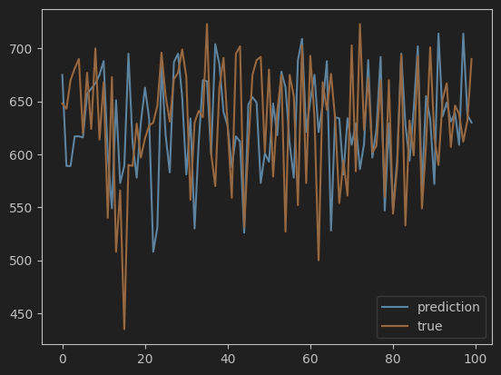
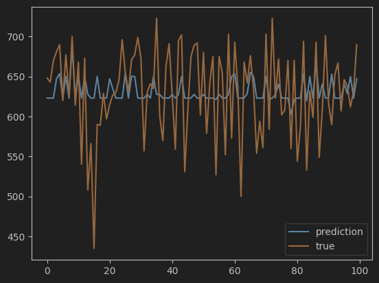
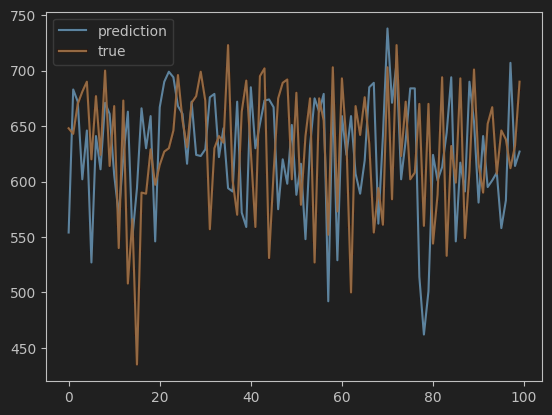
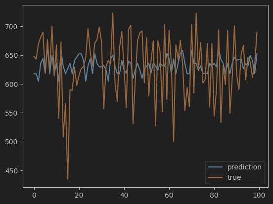

# Лабораторная работа №3. Логическая классификация

В рамках лабораторной работы предстоит реализовать алгоритм построения бинарного решающего дерева и сравнить его с
эталонной реализацией.

На лекции были рассмотрены следующие алгоритмы:

* алгоритм построения бинарного решающего дерева ID3;
* алгоритм редукции дерева;
* алгоритм бинаризации вещественного признака;

## Задание

1. выбрать датасет для классификации, например на [kaggle](https://www.kaggle.com/datasets?tags=13302-Classification);
    1. датасет должен содержать пропуски;
    2. датасет должен содержать категориальные и количественные признаки;
2. реализовать алгоритм построения дерева ID3 с разными критериями:
    1. критерий Донского;
    2. многоклассовый энтропийный критерий;
3. обучить дерево на выбранном датасете;
4. оценить качество классификации;
5. аналогично 1. - 4. решить задачу регрессии;
6. реализовать алгоритм редукции дерева;
7. сравнить качество классификации и регрессии до и после редукции дерева;
8. сравнить с [эталонной](https://scikit-learn.org/stable/) реализацией бинарного решающего дерева;
    1. сравнить качество работы;
    2. сравнить время работы;
9. подготовить небольшой отчет о проделанной работе.

## Примечание про задачу регрессии

В задаче регрессии в качестве меры неопределенности следует использовать среднеквадратичную ошибку. (см. Лекция 3, слайд
29).

## Решение

### 1. Выбрать датасет

[Loan Approval Classification Dataset](https://www.kaggle.com/datasets/taweilo/loan-approval-classification-data)

### 2. Реализовать алгоритм построения дерева ID3 с разными критериями

- [Базовый класс](source/base_decision_tree.py)
- [Классификатор](source/decision_tree_classification.py)
- [Регрессия](source/decision_tree_regression.py)

### 3-8. Обучение деревьев и сравнение реализаций

Полный вывод результатов можно посмотреть в [блокноте](source/main.ipynb)

#### Классификация

| Реализация             | Accuracy | F1 (0) | Время работы, с |
|------------------------|----------|--------|-----------------|
| Без редукции (gini)    | 0.85     | 0.91   | 48.36           |
| Без редукции (donskoy) | 0.85     | 0.91   | 40.81           |
| С редукцией (gini)     | 0.87     | 0.92   | 16.10           |
| С редукцией (donskoy)  | 0.82     | 0.89   | 10.87           |
| SKLearn, без редукции  | 0.85     | 0.90   | 00.12           |
| SKLearn, с редукцией   | 0.89     | 0.93   | 00.07           |

#### Регрессия

| Реализация            | MSE     | Время работы, с | График                                 |
|-----------------------|---------|-----------------|----------------------------------------|
| Без редукции          | 4795.91 | 166.03          |  |
| С редукцией           | 2488.81 | 16.37           |     |
| SKLearn, без редукции | 4948.69 | 00.28           |  |
| SKLearn, с редукцией  | 2361.12 | 00.12           |     |

### Выводы

- Качество реализации сравнимо с реализацией SKLearn как в задаче классификации, так и в задаче регрессии
- Время работы на два порядка ниже, чем у SKLearn. Полагаю, что это из-за лишних вычислений прироста информации
- Редукция вносит ощутимый вклад в задаче регрессии, сильно уменьшая среднеквадратичную ошибку. Однако если посмотреть на графики, то с помощью регрессии нельзя предсказать слишком низкие или слишком высокие результаты из-за усреднения выборки (от этого и амплитуда такая маленькая получается)