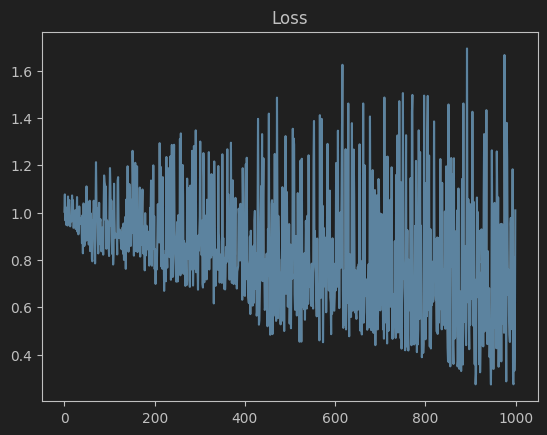
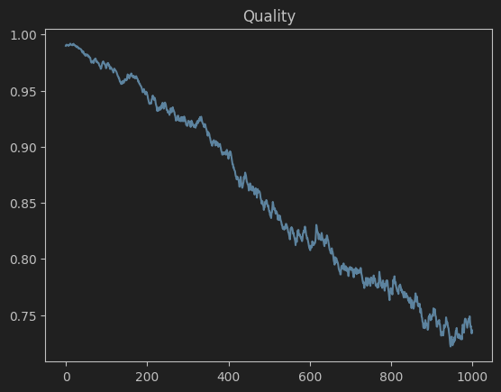
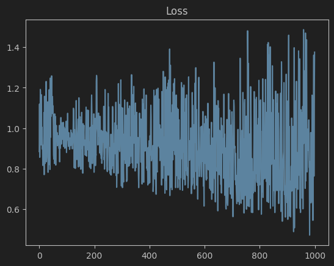
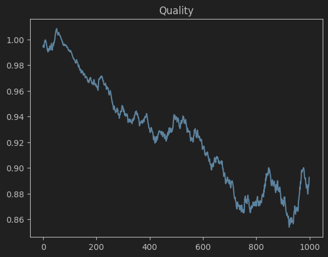
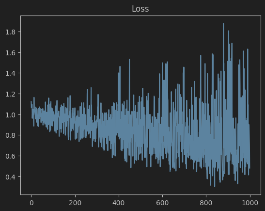
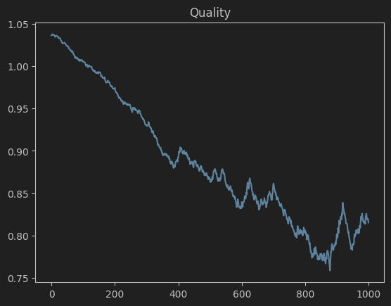
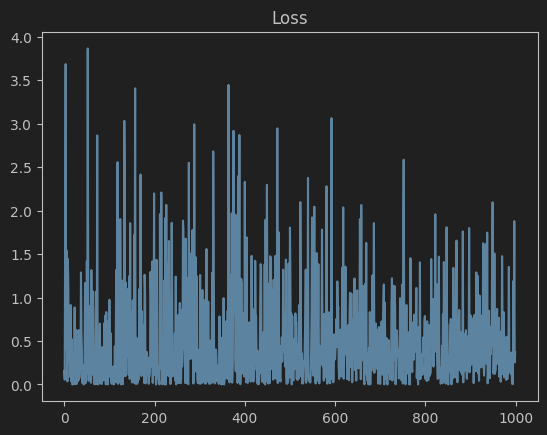
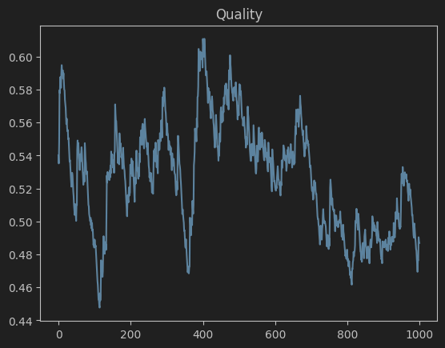
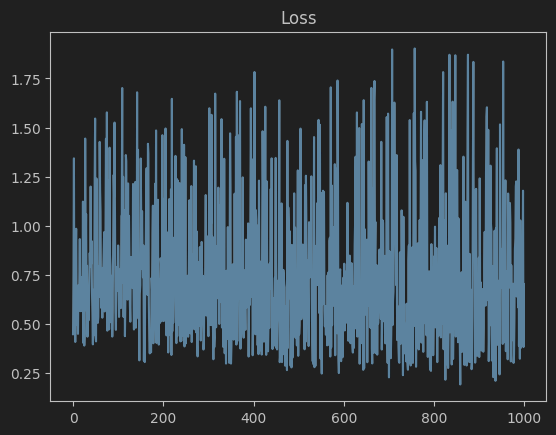
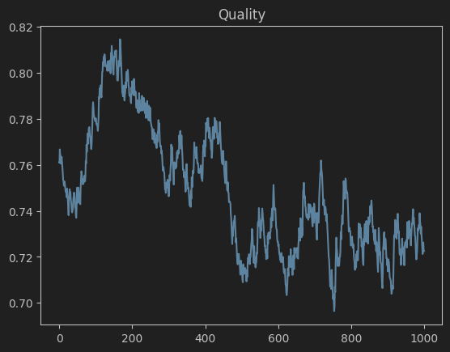

# Лабораторная работа №4. Линейная классификация

В рамках лабораторной работы предстоит реализовать линейный классификатор. И обучить его методом стохастического градиентного спуска с инерцией с L2 регуляризацией и квадратичной функцией потерь.

## Решение

* В качестве датасета был выбран [Heart Disease Prediction](https://raw.githubusercontent.com/kb22/Heart-Disease-Prediction/refs/heads/master/dataset.csv)
* Реализация классификатора приведена в [classifier.py](source/classifier.py)
* Эксперименты и параметры запуска приведены в [main.ipynb](source/main.ipynb)

## Демонстрация работы

### Классификатор с регуляризацией и моментами Нестерова





```
              precision    recall  f1-score   support

          -1       0.80      0.77      0.78        26
           1       0.83      0.86      0.85        35

    accuracy                           0.82        61
   macro avg       0.82      0.81      0.81        61
weighted avg       0.82      0.82      0.82        61
```

#### Классификатор с отступами градиента





```
              precision    recall  f1-score   support

          -1       0.80      0.77      0.78        26
           1       0.83      0.86      0.85        35

    accuracy                           0.82        61
   macro avg       0.82      0.81      0.81        61
weighted avg       0.82      0.82      0.82        61
```

#### Классификатор с рандомным семплированием





```
              precision    recall  f1-score   support

          -1       0.95      0.73      0.83        26
           1       0.83      0.97      0.89        35

    accuracy                           0.87        61
   macro avg       0.89      0.85      0.86        61
weighted avg       0.88      0.87      0.87        61
```

#### Классификатор с весами через корреляцию





```
              precision    recall  f1-score   support

          -1       0.91      0.77      0.83        26
           1       0.85      0.94      0.89        35

    accuracy                           0.87        61
   macro avg       0.88      0.86      0.86        61
weighted avg       0.87      0.87      0.87        61
```

#### Классификатор с весами через мультистарт





```
              precision    recall  f1-score   support

          -1       0.83      0.77      0.80        26
           1       0.84      0.89      0.86        35

    accuracy                           0.84        61
   macro avg       0.84      0.83      0.83        61
weighted avg       0.84      0.84      0.84        61
```

## Сравнение с эталонной реализацией

### Классификатор с весами через корреляцию

```
              precision    recall  f1-score   support

          -1       0.91      0.77      0.83        26
           1       0.85      0.94      0.89        35

    accuracy                           0.87        61
   macro avg       0.88      0.86      0.86        61
weighted avg       0.87      0.87      0.87        61
```

### sklearn.linear_model.SGDClassifier

```
              precision    recall  f1-score   support

          -1       1.00      0.54      0.70        26
           1       0.74      1.00      0.85        35

    accuracy                           0.80        61
   macro avg       0.87      0.77      0.78        61
weighted avg       0.85      0.80      0.79        61
```
