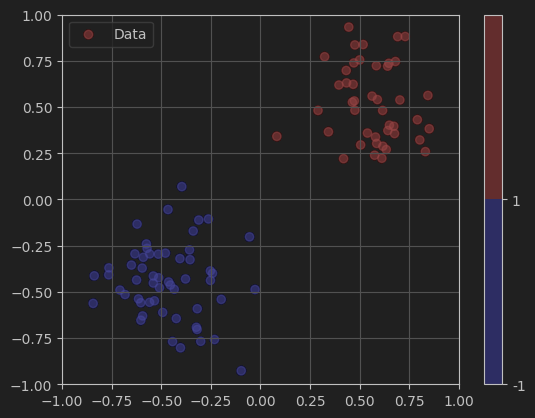
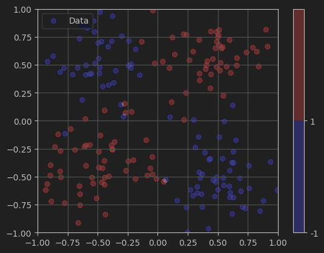
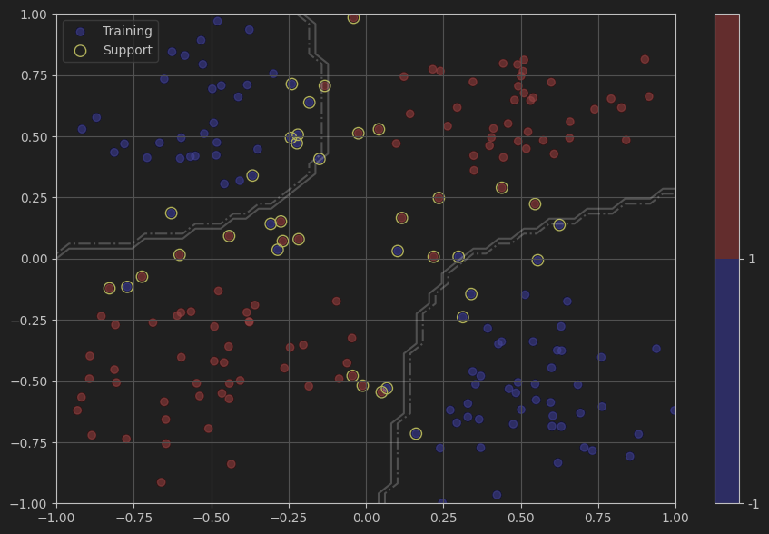
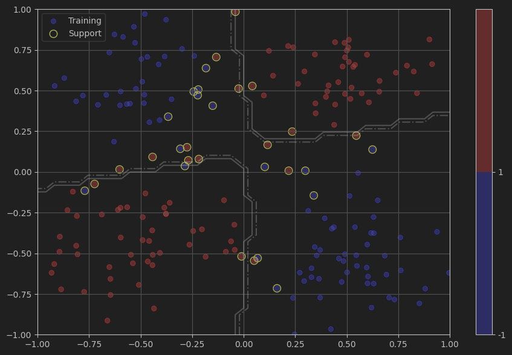

# Лабораторная работа №5. SVM

В рамках лабораторной работы предстоит реализовать SVM и сравнить с эталонной реализацией алгоритма.

## Решение

* В качестве датасета был выбран [Heart Disease Prediction](https://raw.githubusercontent.com/kb22/Heart-Disease-Prediction/refs/heads/master/dataset.csv)
* Реализация SVM приведена в [svm.py](source/svm.py)
* Эксперименты и параметры запуска приведены в [main.ipynb](source/main.ipynb)

## Демонстрация

### Линейное ядро

Исходное распределение



Разбиение


### Гауссово ядро

Исходное распределение



Разбиение



### Полиномиальное ядро

Разбиение




## Запуск 

### Линейное ядро

```
C=0.1, kernel=linear

              precision    recall  f1-score   support

          -1       0.80      0.77      0.78        26
           1       0.83      0.86      0.85        35

    accuracy                           0.82        61
   macro avg       0.82      0.81      0.81        61
weighted avg       0.82      0.82      0.82        61
```

### Гауссово ядро

```
C=0.1, kernel=rbf

              precision    recall  f1-score   support

          -1       0.80      0.77      0.78        26
           1       0.83      0.86      0.85        35

    accuracy                           0.82        61
   macro avg       0.82      0.81      0.81        61
weighted avg       0.82      0.82      0.82        61
```

### Полиномиальное ядро (3)

```
C=0.1, kernel=poly

              precision    recall  f1-score   support

          -1       0.95      0.73      0.83        26
           1       0.83      0.97      0.89        35

    accuracy                           0.87        61
   macro avg       0.89      0.85      0.86        61
weighted avg       0.88      0.87      0.87        61
```

## Сравнение с эталонным решением

### Линейное ядро 

```
              precision    recall  f1-score   support

          -1       1.00      0.74      0.85        31
           1       0.79      1.00      0.88        30

    accuracy                           0.87        61
   macro avg       0.89      0.87      0.87        61
weighted avg       0.90      0.87      0.87        61
```

### Гауссово ядро

```
              precision    recall  f1-score   support

          -1       1.00      0.68      0.81        31
           1       0.75      1.00      0.86        30

    accuracy                           0.84        61
   macro avg       0.88      0.84      0.83        61
weighted avg       0.88      0.84      0.83        61
```

### Полиномиальное ядро

```
              precision    recall  f1-score   support

          -1       0.96      0.77      0.86        31
           1       0.81      0.97      0.88        30

    accuracy                           0.87        61
   macro avg       0.88      0.87      0.87        61
weighted avg       0.88      0.87      0.87        61
```

Реализованные метрики и метрики SKLearn сравнимы между собой, что можно говорить об успешной реализации.
