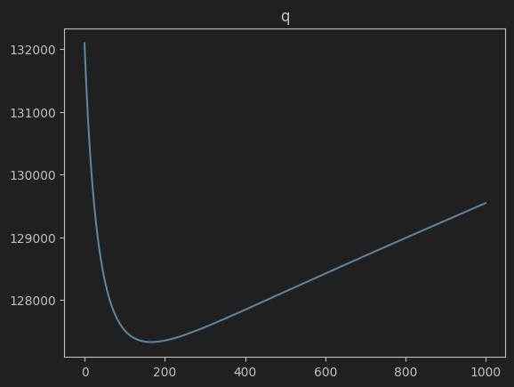
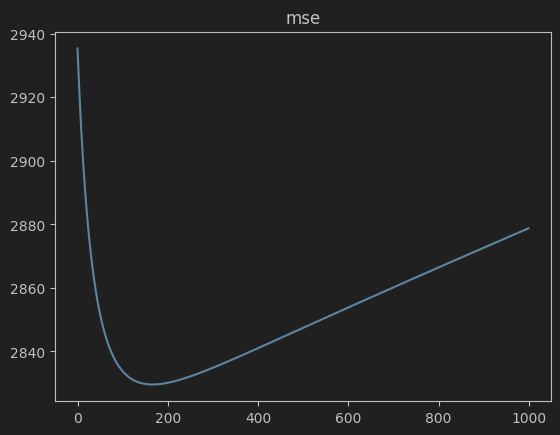
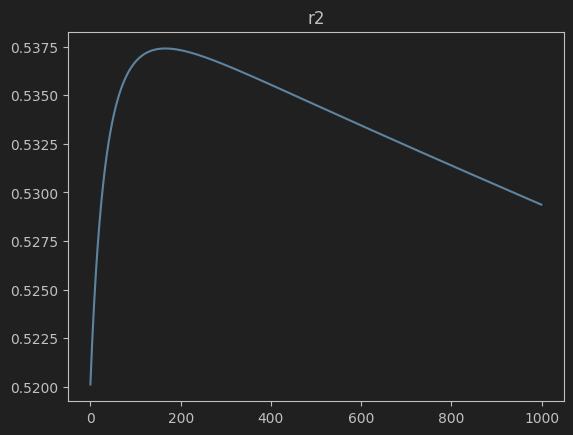
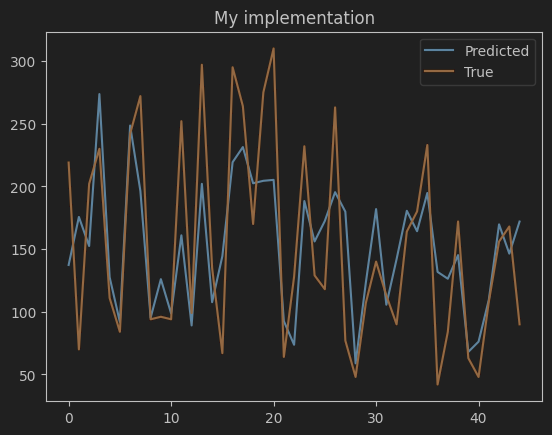
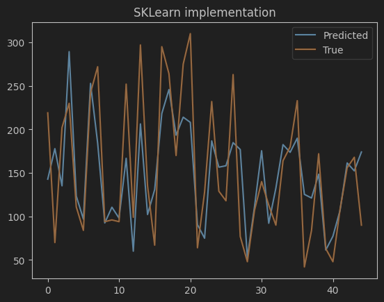

# Лабораторная работа №6. Регрессия

В рамках лабораторной работы предстоит реализовать линейную регрессию и сравнить с эталонной реализацией алгоритма.

## Задание

1. выбрать датасет для линейной регрессии;
2. реализовать решение задачи гребневой регрессии через сингулярное разложение;
3. реализовать оптимальный подбор параметра регуляризации (см. слайд 13);
4. сравнить с эталонным решением;

## Решение

### Датасет

[Diabetes Dataset](https://www.kaggle.com/datasets/mathchi/diabetes-data-set)

Импортируется с помощью `sklearn.datasets`

### Реализация гребневой регрессии

Код гребневой регрессии представлен в файле [ridge_regression.py](source/ridge_regression.py)

```python
import numpy as np


class RidgeRegression:
    def __init__(self, tau: float = 1.0) -> None:
        self.tau = tau
        self.weights_ = None
        self.svd_ = None

    def _compute_svd(self, X: np.ndarray) -> None:
        self.svd_ = np.linalg.svd(X, full_matrices=False)

    def fit(self, X: np.ndarray, y: np.ndarray, tau: float | None = None) -> 'RidgeRegression':
        if not self.svd_:
            self._compute_svd(X)
        if tau is not None:
            self.tau = tau

        U, S, Vt = self.svd_
        S_inv = np.diag(S / (S ** 2 + self.tau))
        self.weights_ = Vt.T @ S_inv @ U.T @ y
        return self

    def predict(self, X: np.ndarray) -> np.array:
        return X @ self.weights_

    def quality(self, X: np.ndarray, y: np.ndarray) -> np.floating:
        return np.linalg.norm(X @ self.weights_ - y) ** 2

```

### Оптимальный подбор параметра регуляризации

Подбор параметра `tau` делается с помощью перебора чисел от 0 до 1000 и нахождением минимального значения функционала

#### Функционал



#### Среднеквадратичная ошибка



#### Коэффициент детерминации



Наилучшее значение функционала модель принимает при `tau=166`

### Сравнение с эталонным решением

Метрики MSE и R2 немного хуже, чем у SKLearn, однако работает быстрее в четыре раза — это историческое событие.

#### Собственная реализация

```
Time 0.00018762517720460892
R2 0.5374111504536094
MSE 2829.60230952483
```



#### Реализация SKLearn

```
Time 0.0006998749449849129
R2 0.5504610920836893
MSE 2749.777331011302
```


