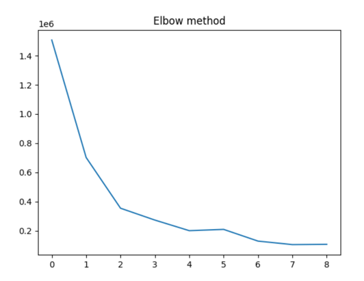
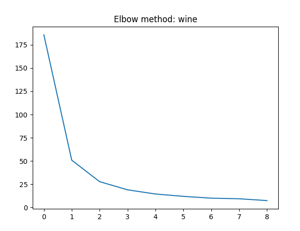

# Лабораторная работа №1. Кластеризация

## Датасеты

### [Latitude and Longitude for Every Country and State](https://www.kaggle.com/datasets/paultimothymooney/latitude-and-longitude-for-every-country-and-state)

## Иерархический алгоритм

* [Agglomerative Hierarchy Algorithm](hierarchy.py)

### Latitude and Longitude for Every Country and State

#### Дендрограмма

#### Оптимальное количество кластеров методом локтя: 3

### Wine Flavanoids-Hue

#### Дендрограмма

#### Оптимальное количество кластеров методом локтя: 2

## Реализации EM и DBSCAN

* [Реализация EM-алгоритма](em.py)
* [Реализация DBSCAN](dbscan.py)

## Задания 4-6

### Latitude and Longitude for Every Country and State

#### Иерархическая кластеризация

##### Моя реализация
Time on MyAgglomerative is 28.5178382396698, intra distance: 46.4795064488434, inter distance: 124.55521496225738

##### Реализация Sklearn 
Time on SK Agglomerative is 0.0011851787567138672, intra distance: 46.903729208444936, inter distance: 129.28855436391325

#### DBSCAN

##### Моя реализация
Time on MyDBSCAN Countries is 0.08959007263183594, intra distance: 70.91766177128424, inter distance: 99.25792436361412

##### Реализация Sklearn
Time on SK DBSCAN Countries is 0.004395008087158203, intra distance: 58.74936670724121, inter distance: 102.88009735856471

#### EM

##### Моя реализация
Time on MyEM Countries is 0.012380838394165039, intra distance: 53.60272550771101, inter distance: 109.2423812962622

##### Реализация Sklearn
Time on SK EM Countries is 0.008035898208618164, intra distance: 44.10995571568893, inter distance: 110.11223250208056

### Wine Flavanoids-Hue

#### Иерархическая кластеризация

##### Моя реализация
Wine My Agglo time: 10.902552843093872, intra distance: 0.7793832272384319, inter distance: 1.8152712524453716

##### Реализация Sklearn 
Wine SK Agglo time: 0.0036041736602783203, intra distance: 0.698133536438323, inter distance: 1.7254413824508592

#### DBSCAN

##### Моя реализация
Time on MyDBSCAN Wine is 0.04693913459777832, intra distance: 0.9799893782288271, inter distance: 1.375366234941942

##### Реализация Sklearn
Time on SK DBSCAN Wine is 0.001043081283569336, intra distance: 0.8774645541259666, inter distance: 1.3203780701470682

#### EM

##### Моя реализация
Time on MyEM Wine is 0.016533851623535156, intra distance: 0.7104276957598752, inter distance: 1.6582335591820132

##### Реализация Sklearn
Time on SK EM Wine is 0.006349086761474609, intra distance: 0.523740831874542, inter distance: 1.5904652624192719

### Сравнительная характеристика

`Моя метрика VS Метрика Sklearn`

* Latitude and Longitude for Every Country and State

| Алгоритм      | Внешнее расстояние | Внутреннее расстояние | Время работы   |
|---------------|--------------------|-----------------------|----------------|
| Иерархическая | 46.479 VS 46.903   | 124.555 VS 129.288    | 28.51 VS 0.01  |
| DBSCAN        | 70.9 VS 58.7       | 99.25 VS 102.8        | 0.089 VS 0.004 |
| EM            | 109.24 VS 110.11   | 53.6 VS 44.10         | 0.012 VS 0.008 |

* Wine Flavanoids-Hue

| Алгоритм      | Внешнее расстояние | Внутреннее расстояние | Время работы   |
|---------------|--------------------|-----------------------|----------------|
| Иерархическая | 1.815 VS 1.725     | 0.779 VS 0.698        | 10.90 VS 0.003 |
| DBSCAN        | 1.375 VS 1.320     | 0.979 VS 0.877        | 0.04 VS 0.001  |
| EM            | 1.658 VS 1.590     | 0.710 VS 0.523        | 0.016 VS 0.006 |

## Заключение

В рамках лабораторной работы были реализованы три алгоритма кластеризации. 
Также были построены linkage-матрицы для иерархического алгоритма и далее дендрограммы и графики "локтя" для определения оптимального количества кластеров.

Результаты иерархической кластеризации примерно совпадают по метрикам, но моя реализация получилась слишком медленной.

Время работы DBSCAN сопоставимо с библиотечной реализацией, но сильно отличаются результаты (количество кластеров и их содержание). 

Реализации EM сопоставимы по скорости и метрикам, но кластеры получилось визуально разными, особенно это заметно для датасета со странами.

Стоит заметить, что выбранные датасеты не предоставляют явно разделимые визуально кластеры, кластеры имеют перемычки и это может объяснить сильные расхождения в работе разных алгоритмов.