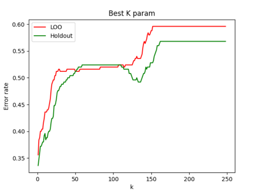

# Лабораторная работа 2

## 1. Датасет
[Updated Pollution Dataset](https://www.kaggle.com/datasets/mujtabamatin/air-quality-and-pollution-assessment)

### Key Features:

- Temperature (°C): Average temperature of the region.
- Humidity (%): Relative humidity recorded in the region.
- PM2.5 Concentration (µg/m³): Fine particulate matter levels.
- PM10 Concentration (µg/m³): Coarse particulate matter levels.
- NO2 Concentration (ppb): Nitrogen dioxide levels.
- SO2 Concentration (ppb): Sulfur dioxide levels.
- CO Concentration (ppm): Carbon monoxide levels.
- Proximity to Industrial Areas (km): Distance to the nearest industrial zone.
- Population Density (people/km²): Number of people per square kilometer in the region.

### Target Variable: Air Quality Levels

- Good: Clean air with low pollution levels.
- Moderate: Acceptable air quality but with some pollutants present.
- Poor: Noticeable pollution that may cause health issues for sensitive groups.
- Hazardous: Highly polluted air posing serious health risks to the population.

## 2. Реализация

Представлена в файле [knn.py](./knn.py)

- Гауссово ядро
- Окно парзена с переменной шириной

## 3. Подбор k при помощи Leave-One-Out
```
k=1, error=[0.34]
k=2, error=[0.35333333]
k=3, error=[0.36333333]
k=4, error=[0.37]
k=5, error=[0.39]
k=6, error=[0.39333333]
k=8, error=[0.39333333]
k=10, error=[0.39333333]
k=7, error=[0.39666667]
k=9, error=[0.39666667]
```
...

## 4. График эмпирического риска

...

## 5. Сравнение с эталонной реализацией.
```
MyKNNClf(k=2) vs KNeighborsClassifier(k=2)
Time: 0.1144249170000009s vs 0.00720237499999854s
Accuracy: 0.652 vs 0.72

MyKNNClf(k=5) vs KNeighborsClassifier(k=5)
Time: 0.11149449999999916s vs 0.003725957999996865s
Accuracy: 0.628 vs 0.688

MyKNNClf(k=10) vs KNeighborsClassifier(k=10)
Time: 0.11267174999999696s vs 0.0036574999999956503s
Accuracy: 0.604 vs 0.64

MyKNNClf(k=30) vs KNeighborsClassifier(k=30)
Time: 0.10937349999999668s vs 0.0039239580000014485s
Accuracy: 0.516 vs 0.64
```

## 6. Выводы

- Сравнение с эталонной реализацией показала, что модель работает весьма точно при маленьких k (чем выше k, тем больше погрешность)
- То же самое можно наблюдать и на графиках риска
- Скорость работы собственной реализации на пару порядков ниже