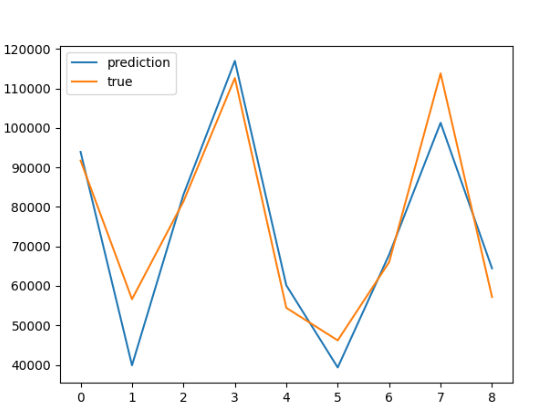
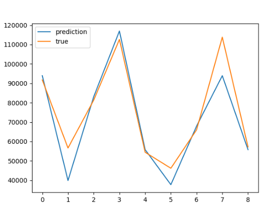
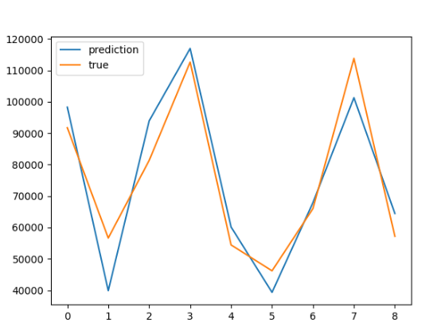
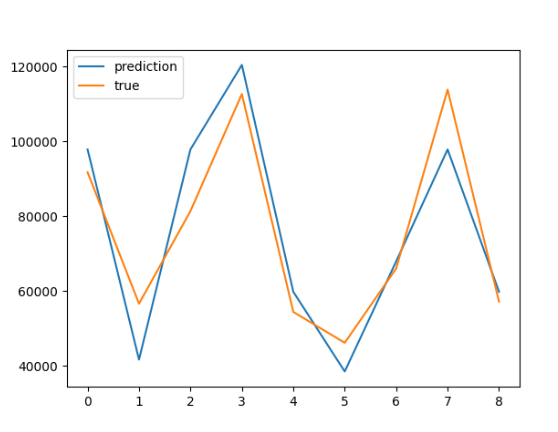

# Лабораторная работа №3. Логическая классификация

В рамках лабораторной работы предстоит реализовать алгоритм построения бинарного решающего дерева и сравнить его с
эталонной реализацией.

На лекции были рассмотрены следующие алгоритмы:

* алгоритм построения бинарного решающего дерева ID3;
* алгоритм редукции дерева;
* алгоритм бинаризации вещественного признака;

## Задание

1. выбрать датасет для классификации, например на [kaggle](https://www.kaggle.com/datasets?tags=13302-Classification);
    1. датасет должен содержать пропуски;
    2. датасет должен содержать категориальные и количественные признаки;
2. реализовать алгоритм построения дерева ID3 с разными критериями:
    1. критерий Донского;
    2. многоклассовый энтропийный критерий;
3. обучить дерево на выбранном датасете;
4. оценить качество классификации;
5. аналогично 1. - 4. решить задачу регрессии;
6. реализовать алгоритм редукции дерева;
7. сравнить качество классификации и регрессии до и после редукции дерева;
8. сравнить с [эталонной](https://scikit-learn.org/stable/) реализацией бинарного решающего дерева;
    1. сравнить качество работы;
    2. сравнить время работы;
9. подготовить небольшой отчет о проделанной работе.

## Примечание про задачу регрессии

В задаче регрессии в качестве меры неопределенности следует использовать среднеквадратичную ошибку. (см. Лекция 3, слайд
29).

## Решение

### 1. Выбрать датасет

[Titanic Dataset](https://www.kaggle.com/datasets/yasserh/titanic-dataset)
[Salary Dataset](https://www.kaggle.com/datasets/abhishek14398/salary-dataset-simple-linear-regression)

### 2. Реализовать алгоритм построения дерева ID3 с разными критериями

[tree.py](tree.py)

### 3-8. Обучение деревьев и сравнение реализаций

#### Классификация

| Реализация                            | Accuracy | F1 (not survived) | Время работы, с |
|---------------------------------------|----------|-------------------|-----------------|
| SELF-WRITTEN, NO REDUCTION: GINI      | 0.70     | 0.75              | 0.103           |
| SELF-WRITTEN, NO REDUCTION: DONSKOY   | 0.61     | 0.65              | 0.047           |
| SELF-WRITTEN, PRE-REDUCTION: GINI     | 0.75     | 0.83              | 0.034           |
| SELF-WRITTEN, PRE-REDUCTION: DONSKOY  | 0.76     | 0.83              | 0.022           |
| SELF-WRITTEN, POST-REDUCTION: GINI    | 0.72     | 0.77              | 0.865           |
| SELF-WRITTEN, POST-REDUCTION: DONSKOY | 0.64     | 0.68              | 0.005           |
| SK, NO REDUCTION: GINI                | 0.73     | 0.78              | 0.004           |
| SK, REDUCTION: GINI                   | 0.74     | 0.81              | 0.003           |

#### Регрессия

| Реализация                 | MSE     | Время работы, с | График                   |
|----------------------------|---------|----------------|--------------------------|
| SELF-WRITTEN, NO REDUCTION | 66625774 | 0.112      |  |
| SELF-WRITTEN, REDUCTION    | 86813239 | 0.073          |     |
| SK, NO REDUCTION           | 88077188 | 0.0732         |    |
| SK, REDUCTION              | 105065105 | 0.062          |       |

### Выводы

В ходе выполнения работы были изучены принципы построения дерева решений.
Построенные деревья использовались для выполнения задач классификации и регрессии.
В обеих задачах реализация показала сравнимый с эталонной реализацией результат: как по времени работы, так и по точности предсказаний.
Также была произведена редукция, которая позволила улучшить результат на несколько процентов в случае с классификацией, но почти не дала заметного результата в случае с регрессией.