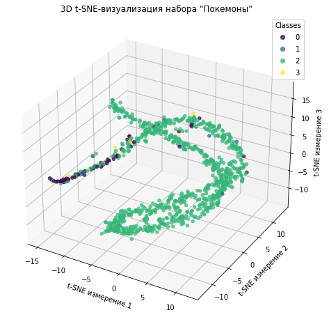
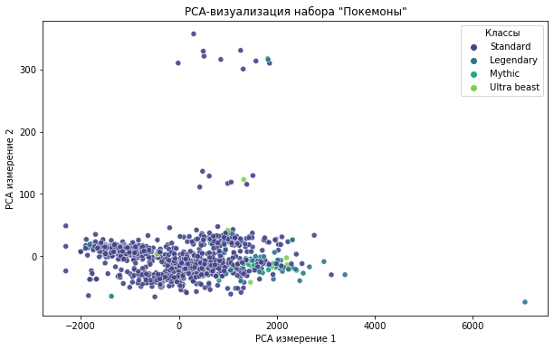
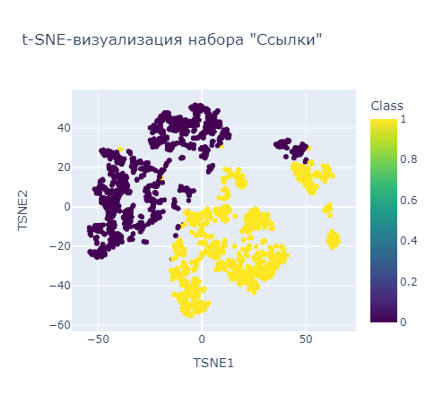
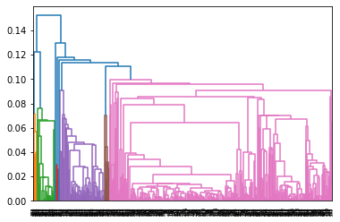
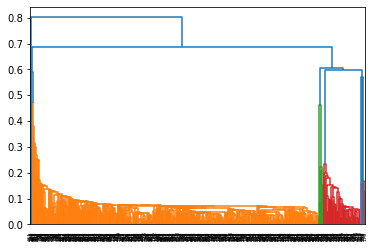

# Лабораторная работа №1 "Алгоритмы кластеризации"

В рамках данной работы был реализован алгоритм иерархической кластеризации, EM-алгоритм и DBSCAN. На выбранных данных была проверена работоспособность этих алгоритмов. Было произведено сравнение разработанных решений и их библиотечных версий. Библиотечные версии показывают то же качество за гораздо более короткое время.

Подробный отчёт с графиками и кодом расположен в [блокноте clusterization](./source/clusterization.ipynb).

В работе были использованы следующие наборы данных:
- [Покемоны](https://www.kaggle.com/datasets/shreyasur965/pokemon-go) - набор с характеристиками вымышленных персонажей (включая тип покемона). t-SNE и PCA визуализации соответственно:

 
- [Ссылки на сайты](https://www.kaggle.com/datasets/sergioagudelo/phishing-url-detection) - набор с текстовыми характеристиками ссылок и метаинформацией доменов сайтов Интернета, в качестве целевой переменной выступает бинарная переменная, сигнализирующая о "фишинговости" ресурса. t-SNE визуализация:

Визуализация наборов показала, что кластеризация на них является затруднительной. Для набора данных "Покемоны" наиболее жизнеспособной гипотезой является кластеризация, при которой часть классов Покемонов отделяется от остальных классов (на визуализации это видно). Для набора "Ссылки" видна возможность кластеризации по заданной целевой переменной "фишинговости" сайта.

На каждом из наборов были применены следуюшие алгоритмы кластеризации:
- Иерархическая кластеризация
- EM-алгоритм
- DBSCAN

Алгоритмы были представлены в 2-ух вариантах: реализованные автором вручную и библиотечные аналоги.

## Отчёт о работе алгоритмов на выбранных наборах данных

### Алгоритм иерархической кластеризации

#### Набор данных "Покемоны"
Денрограмма:

Согласно алгоритму, оптимальное кол-во кластеров - 79. Это подтверждает трудность кластеризации данного набора данных. В дальнейших исследованиях кластеризация проводилась на 2 кластера вопреки рекомендации алгоритма.
##### Авторская реализация
Межкластерное расстояние: 0,85
Внутрикластерное расстояние: 0,19
Время выполнения: 61 с
##### Библиотечная реализация
Межкластерное расстояние: 0,89
Внутрикластерное расстояние: 0,18
Время выполнения: 2,43 мс

#### Набор данных "Ссылки"
Дендрограмма:

Согласно алгоритму, оптимальное кол-во кластеров - 2. Начальная гипотеза о кластеризации по целевой переменной подтверждается.
##### Авторская реализация
Межкластерное расстояние: 11,8

Внутрикластерное расстояние: 8,2

Время выполнения: 80 с
##### Библиотечная реализация
Межкластерное расстояние: 11,8

Внутрикластерное расстояние: 8,2

Время выполнения: 4,64 мс

### EM-алгоритм

#### Набор данных "Покемоны"
##### Авторская реализация
Межкластерное расстояние: 0,89

Внутрикластерное расстояние: 0,18

Время выполнения: 39,8 с
##### Библиотечная реализация
Межкластерное расстояние: 0,89

Внутрикластерное расстояние: 0,18

Время выполнения: 86,4 мс

#### Набор данных "Ссылки"
##### Авторская реализация
Межкластерное расстояние: 11,8

Внутрикластерное расстояние: 8,2

Время выполнения: 7 мин 12 с
##### Библиотечная реализация
Межкластерное расстояние: 10,1

Внутрикластерное расстояние: 7,5

Время выполнения: 149 мс

### DBSCAN

#### Набор данных "Покемоны"
##### Авторская реализация
Межкластерное расстояние: 0,89

Внутрикластерное расстояние: 0,18

Время выполнения: 18,5 сек
##### Библиотечная реализация
Межкластерное расстояние: 0,89

Внутрикластерное расстояние: 0,18

Время выполнения: 40,6 мс

#### Набор данных "Ссылки"
##### Авторская реализация
Межкластерное расстояние: 16.2

Внутрикластерное расстояние: 9.0

Время выполнения: 15 мин 30 с
##### Библиотечная реализация
Межкластерное расстояние: 16.3

Внутрикластерное расстояние: 11.3

Время выполнения: 257 мс

## Выводы
Универсального алгоритма на все наборы данных нет.
Авторские реализации алгоритмов показывают сопоставимое качество, но гораздо меньшую скорость, чем библиотечные варианты.
