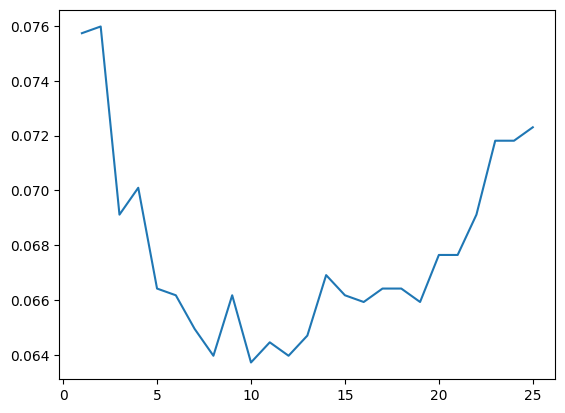

# Лабораторная работа №2 "Метрическая классификация"

В рамках данной работы был реализован алгоритм KNN с методом окна Парзена переменной ширины с гауссовым ядром. Были опробованы 2 версии алгоритма:
* Ширина Парзеновского окна равна ширине до самого дальнего из k соседей
* Ширина Парзеновского окна задаётся гиперпараметром

Реализация была проверена на [наборе данных](https://www.kaggle.com/datasets/taweilo/fish-species-sampling-weight-and-height-data), содаржащем длину, ширину, отношение одного к другому и вид различных особей рыбы.
Методом скользящего контроля был подобран параметр k. Процесс перебора представлен на графике:

Для обеих версий оптимальным вариантом оказался k=10.

Метрика accuracy для авторской и библиотечной версий алгоритма совпала и составила 0,9448529411764706.
Скорость работы авторского алгоритма составила 358 мс.
Для библиотечной версии скорость работы 5,41 мс для режиме по-умолчанию, использующего деревья при поиске ближайших сосдей. Для библиотечной версии в режиме brute, получающую ближайших соседей методом поиска без деревьев, скорость обучения составила 2,44 мс, а скорость предсказания - 18,5 мс.

**Вывод**: авторский алгоритм обладает точно такой же точностью, как и библиотечный, однако работает на порядок дольше.
