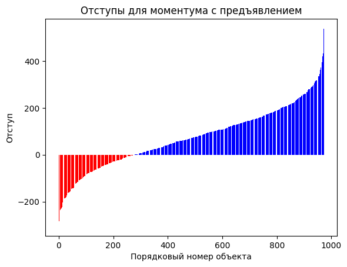
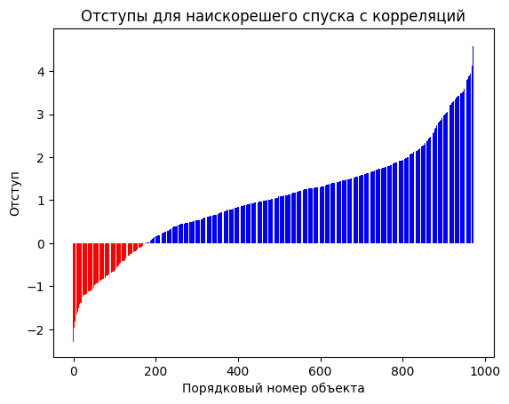

# Лабораторная работа №4 "Линейная классификация"

## Данные

Набор состоит из 973 строк и 15 колонок.

Для задачи классификации в качестве целевой переменной используется колонка `Gender` - пол спортсмена. Значений ровно два: `Male` и `Female`. Сильного дисбаланса не наблюдается: 53% набора данных - мужчины, 47% - женщины.
В качестве признаков использовались все колонки набора, кроме целевой переменной.

## Реализация линейного классификатора

Для дальнейшей работы был создан вспомогательный метод для визуализации отступов объектов от разделяющей гиперплоскости. Результат работы метода для случайной матрицы весов:

Были реализованы методы стохастического градиентного спуска с инерцией и наискорейшего спуска. Была добавлена возможность включения регуляризации, а также были реализованы различные методы инициализации матрицы весов.

Результаты работы метода **стохастического градиентного спуска с инерцией**:

| Модификация | Точность | Норма весов |
| -------- | ------ | ------ |
| Случайная матрица весов        | 0.459   | 490 |
| Регуляризация        | 0.623   | 148 |
| Инициализация через корреляцию       | 0.678   | 482 |
| Мультистарт       | 0.692   | 412 |
| Предъявление по отступу       | 0.702   | 174 |

Видно, что лучшей модификацией метода стохастического градиенного спуска с инерцией себя показала модификация предъявления объектов по модулю отступа. Также видно, что регуляризация действительно уменьшила норму весов.
В целом видно, что все модификации метода дают прирост к качеству. Это доказывает, что сходимость метода сильно зависит от начальной матрицы весов.

Отступы для спуска с инерцией и предъявления по отступу:

Результаты работы метода **наискорейшего градиентного спуска**:

| Модификация | Точность | Норма весов |
| -------- | ------ | ------ |
| Случайная матрица весов        | 0.695   | 1.458 |
| Инициализация через корреляцию       | 0.825   | 1.593 |
| Мультистарт       | 0.777   | 1.766 |
| Предъявление по отступу       | 0.692   | 1.546 |

Наискорейший спуск показал себя на рассматриваемых данных лучше. Лучшая модификация - инициализация через корреляцию. Интересно, что нормы матрицы весов для всех модификаций метода гораздо меньше норм весов спуска с инерцией. Это показывает, что скорейший спуск лучше подбирает шаг по весам и может сам регуляризоваться.

Отступы для наискорейшего спуска с корреляцией:

## Библиотечная версия

В качестве библиотечного аналога был использован `sklearn.linear_model.SGDClassifier`. Для включения режима скорейшего спуска был использован параметр `learning_rate='optimal'`.
При том же количестве итераций точность (accuracy) для моментума составила `0.466`, для наискорейшего спуска - `0.565`, что значительно ниже точности разработанных алгоритмов.
