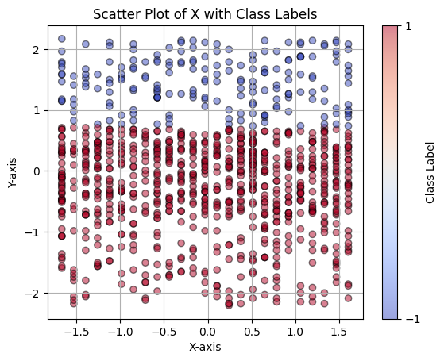
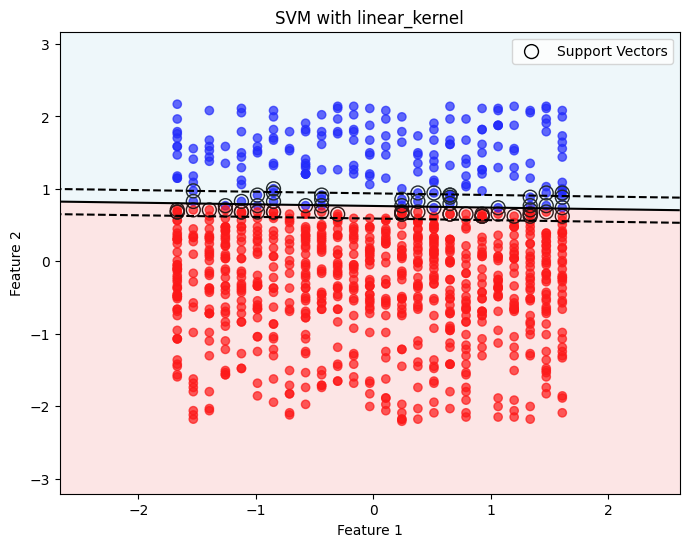
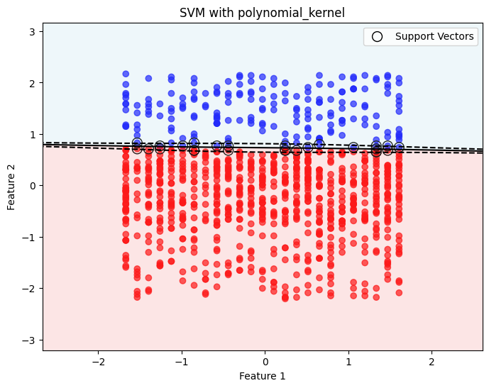
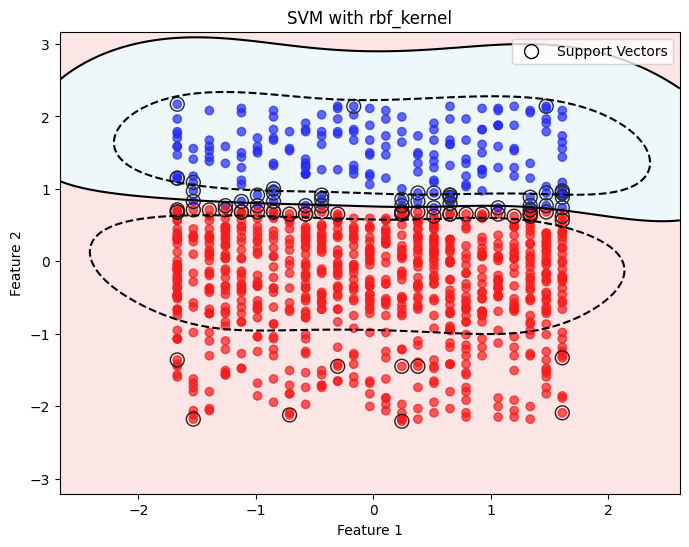

# Лабораторная работа №5 "Метод опорных векторов"

## Данные

[Набор](https://www.kaggle.com/datasets/valakhorasani/gym-members-exercise-dataset) состоит из 973 строк и 15 колонок.

Для задачи классификации в качестве целевой переменной используется преобразованная колонка `Experience_Level` - уровень спортсмена. Уровень 1 записывается в класс 1, уровни 2 и 3 - в класс -1.
В качестве признаков использовались колонки `Resting_BPM` и `Session_Duration (hours)`.

Соответствие значения признаков и классов представлено на графике:

Видно, что данные примерно линейно разделимы.

## Реализация SVM

Был реализован алгоритм SVM с использованием метода `scipy.optimize.minimize` для поиска решения двойственной задачи и выражения из него итоговых весов модели.

Было также реализовано линейное, полиномиальное и радиально-базисное ядро. Результаты представлены на графиках.

Линейное ядро:

Полиномиальное ядро:

Радиально-базисное ядро:

Точность (accuracy) предсказания классов на отложенной тестовой выборке составила `100%`.

## Библиотечная версия

Был использован класс `sklearn.svm.SVC`. Его точность на тестовых данных составила `0.997`. Скорость работы значительно меньше скорости работы ручной реализации (30 мс против 1 минуты).

