# Лабораторная работа №1

# Визуализация данных
### Датасет 1: Iris Clustering
[Ссылка на датасет](https://www.kaggle.com/datasets/uciml/iris)

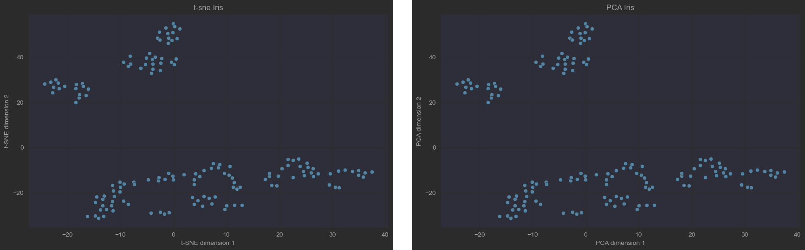

**Гипотеза**: судя по рисунку, алгоритмы должны выделять 3-4 кластера.

### Датасет 2: Mall Customers 
[Ссылка на датасет](https://www.kaggle.com/datasets/shwetabh123/mall-customers)

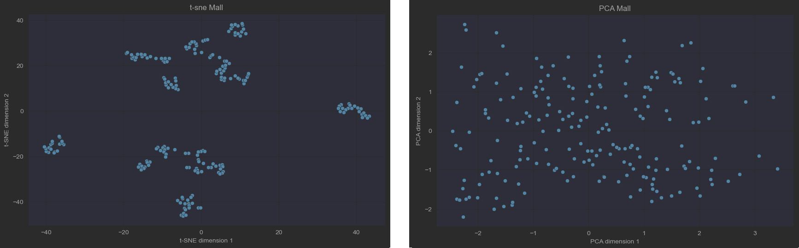

**Гипотеза**: алгоритмы должны выделять 4-5 кластеров. PCA плохо справилcя с визуализацией, у TSNE получились более выделенные результаты. 

# Иерархический алгоритм и дендрограмма
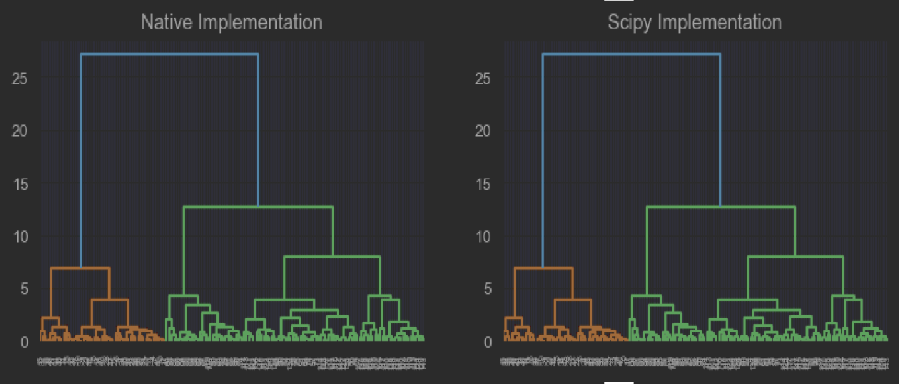
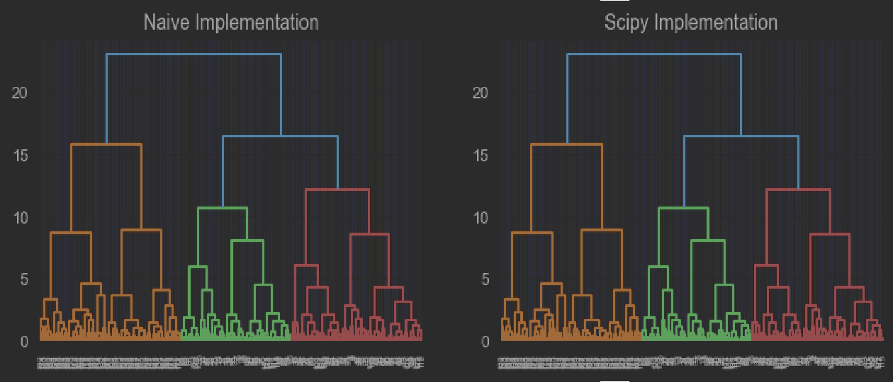

Видно, что дендрограммы, построенные разработанным алгоритмом и его реализацией в scipy аналогичны. 

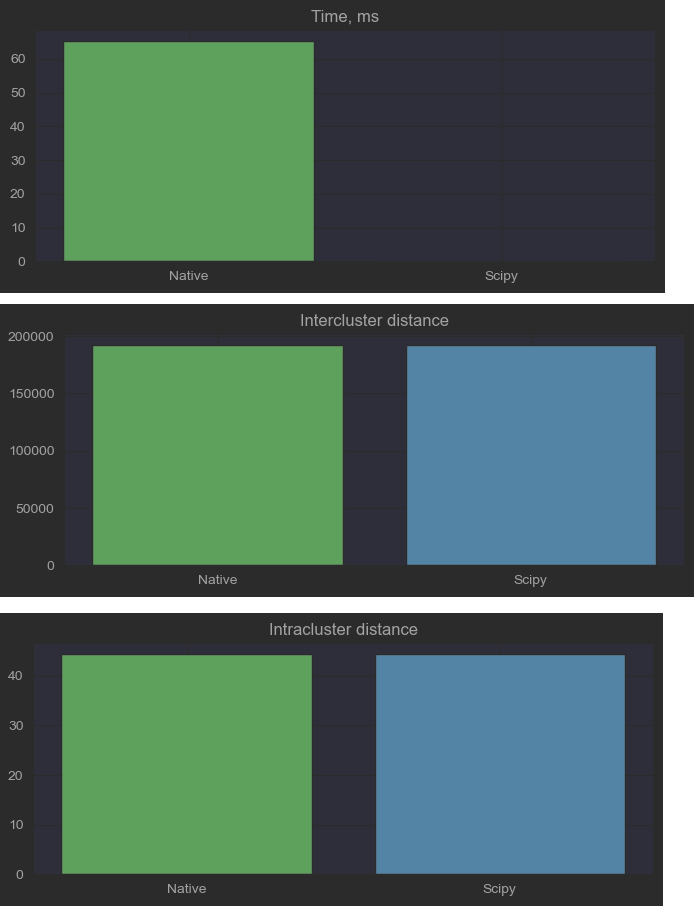
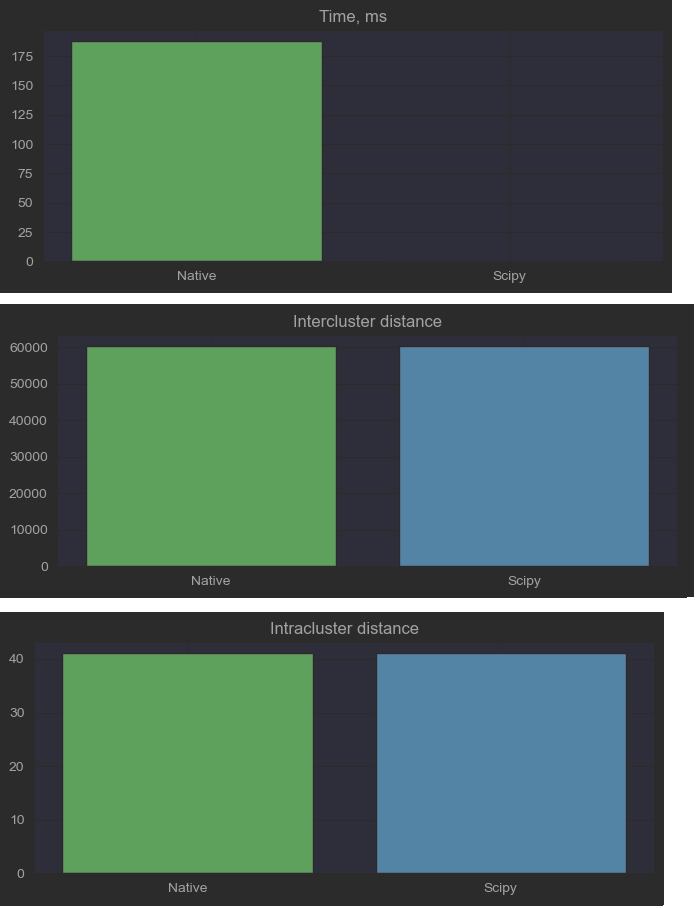

По графикам видно, что среднее растояние между кластерами и внутри них совпадают. Видна большая разница во времени исполнения, реализованный алгоритм значительно медленнее.

Алгоритм также определил оптимальное число кластеров: для IrisClustering - 4 кластера, для Customers - 5.

# EM-алгоритм
### Iris Clustering
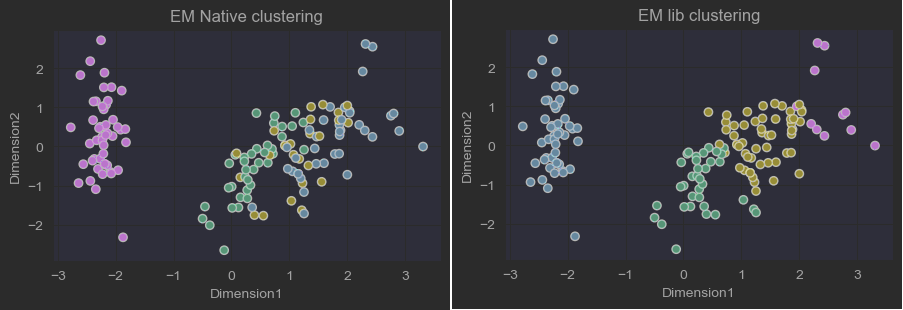

На рисунке показано распределение меток на построенных данных. Данные были преобразованы к стандартному распределению при помощи `StandardScaler` из библиотеки `sklearn`.

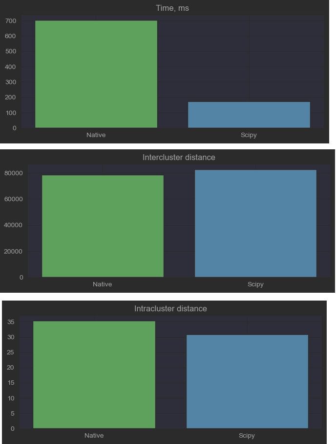

На рисунке показаны метрики. По времени реализованный алгоритм отрабатывает медленнее, расстояния между кластерами почти совпадают, расстояния между кластерами отличаются сильнее

### Customers
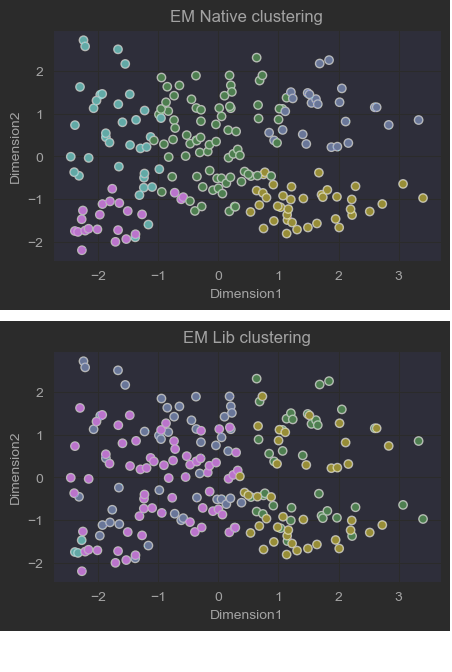

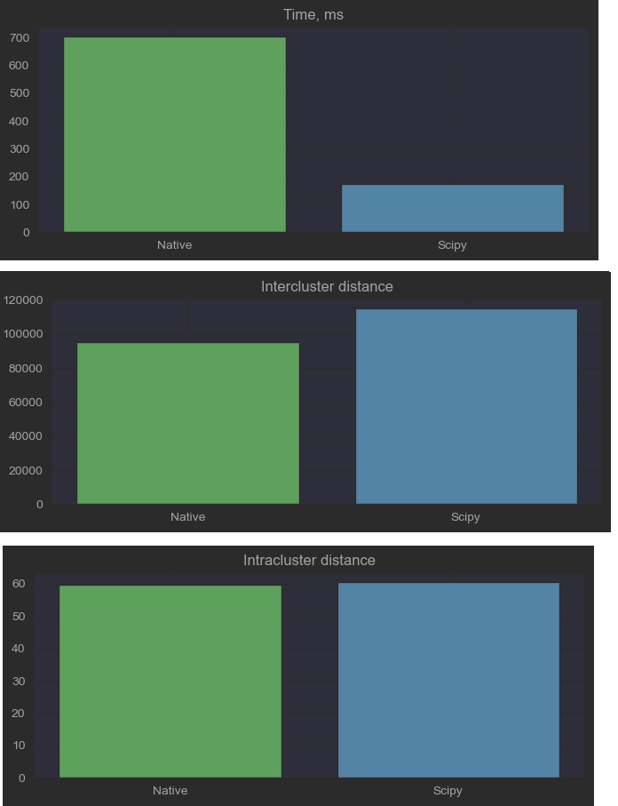

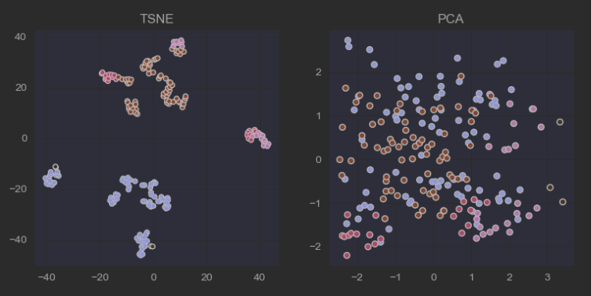

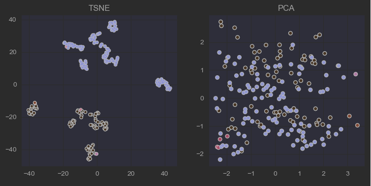

# DBSCAN
### Iris
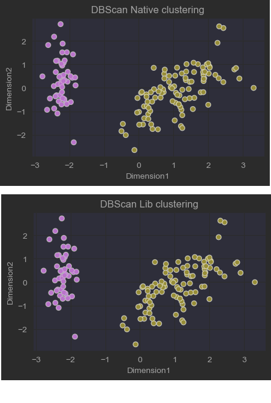

На рисунке показано распределение меток на построенных данных. Здесь `min_samples=15`, `epsilon=1.5`.
### Customers
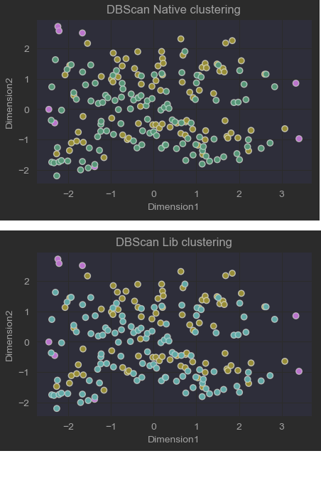

На рисунке показано распределение меток на построенных данных. Здесь `min_samples=15`, `epsilon=1.5`.
