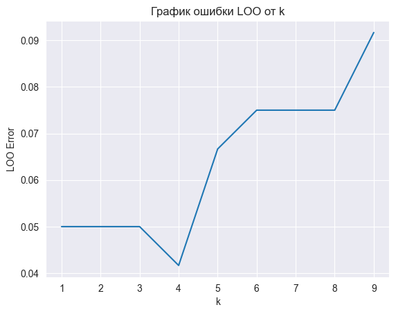

В ходе проделанной лабораторной работы был написан алгоритм классификации. Реализован алгоритм KNN с методом окна Парзена переменной ширины, в качестве ядра использовалось гауссово ядро. K было подобрано с помощью метода LOO.

Метрики качества получились следующие: Accuracy для ручного алгоритма: 90% Precession для ручного алгоритма: 91% Recall для ручного алгоритма: 90%

Accuracy для ручного алгоритма: 93% Precession для ручного алгоритма: 94% Recall для ручного алгоритма: 93%

Следовательно, алгоритмы полностью совпадают по качеству.

Время работы библиотечного алгоритма составило 0.0040 секунды. Время работы написанного алгоритма составило 0.0300 секунды.

Время отличается на 1 порядок.

Также был построен график эмпирического риска для различных k

