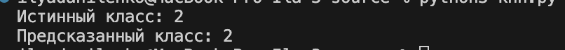
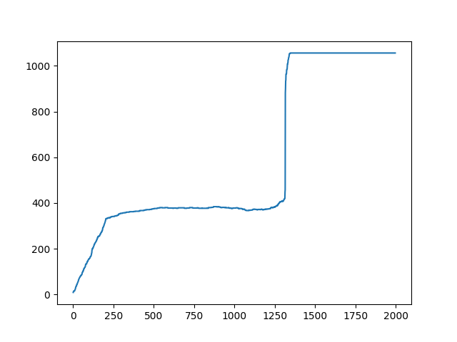
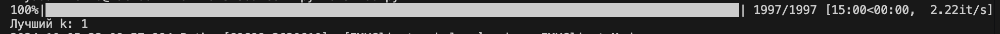
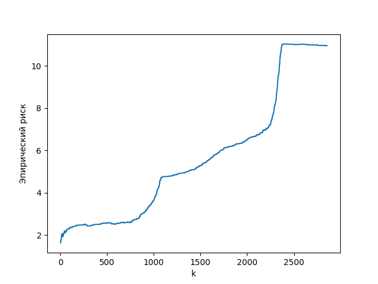
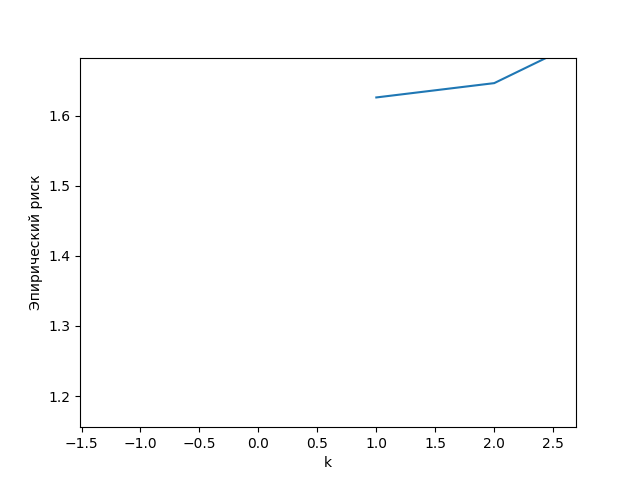
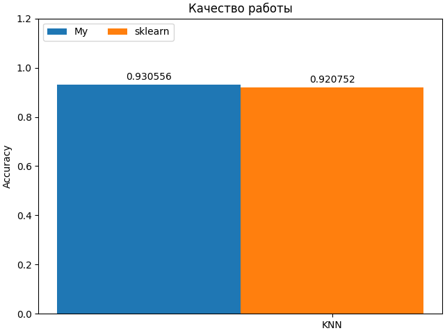
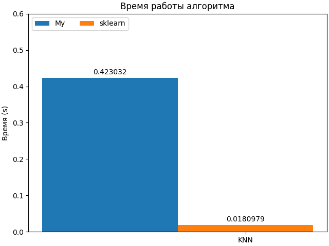

## Lab 2

### Задание 1
Датасет классификации видов рыб по длине, весу b соотношению веса к длине:
https://www.kaggle.com/datasets/taweilo/fish-species-sampling-weight-and-height-data

### Задание 2

Скрипт в котором реализована функция чтения датасета: [read_fish.py](./source/read_fish.py)

Скрипт [knn.py](./source/knn.py) реализует KNN с методом окна Парзена. В качестве ядра взято гаусово ядро. 

Краткие пояснения по коду:
Функция knn принимает аргументами `X` - датасет, `y` - метки классов, `u` - объект(ы) для предсказания, `k` - кол-во соседей.

Внутри реализован KNN, для каждого объекта считается сумма весов его соседей по каждому классу. После чего находится класс с максимальным весом и добавляется в массив предсказаний.

Для теста алгоритма было взят 1001 объект из датасета. Объект исключен из датасета. Данный объект подан в качестве аргумента `u` на вход функции `knn` (`k` = 1).

Вывод программы:

### Задание 3

Скрипт [loo.py](./source/loo.py) реализует метод скользящего контроля.

Краткие пояснения по коду:
Перебирается k от 1 до кол-во объектов -1 в датасете X. Внутри этого перебора происходит поэлементное исключение из датасета объекта, после чего запускается KNN, где в качестве `u` передается исключенный объект, а в качестве `X` и `y` измененный датасет, также считается кол-во ошибок. 

По окончанию перебора k, находится k при котором кол-во ошибок минимально. Также строится график зависимости количества ошибок от k.

График выглядит следующим образом.

`k` с наименьшим количеством ошибок:

### Задание 4
Скрипт [emper.py](./source/emper.py) выводит график эмпирического риска для различных k. В качестве функции потерь взята квадратичная функция. 
С помощью функции `train_test_split` из библиотеки sklearn датасет разделяется на тренировочные данные и тестовые. 
Происходит перебор k от 1, предсказание объектов из тестовой выборки и подсчет эмпирического риска. После чего строится график зависимости ошибки от k.

Приближенный график

По графику видно, что меньшего всего ошибка при `k` = 1.

Ответ: `k` = 1, поскольку ошибка при данном k минимальна.

### Задание 5
Скрипт [metrics.py](./source/metrics.py) производит сравнение эталонного алгоритма (KNeighborsClassifier) и самописного.

По метрике качества (accuracy) - практически одинаковые значения. Самописный даже немного лучше.

По времени - самописный в 42 раза медленней, чем эталонный. 
