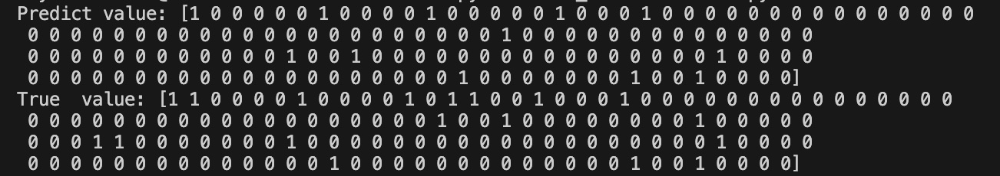
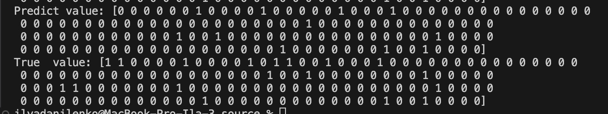
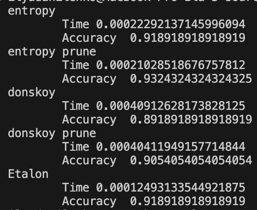
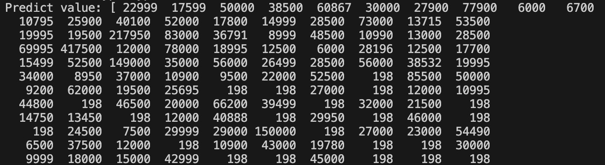
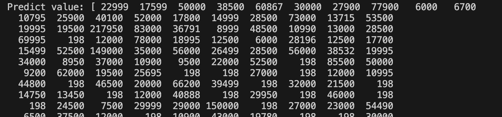
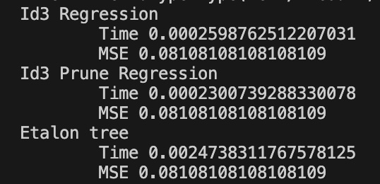

## Lab 3

### Задание 1
Датасет для классификации супергероев из разных комиксов.
https://www.kaggle.com/datasets/shreyasur965/super-heroes-dataset

Классифицировал наличие альтерэго у них. 

Скрипт в котором реализована функция чтения датасета: [read.py](./source/read.py). Функция `read_hero`. Объединял цвет волос вручную и расы. 

### Задание 2, 3, 6 

Скрипт [id3_classification.py](./source/id3_classification.py) реализующий алгоритм построения дерева ID3 с разными критериями. Само дерево реализованно в виде класса `DecisionTreeClassification`. Название критерия (donskoy - критерий Донсокого, entropy - многоклассовый энтропийный критерий) передается в качестве аргумента `method` конструктора класса. Для обучения необходимо использовать метод `fit`. Для предсказаний необходимо использовать метод `predict`. 

Вывод программы:

Редукция дерева реализованна в методе класса `pruning`.

Вывод редуцированного дерева

### Задание 4, 7, 8

Оценка классификации, сравнение редуцированного и не редуцированного дерева, а также сравнение с эталонным решение реализованно в скрипте [metrics_class.py](./source/metrics_class.py). Оценка качества производилась по метрике `accuracy`.

Результат сравнения:

Как видно из скрина, редуцированное дерево по времени и по accuracy немного лучше, чем не редуцированное. Эталонное решение работает в два раза быстрее чем построение по энтропийному критерию, однако accuracy совпадет.

### Задание 5, 6, 7, 8

Для регресии был выбран датасет для предсказания цены на автомобиль с пробегом:
https://www.kaggle.com/datasets/taeefnajib/used-car-price-prediction-dataset

Скрипт [id3_regression.py](./source/id3_regression.py) реализующий алгоритм построения дерева ID3 для решения задачи регрессии. Само дерево реализованно в виде класса `DecisionTreeRegression`. Для обучения необходимо использовать метод `fit`. Для предсказаний необходимо использовать метод `predict`. 

Предсказанные значения:

Реальные значения:

Редукция дерева реализованна в методе класса `pruning`.

Вывод редуцированного дерева.

Оценка регрессии, сравнение редуцированного и не редуцированного дерева, а также сравнение с эталонным решение реализованно в скрипте [metrics_reg.py](./source/metrics_reg.py). Оценка производилась по MSE.

Результаты сравнения:

Как видно из скрина, редуцированное дерево работает быстрее, чем не редуцированное, при этом оценка не падает. Эталонное решение в 10 раз медленнее, чем самописное, при той же самой эффективности.