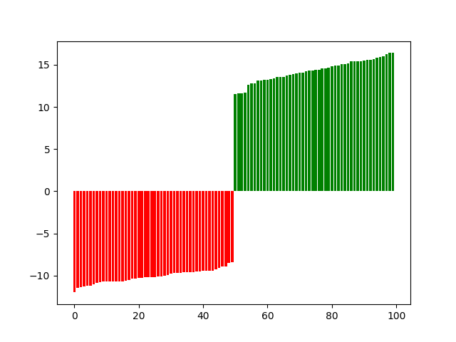
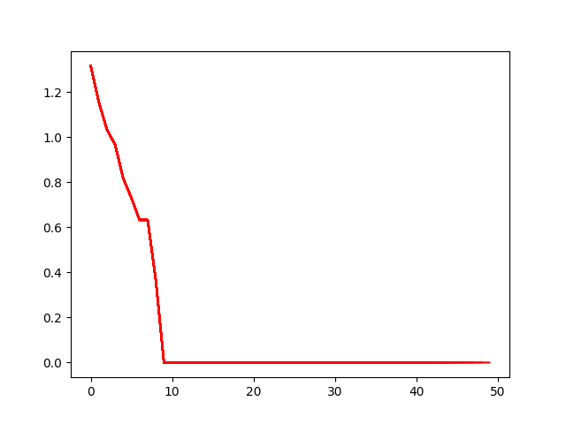
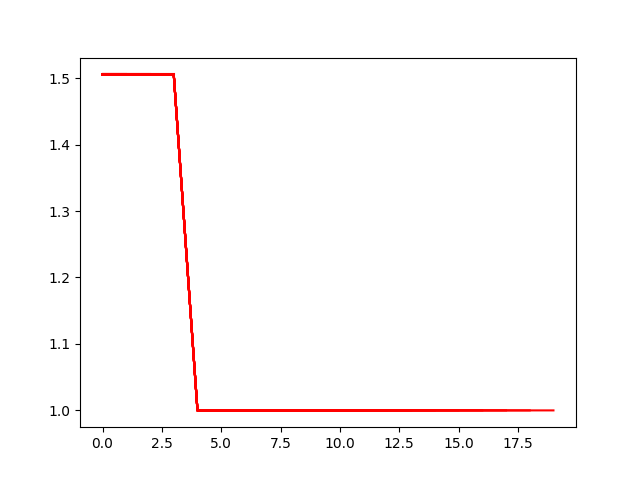
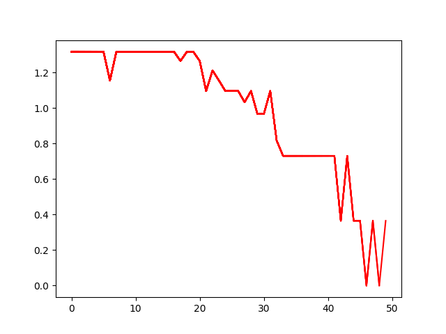
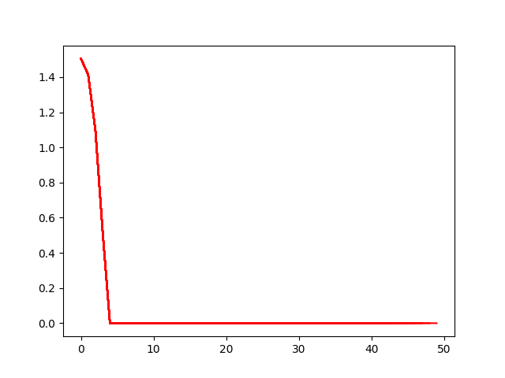
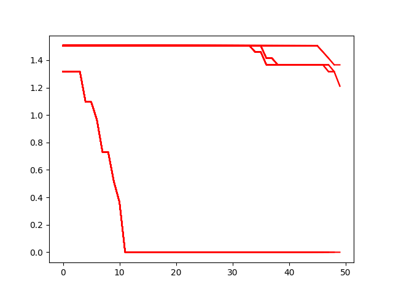
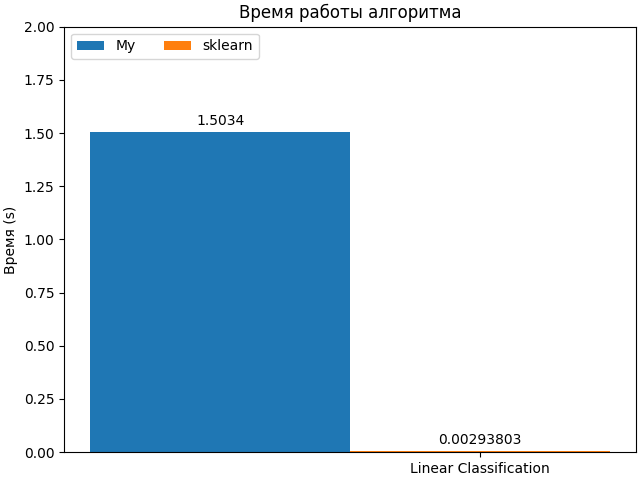
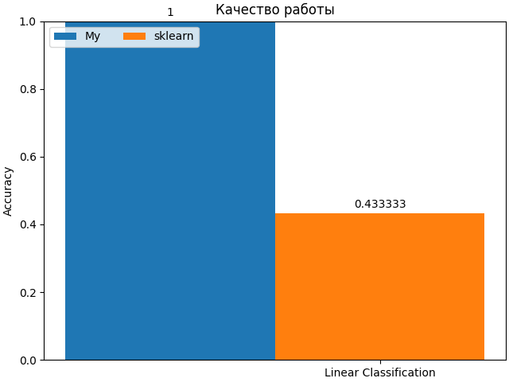

## Lab 4

### Задание 1
Датасет Ирисы.
Оставил только два класса `Iris-setosa` и `Iris-versicolor`

Скрипт в котором реализована функция чтения датасета: [read.py](./source/read.py). Функция `read_data`. С помощью `LabelEncoder` закодировал `Species` - метки классов.

### Задание 2

Вычисление отступов реализовано в скрипте [loss.py](./source/core/loss.py) с помощью статического метода `get` класса `Lin`.

Визуализация:

### Задание 3
Вычисление градиента функции потерь реализованно в скрипте [loss.py](./source/core/loss.py) с помощью статического метода `dget` класса `Lin`.

### Задание 4
Рекуррентную оценку функционала качества реализована в классе `LinearClassificator` в скрипте [model.py](./source/core/model.py) в методе `_backprop`.

### Задание 5
Метод стохастического градиентного спуска с инерцией реализован в скрипте [optim.py](./source/core/optim.py) - класс `MomentumSGD`.

Пример работы Линейного классификатора с Momentum: скрипт [momentum.py](./source/momentum.py).

График потерь (RMSE):

### Задание 6
L2 регуляризация реализована в скрипте [regular.py](./source/core/regular.py) - класс `L2`. Применяется регуляризация в методе `_backprop` класса `LinearClassificator` в скрипте [model.py](./source/core/model.py).

Пример работы Линейного классификатора с Momentum и L2: скрипт [momentum_l2.py](./source/momentum_l2.py).

График потерь (RMSE):

### Задание 7
Cкорейший градиентный спуск реализован в скрипте [optim.py](./source/core/optim.py) - класс `FastGD`

Пример работы Линейного классификатора с FastGD: скрипт [fastgd.py](./source/fastgd.py)

График потерь (RMSE):

Примечание: на данной задаче работает плохо, веса в процессе обновления принимают гигантские значения.

### Задание 8
Предъявление объектов по модулю отступа реализованы функцией `get_batches_margins` в скрипте [utils.py](./source/core/utils.py). На вход функция принимает X и y датасета и вес модели, на выходе генератор выдающий батч для обучения.

Функция применена в классе `LinearClassificatorModule` в скрипте [model.py](./source/core/model.py) в методе `train`. Класс `LinearClassificatorModule` унаследован от класса `LinearClassificator`, переопределен метод `train` для работы с предъявлением объектов по модулю отступа.

Пример работы Линейного классификатора с предъявлением объектов по модулю отступа: скрипт [modules.py](./source/modules.py)

График потерь (RMSE):

### Задание 9
i. Инициализация весов через корреляцию реализована классом `CorrelationWeightGenerator` - скрипт [weights.py](./source/core/weights.py). Пример работы Линейного классификатора с инициализацией весов через корреляцию: скрипт [correlation.py](./source/correlation.py).

График потерь (RMSE):

ii. Мультистарт реализован классом `Multistart` в скрипте [model.py](./source/core/model.py). После обучения, можно получить лучшую модель класса `LinearClassificator` с наилучшими параметрами стартовых весов и дообучить ее. Или же получить стартовые веса с помощью метода `get_best_w_b`. Пример работы мультистарта (обучил все модели полностью, можно не полностью, просто как пример работы): скрипт [multistart.py](./source/multistart.py)

График потерь всех моделей (RMSE) - модель, которая обучилась до 0 сохранена:

iii. Случайное предъявление реализовано классом `RandomWeightGenerator` - скрипт [weights.py](./source/core/weights.py). Пример работы Линейного классификатора с случайным предъявлением был показан в заданиях 5-8.

### Задание 10
За эталон был взят `SGDClassifier` из библиотеки `sklearn`. Сравнение производилось с моделью линейного классификатора, обученного Momentum, с инициализацией весов через корреляцию, L2 регуляризацией.

Время работы:

Видно, что моя реализация сильно медленнее эталона.

Точность работы (метрика accuracy):

Точность моей реализации сильно выше чем эталонная.