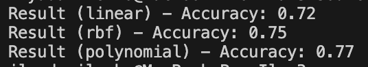
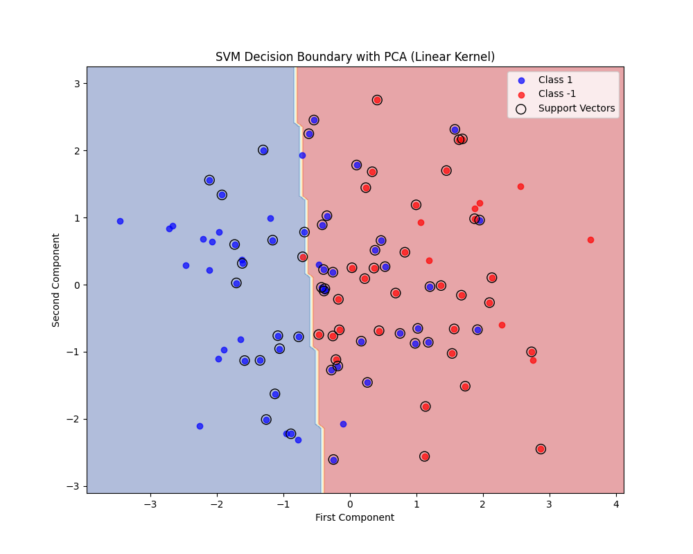
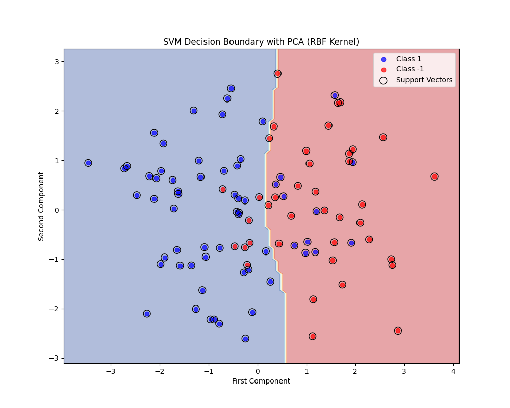
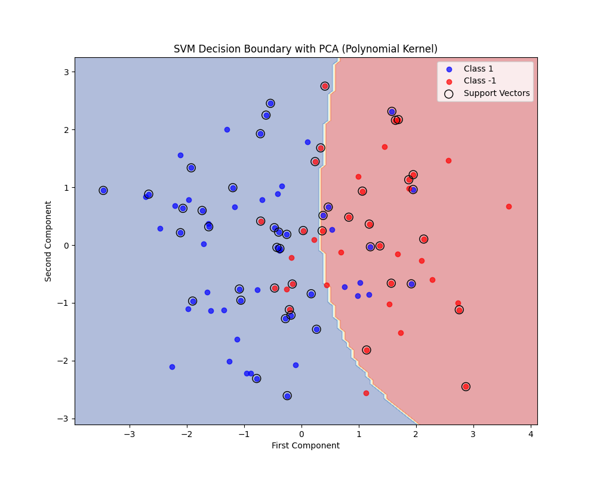
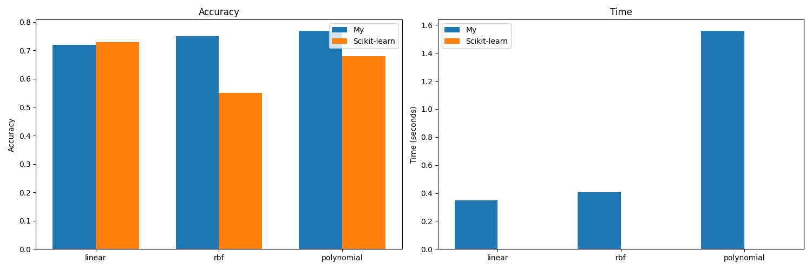

## Lab 5

### Задание 1
Датасет для бинарной классификации депрессии у студентов:
https://www.kaggle.com/datasets/hopesb/student-depression-dataset?resource=download

Скрипт в котором реализована функция чтения датасета: [read.py](./source/read.py). Функция `read_student`.

### Задание 2-4
Решение двойственной задачи реализованно классом `SVM` из скрипта [dual.py](./source/dual.py). Линейное ядро реализовано в методе `__linear_kernel`. RBF ядро реализовано в методе `__rbf_kernel`. Полиномиальное ядро реализовано в методе `__polynomial_kernel`. Конструктор класса принимает тип ядра в качестве строкового аргумента, далее для всех ядер ожидается `C`, для rbf ожидается `gamma`, для полиномиального ожидается `gamma`, `r`, `d`. Метод `solve` просчет параметры разделяющей гиперплоскости. Метод `predict` позволяет выполнить предсказание классов.

Точность предсказаний классификации с разными ядрами:

### Задание 5
Визуализация реализована в скрипте [vis.py](./source/vis.py). Для визуализации используется `PCA`.

На визуализации видно отображение разделяющей плоскости, синее поле - есть депрессия, красное поле - нет депрессии. Черным обведены опорные вектора. Данные раскрашены в соответствии с их истинными метками класса. 

С линейным ядром:

С RBF ядром:

С полиномиальным ядром:

### Задание 6
Сравнение происходит в скрипте [compare_svm.py](./source/compare_svm.py). За эталон взят `SVC` из библиотеки `sklearn`.

Результаты сравнения по точности и по времени работы:

Как видно из график, при линейном ядре - эталон справляется лучше, при rbf и полиномиальном ядре - моя реализация справляется сильно лучше эталонной (скорее всего потому что я использовал в качестве метода минимизации `BFGS`, улучшая метрики под конкретно этот датасет, на другом датасете скорее всего результат будет хуже или сравним). По времени эталонная реализация работает сильно лучше, поскольку класс `SVC` из библиотеки `sklearn` является оберткой над С++ библиотекой libsvm.