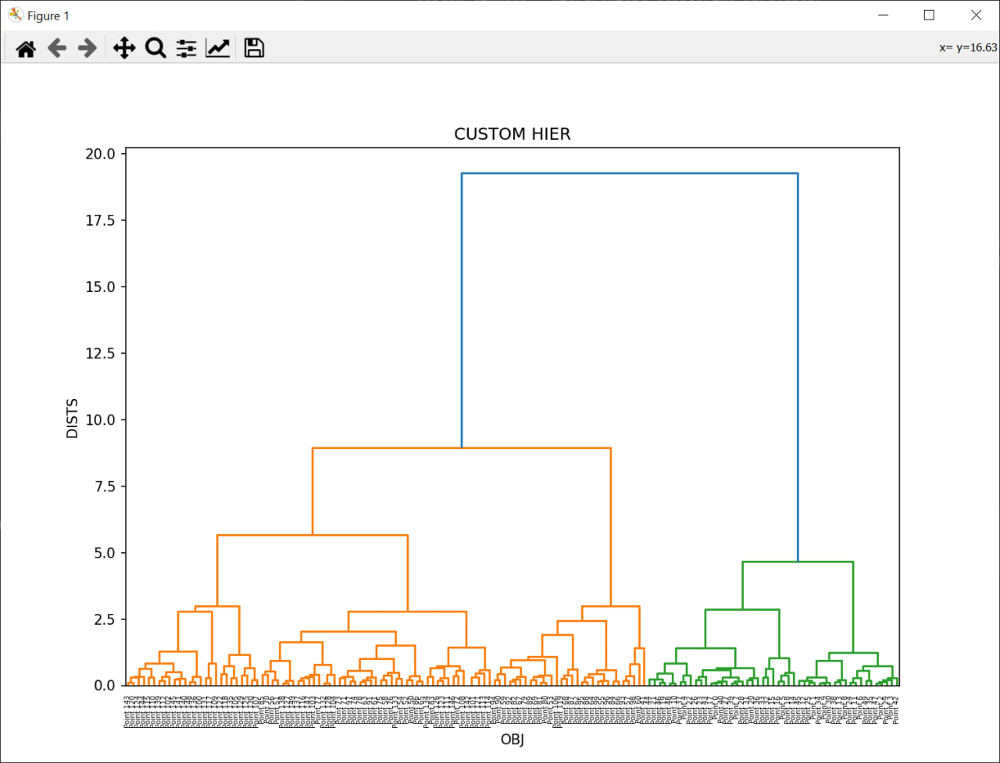
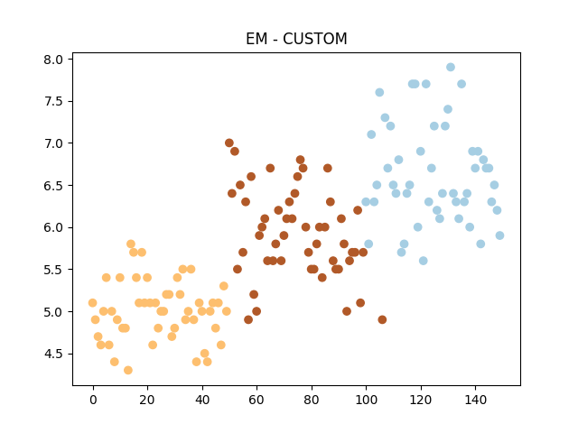
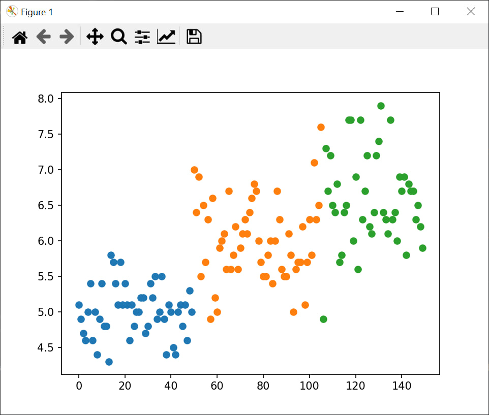
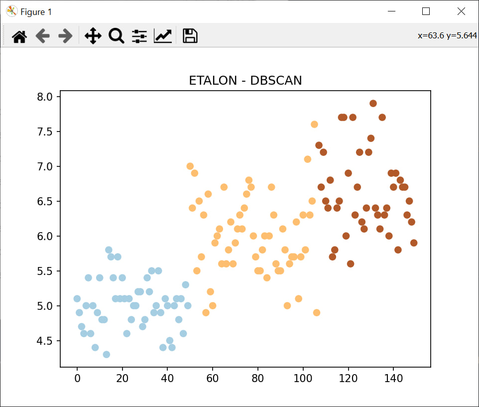

# Лабораторная работа №1 "Алгоритмы кластеризации"

В рамках данной работы был реализован алгоритм иерархической кластеризации, EM-алгоритм и DBSCAN. На выбранных данных была проверена работоспособность этих алгоритмов. Было произведено сравнение разработанных решений и их библиотечных версий. Библиотечные версии показывают то же качество за гораздо более короткое время.

## Датасет

Для тестирования алгоритмов кластеризации были выбраны [Ирисы Фишера](https://archive.ics.uci.edu/ml/datasets/iris) - классический набор данных с характеристиками цветков ириса (включая длину и ширину чашелистиков и лепестков).

На каждом из наборов были применены следуюшие алгоритмы кластеризации:
- Иерархическая кластеризация
- EM-алгоритм
- DBSCAN

## Отчёт о работе алгоритмов на выбранных наборах данных

### Алгоритм иерархической кластеризации

В дальнейших исследованиях кластеризация проводилась на 3 кластера. Использовалось расстояние Уорда.

#### Набор данных "Ирисы"
Дендрограмма:

| TYPE    | EXEC TIME | DISTANCE INSIDE CLUSTER | DISTANCE BETWEEN CLUSTERS |
|---------|-----------|--------------------------|---------------------------|
| CUSTOM  | 0.616799  | 1.232167                | 2.831389                  |
| ETALON  | 0.006281  | 1.232167                | 2.831389                  |

### EM-алгоритм

В дальнейших исследованиях кластеризация проводилась на 3 кластера.

#### Набор данных "Ирисы"

| TYPE    | EXEC TIME | DISTANCE INSIDE CLUSTER | DISTANCE BETWEEN CLUSTERS |
|---------|-----------|--------------------------|---------------------------|
| CUSTOM  | 0.000998  | 17.225181               | 66.999387                 |
| ETALON  | 0.122774  | 17.077051               | 66.747250                 |

#### Визуализация результата работы EM - кастомная реализация

#### Визуализация результата работы EM - библиотечная реализация

### DBSCAN

DBSCAN был запущен со следующими параметрами:

- min_points = 5
- epsilon = 3

#### Набор данных "Ирисы"

| TYPE    | EXEC TIME | DISTANCE INSIDE CLUSTER | DISTANCE BETWEEN CLUSTERS |
|---------|-----------|--------------------------|---------------------------|
| CUSTOM  | 0.002517  | 17.086058               | 68.745253                 |
| ETALON  | 0.005809  | 17.084618               | 69.079002                 |

#### Визуализация результата работы DBSCAN - кастомная реализация

#### Визуализация результата работы DBSCAN - библиотечная реализация

