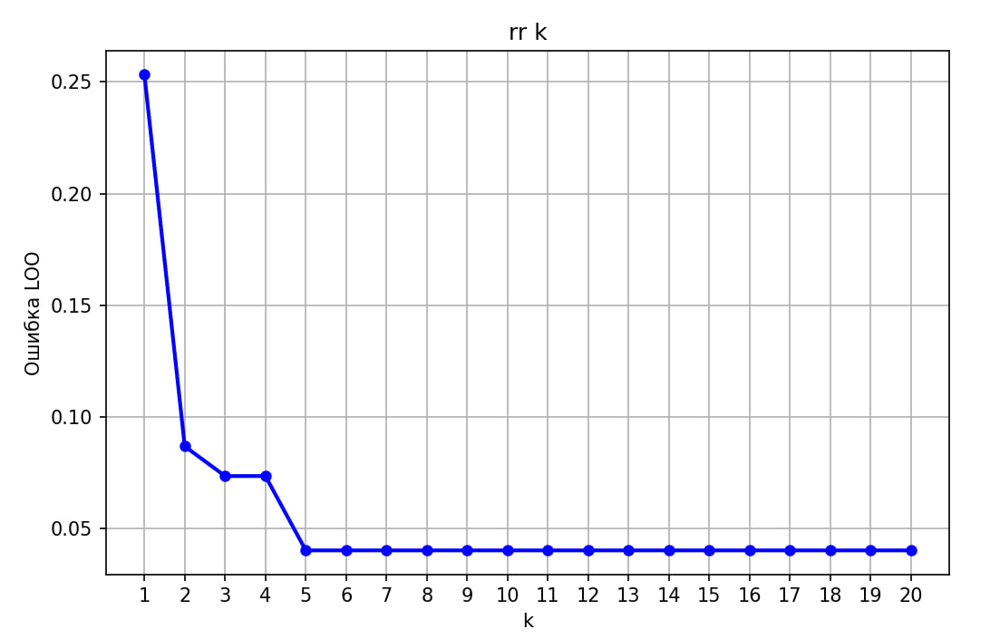

# Лабораторная работа №2: «Метрическая классификация»

## Цель работы
Целью данной лабораторной работы является реализация алгоритма метрической классификации, а именно метода ближайших соседей (k-Nearest Neighbors, KNN) с использованием окна Парзена переменной ширины, основанного на гауссовом ядре. Также проводится сравнение производительности и точности разработанного алгоритма с аналогом, представленным в библиотеке `scikit-learn`.

## Реализация алгоритма
В рамках лабораторной работы был реализован алгоритм KNN с методикой окна Парзена, что позволило адаптировать ширину окна в зависимости от плотности объектов в окрестности целевой точки. Для ядра использовалась гауссовая функция, обеспечивающая плавное уменьшение веса соседних точек по мере увеличения расстояния до них.

## Датасет для проверки
В качестве данных для проверки корректности реализации был выбран классический [набор данных «Ирисы Фишера»](https://www.kaggle.com/datasets/vikrishnan/iris-dataset), который представляет собой один из стандартных наборов для задач классификации.

## Подбор гиперпараметров
Для выбора оптимального значения гиперпараметра \( k \) (число ближайших соседей) использовался метод скользящего контроля (cross-validation). В ходе экспериментов было проведено множество запусков алгоритма с разными значениями \( k \). Процесс поиска оптимального значения и его влияние на метрику качества визуализирован на графике:

## Оценка точности алгоритма
Для оценки точности классификации использовалась метрика `accuracy`. В результате тестирования точность кастомной реализации и реализации из библиотеки `scikit-learn` совпала и составила **0.9667**.

## Сравнение производительности
Производительность алгоритмов была оценена на одном и том же наборе данных. Время выполнения алгоритма составило:
- **Кастомная реализация**: 0.00099 с
- **`scikit-learn`**: 0.00099 с

Это свидетельствует о том, что реализованный алгоритм по скорости работы не уступает библиотечной версии, сохраняя при этом идентичную точность классификации.

## Выводы
В ходе лабораторной работы был реализован алгоритм KNN с окном Парзена переменной ширины, адаптированным под использование гауссова ядра. Алгоритм был успешно протестирован на наборе данных «Ирисы Фишера», где продемонстрировал высокую точность и производительность, сопоставимую с библиотечным аналогом из `scikit-learn`. Таким образом, данная работа продемонстрировала возможности создания собственных метрических алгоритмов классификации, их оптимизации и сравнения с готовыми библиотечными решениями.
