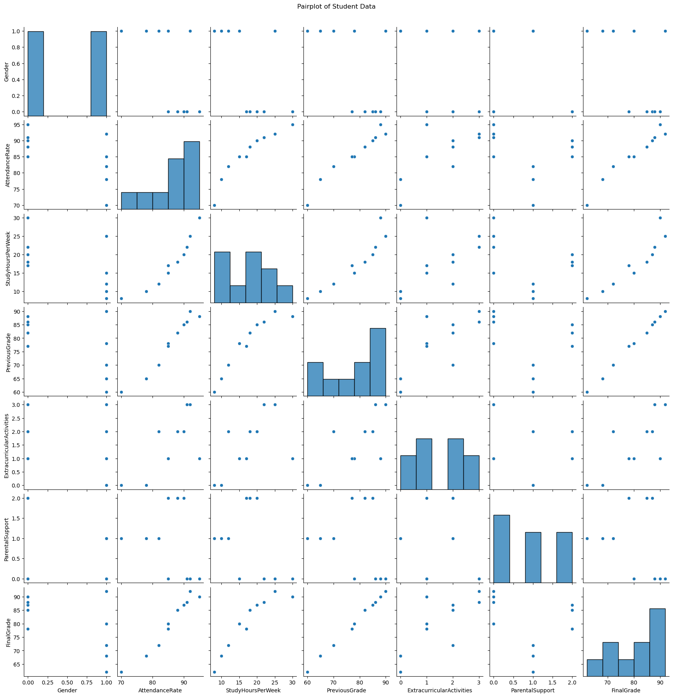
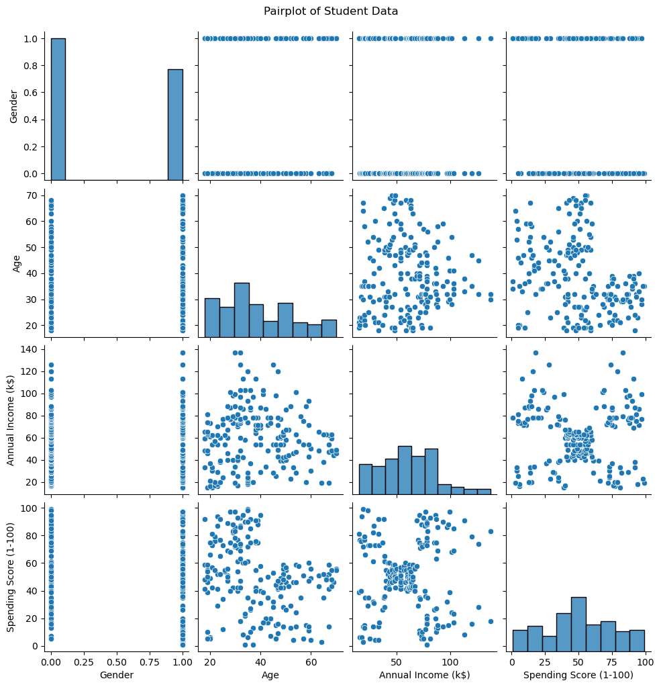
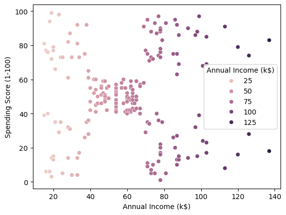
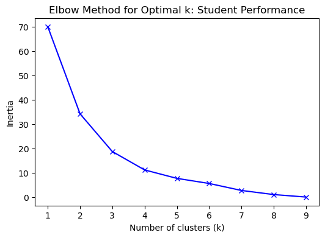
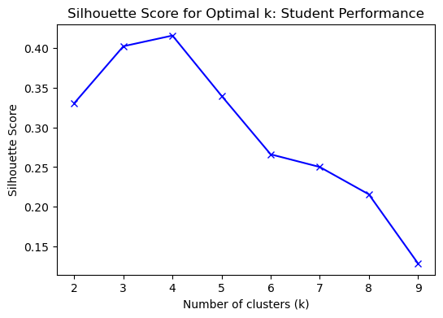
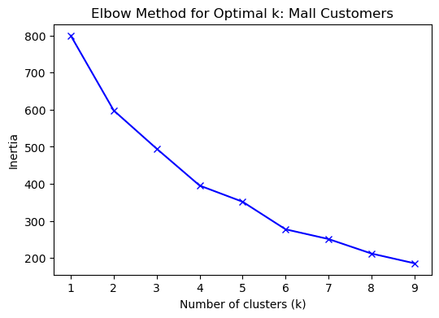
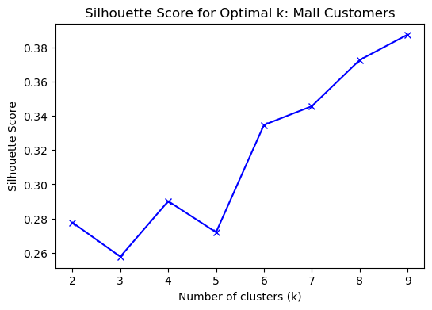
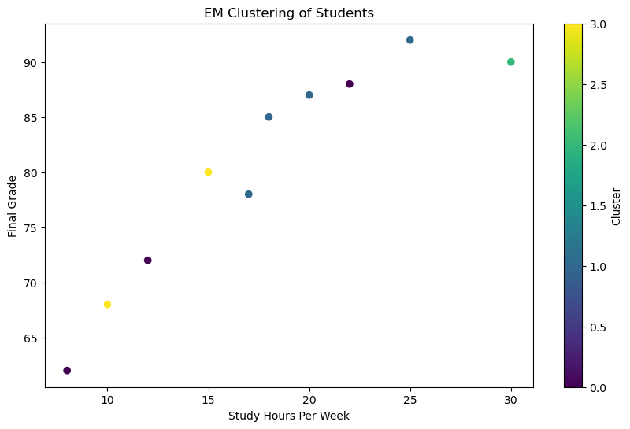
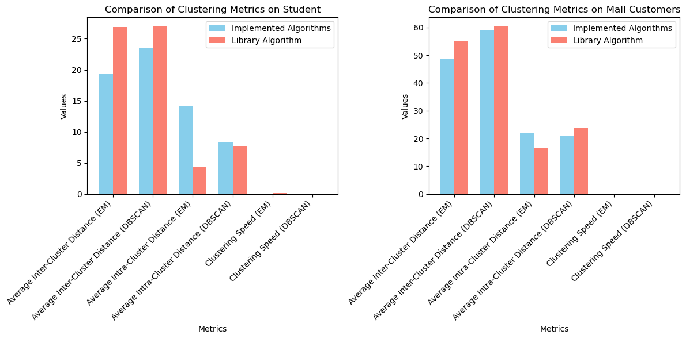

### **Lab #1 Clustering**

#### 
 1. For this lab work i have selected the 'Student Performance Dataset' and 'Mall Customers' dataset from kaggle. 

####   
 1.1 Since both datasets didn't have class labels there was no need to perform the first step in the given tasks. Although FinalGrade from the Student Performance can be considered as a class label I decided to treat it as a feature. 

#### 1.2 I have used pairplots of the given datasets to visualise the data in the data sets.

####  
 1.3 As for the first dataset we have no clear indicator of the cluster shape. But looking at the shape between FinalGrade and StudyHours it seems to be an elongated cluster but I can't be sure. The second dataset we have somewhat clear clusters. the shape appears to be spherical. 

#### 
 1.4 Though it is not clear, for the first dataset my assumption is 3 clusters by looking at the graph below but for the second dataset at least 5 clusters apear in the graph for Annual Income and Spending Score. 

#### 2. I have implented a hierarchical algorithm based on Agglomerative clustering.

#### 2.1 Dendrograms for the two datasets

        
#### 2.2 I used the Elbow method and Silhouette method just incase to determine the optimal number of clusters for each dataset. 
    

    
####    According to the results for the Studet Performance Dataset 4 clusters seems to be the appropriate number. For the Mall Customers dataset, I chose 9 clusters. 
    

#### 3. I have implemented EM algorithm and DBSCAN algorithm.

#### 4. The following metrics were applied on those algorithms.
####    * Based on the clustering results, calculated the average intra-cluster distance;
####    * Based on the clustering results, calculated the average inter cluster distance;
####    * measured the clustering speed;

### For Sudents Performance Dataset: 

<table border="1" class="dataframe">
  <thead>
    <tr style="text-align: right;">
      <th></th>
      <th>Metric</th>
      <th>Implemented Algorithms</th>
      <th>Library Algorithm</th>
    </tr>
  </thead>
  <tbody>
    <tr>
      <th>0</th>
      <td>Average Inter-Cluster Distance (EM)</td>
      <td>19.425647</td>
      <td>26.902738</td>
    </tr>
    <tr>
      <th>1</th>
      <td>Average Inter-Cluster Distance (DBSCAN)</td>
      <td>23.592534</td>
      <td>27.080414</td>
    </tr>
    <tr>
      <th>2</th>
      <td>Average Intra-Cluster Distance (EM)</td>
      <td>14.183474</td>
      <td>4.425080</td>
    </tr>
    <tr>
      <th>3</th>
      <td>Average Intra-Cluster Distance (DBSCAN)</td>
      <td>8.266281</td>
      <td>7.791194</td>
    </tr>
    <tr>
      <th>4</th>
      <td>Clustering Speed (EM)</td>
      <td>0.075961</td>
      <td>0.171745</td>
    </tr>
    <tr>
      <th>5</th>
      <td>Clustering Speed (DBSCAN)</td>
      <td>0.000000</td>
      <td>0.000000</td>
    </tr>
  </tbody>
</table>

### For Mall Customers Dataset: 

<table border="1" class="dataframe">
  <thead>
    <tr style="text-align: right;">
      <th></th>
      <th>Metric</th>
      <th>Implemented Algorithms</th>
      <th>Library Algorithm</th>
    </tr>
  </thead>
  <tbody>
    <tr>
      <th>0</th>
      <td>Average Inter-Cluster Distance (EM)</td>
      <td>48.859014</td>
      <td>54.979429</td>
    </tr>
    <tr>
      <th>1</th>
      <td>Average Inter-Cluster Distance (DBSCAN)</td>
      <td>58.802527</td>
      <td>60.551800</td>
    </tr>
    <tr>
      <th>2</th>
      <td>Average Intra-Cluster Distance (EM)</td>
      <td>22.121713</td>
      <td>16.726480</td>
    </tr>
    <tr>
      <th>3</th>
      <td>Average Intra-Cluster Distance (DBSCAN)</td>
      <td>21.046504</td>
      <td>24.016913</td>
    </tr>
    <tr>
      <th>4</th>
      <td>Clustering Speed (EM)</td>
      <td>0.142644</td>
      <td>0.249322</td>
    </tr>
    <tr>
      <th>5</th>
      <td>Clustering Speed (DBSCAN)</td>
      <td>0.002514</td>
      <td>0.000997</td>
    </tr>
  </tbody>
</table>

#### 5. The following metrics were applied on reference algorithms.
####    * Based on the clustering results, calculated the average intra-cluster distance;
####    * Based on the clustering results, calculated the average inter cluster distance;
####    * measured the clustering speed;

#### 6. Comparisons between implemented and reference algorithms is the following.

