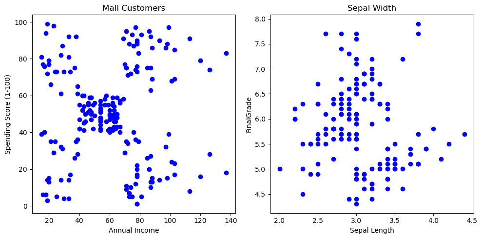
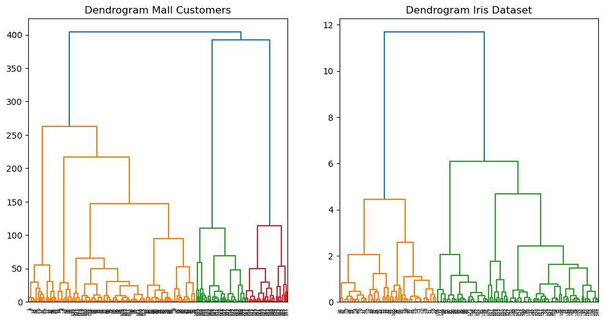
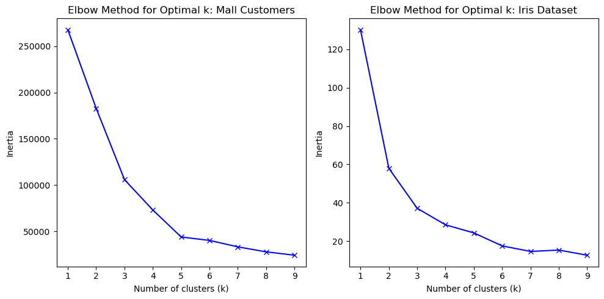
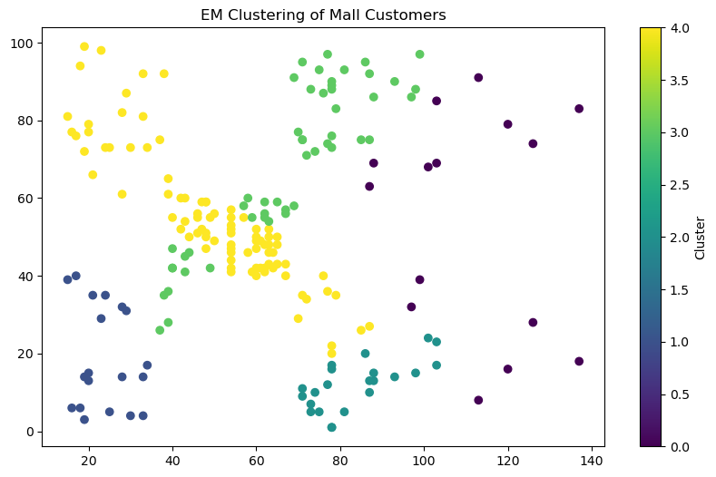
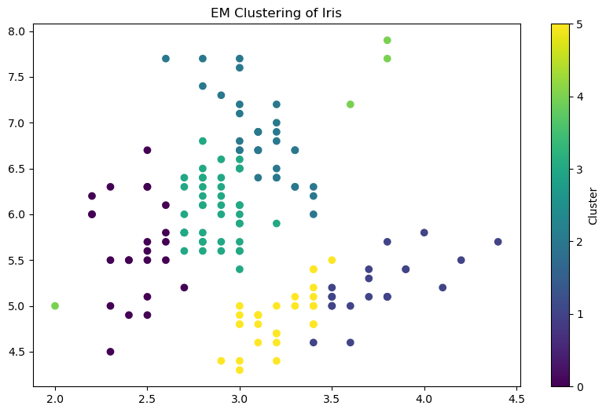
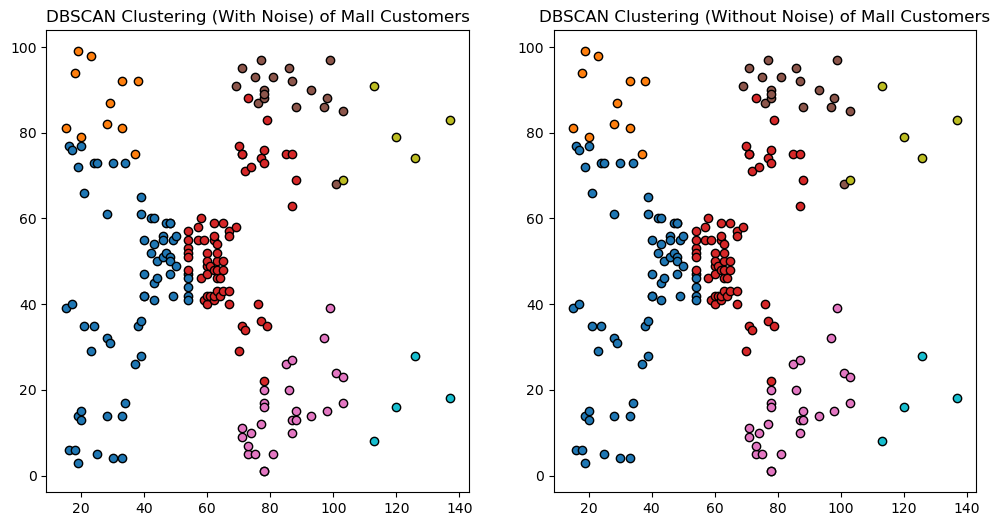
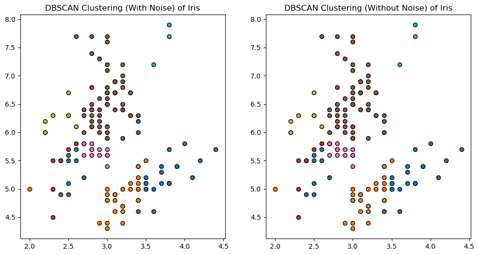
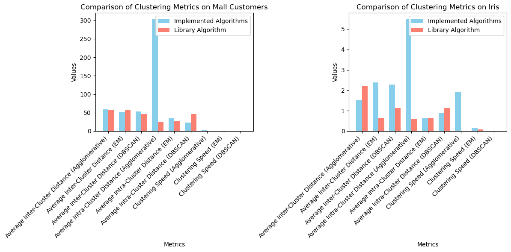

### **Lab #1 Clustering**

#### 
 1. For this lab work I have selected the [IRIS Dataset](https://www.kaggle.com/datasets/arshid/iris-flower-dataset) and [Mall Customers](https://www.kaggle.com/datasets/vjchoudhary7/customer-segmentation-tutorial-in-python/data) datasets from kaggle. 

####   
 1.1 Since both datasets didn't have class labels there was no need to perform the first step in the given tasks. Although FinalGrade from the Student Performance can be considered as a class label I decided to treat it as a feature. 

#### 1.2 I have used scatter plots of the given datasets to visualise the data in the datasets. I use the [importing_data.py](./source/importing_data.py) to import and visualise the data in one go.

####  
 1.3 The first dataset is made up of **clusters with jumpers**. As clearly seen on the plot we have one or two points that connect the areas with dense consentration of points. As for the second dataset, it has no clear shape but I assume is made up of **overlapping clusters**.  

#### 
 1.4 Though it is not clear, for the first dataset my assumption is at least 5 clusters by looking at the graph. As for the second dataset, there seem to be 2 or 3 areas with consentration but I cannot be so sure.

#### 2. I have implented a hierarchical algorithm based on Agglomerative clustering. [my_hierarchy.py](./source/my_hierarchy.py) contains the code for this implementation. It takes the number of desired clusters, linkage method and a dataframe as arguements. It outputs the linkage matrix and labels. I have implemented a function tha takes these and plots a dendrogram.

#### 2.1 Dendrograms for the two datasets

        
#### 2.2 Optimum number of Clusters

#### 
 Using the elbow method on the datasets we can see for the first dataset 5 clusters is the optimum amount. As for the IRIS dataset, I think 6 is the optimum number of clusters.

    
####    According to the results for the Studet Performance Dataset 4 clusters seems to be the appropriate number. For the Mall Customers dataset, I chose 9 clusters. 

#### 3. I have implemented [EM algorithm](./source/em.py) and [DBSCAN algorithm](./source/dbscan.py).

#### 4. The following metrics were applied on those algorithms.
####    * Based on the clustering results, calculated the average intra-cluster distance;
####    * Based on the clustering results, calculated the average inter cluster distance;
####    * measured the clustering speed;

### For Mall Customers: 

| | Metric |	Implemented Algorithms |	Library Algorithm |
| - |----- | ----------------------- | ------------------ |
|1 |	Average Inter-Cluster Distance (Agglomerative) |	56.145836 |	57.496240 |
| 2 |	Average Inter-Cluster Distance (EM) |	53.640901 |	53.640901 |
| 3 |	Average Inter-Cluster Distance (DBSCAN) |	53.668599 |	46.091641 |
| 4 |	Average Intra-Cluster Distance (Agglomerative) |	17.413636 |	19.756912 |
| 5 |	Average Intra-Cluster Distance (EM) |	28.358630	| 28.358630 |
| 6 |	Average Intra-Cluster Distance (DBSCAN) |	23.407162 |	46.091641 |
| 7 |	Clustering Speed (Agglomerative) |	0.091588 |	0.003546 |
| 8 |	Clustering Speed (EM) |	0.103967 |	0.093742 |
| 9 |	Clustering Speed (DBSCAN) |	0.001534 |	0.023332 |

### For IRIS Dataset: 

| | Metric |	Implemented Algorithms |	Library Algorithm |
| - |----- | ----------------------- | ------------------ |
|0|	Average Inter-Cluster Distance (Agglomerative)|	2.500110|	2.745475|
|1|	Average Inter-Cluster Distance (EM)|	2.740543|	0.586880|
|2|	Average Inter-Cluster Distance (DBSCAN)|	2.757433|	2.300989|
|3|	Average Intra-Cluster Distance (Agglomerative)|	1.462248|	0.530974|
|4|	Average Intra-Cluster Distance (EM)|	0.511860|	0.586880|
|5|	Average Intra-Cluster Distance (DBSCAN)|	0.813546|	2.300989|
|6|	Clustering Speed (Agglomerative)|	0.040753|	0.010765|
|7|	Clustering Speed (EM)|	0.286408|	0.151743|
|8|	Clustering Speed (DBSCAN)|	0.000641|	0.013844|

#### 5. The following metrics were applied on reference algorithms.
####    * Based on the clustering results, calculated the average intra-cluster distance;
####    * Based on the clustering results, calculated the average inter cluster distance;
####    * measured the clustering speed;

#### 6. Comparisons between implemented and reference algorithms is the following.

#### 
Average Inter-Cluster Distance: Lower values indicate better separation between clusters.
#### Conclusion: Implemented hierarchical clustering performs better on both datasets. EM clustering performs almost the same as the library implementation on the first dataset but on the second dataset the library implementation performs a little bit better. My DBSCAN implementation outperforms the library version on the first dataset but performs poorly in the second dataset.

#### Average Intra-Cluster Distance: Lower values indicate that points within the same cluster are closer together.
#### Conclusion: Both EM algorithms have almost the same average intra-cluster distance, indicating better compactness within clusters. However, the implemented DBSCAN algorithm has a much lower intra-cluster distance compared to the library version on both datasets. Both versions of the hierarchical clustering have more or less the same average intra-cluster distances.

#### Clustering Speed: Lower values indicate faster clustering.
#### Conclusion: Both implemented and library algorithms performed fast but the library algorithms are a little bit faster on almost all datasets.

