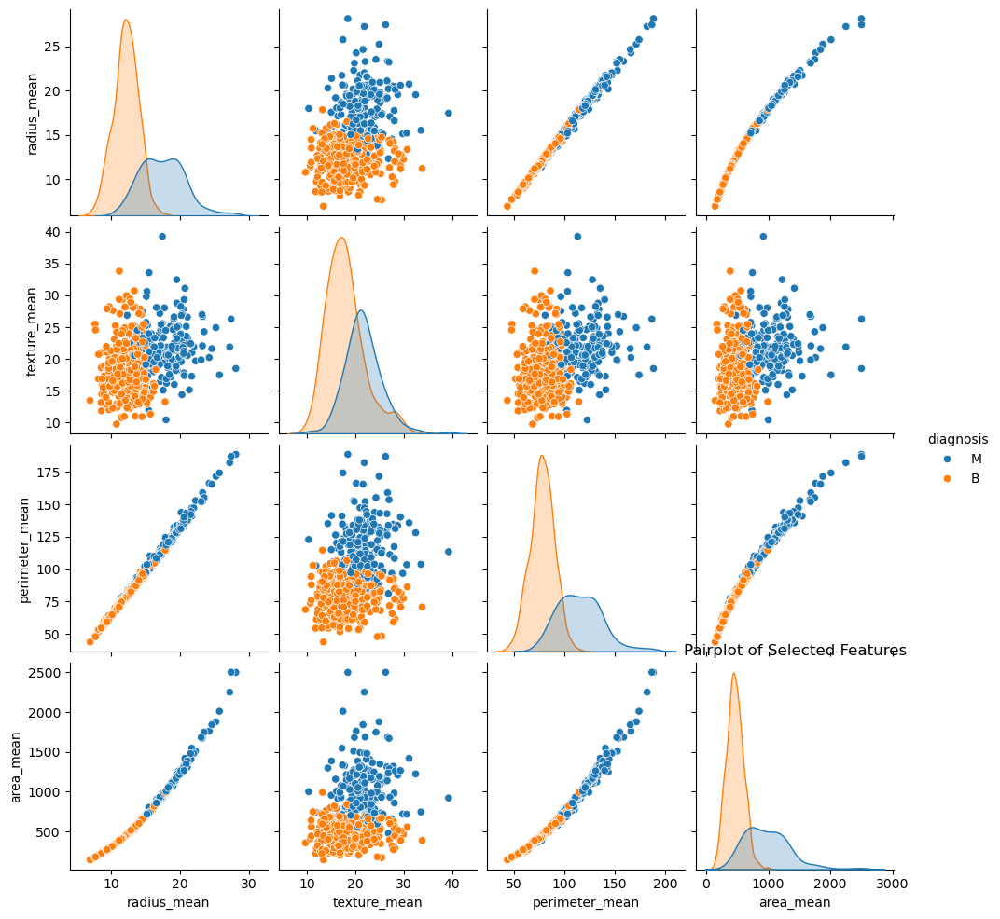
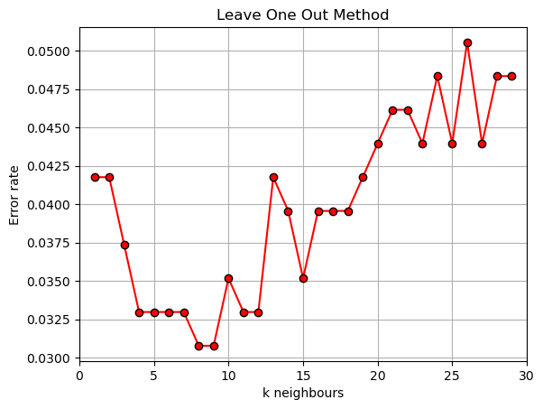

# Lab work #2. Metric classification
# Data
The [KNN Algorithm Dataset](https://www.kaggle.com/datasets/gkalpolukcu/knn-algorithm-dataset) from kaggle.com was selected for this lab work. Based on this dataset, the type of tumours can be classified in to Benign (B) or Mallignant (M). First, the dataset is preprocessed. The 'id' column is removed before it is not important for the task and a column named 'Unnamed: 32' was removed because ot was full of empty values.
# Visualizing Data
 

# Implementing KNN
The custom implementation of the algorithm is located in [knn.py](source/knn.py). It takes the number of neighnours and mode for the Parzen window as arguments during initialization. Eventhough the task requires variable-width Parzen window, the implementation can work with **Simple**, **Variable Width** and **Fixed width** Parzen window. It uses Gaussian Kernel as its kernel.

# Parameter Selection
The value for k was selected using sliding control (LOO) method and plotting its emperical risk graph. 



The plot shows the Error rate against the number (k) of neighbours. The Minimum bound for k is 1 and the maximum bound is chosen to be 30 based on the size of the samples in the dataset. So for values of k ranging from 1 to 30 with a step of 1: the LOO was calculated and plotted. From the results, the optimal values for k are shown to be 8 or 9. For this task, **k = 9**.

# Comparison of Metrics
These are the results optained by running the two libraries on the whole test set.
<p>

 **Implemented KNN using variable Parzen Window**                                           
 *114 samples in 19.338 ms*                                  
|             | precision |   recall | f1-score |  support|
|-------------|-----------|----------|----------|---------|
|           0 |      0.97 |     0.97 |     0.97 |       71|
|           1|       0.95 |     0.95 |     0.95 |       43|
|    accuracy|                       |     0.96 |      114|
|   macro avg|       0.96 |     0.96 |     0.96 |      114|
|weighted avg|       0.96 |     0.96 |     0.96 |      114|

**Reference KNN**                                           
 *114 samples in 39.337 ms*                                  
|             | precision |   recall | f1-score |  support|
|-------------|-----------|----------|----------|---------|
|           0 |      0.97 |     0.97 |     0.97 |       71|
|           1|       0.95 |     0.95 |     0.95 |       43|
|    accuracy|                       |     0.96 |      114|
|   macro avg|       0.96 |     0.96 |     0.96 |      114|
|weighted avg|       0.96 |     0.96 |     0.96 |      114|

</p>

Based on the Metrics both perform exactly the same on accuracy. But the reference library takes longer. The performance was also compared by selecting a random test value (the 100th index of the test set).
```
Implemented KNN prediction: 1 | Reference KNN prediction: 1
Elapsed Time: 
for Implemented KNN: 1.010899999528192s | 
for Reference KNN: 30.417199999646982s
```
Here also the implemented algorithm performs better solely and highly on time elapsed. 

# Conclusion
The implemented KNN outperforms the refernce KNN on speed both on the complete test set and a random chosen test value. They both have the same accuracy score across all metrics (F1, Recall and Accuracy). But, for a large dataset the reference KNN will be much better as it will be able to handle the volume.