# Иерархическая кластеризация

## Mall Customers dataset
### Библиотечная реализация
- Время: 0.001 секунд
- Среднее внутрикластерное расстояние: 24.283
- Среднее межкластерное расстояние: 61.145

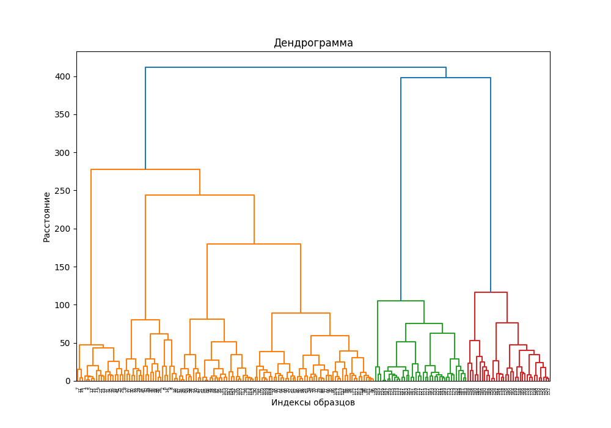

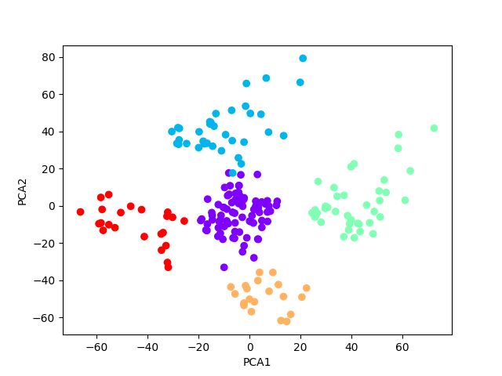

### Ручная реализация
- Время: 0.476 секунд
- Среднее внутрикластерное расстояние: 24.372
- Среднее межкластерное расстояние: 60.828

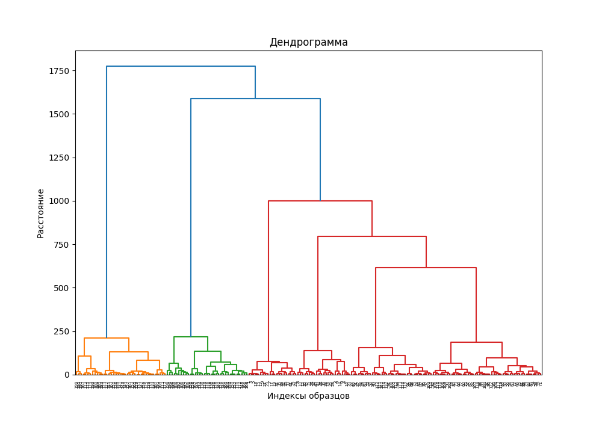

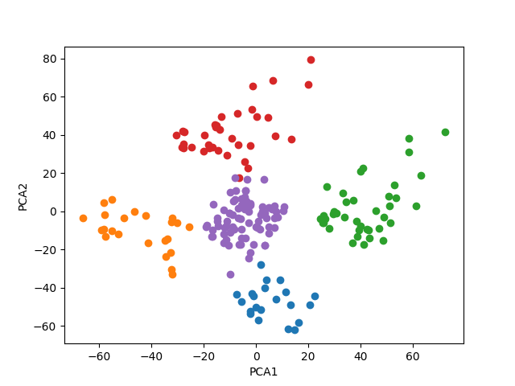

## wine-clustering dataset
### Библиотечная реализация
- Время: 0.002 секунд
- Среднее внутрикластерное расстояние: 190.197
- Среднее межкластерное расстояние: 606.489

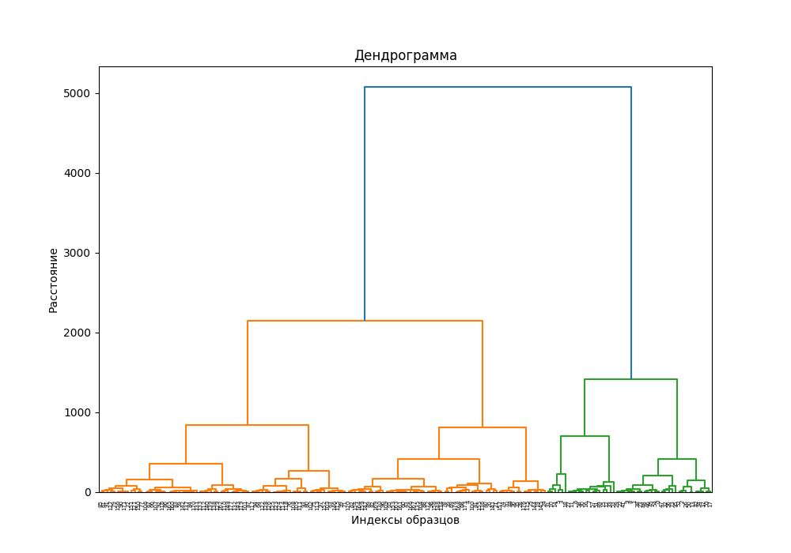

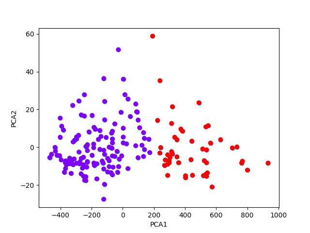

### Ручная реализация
- Время: 0.352 секунд
- Среднее внутрикластерное расстояние: 194.258
- Среднее межкластерное расстояние: 567.325
- 
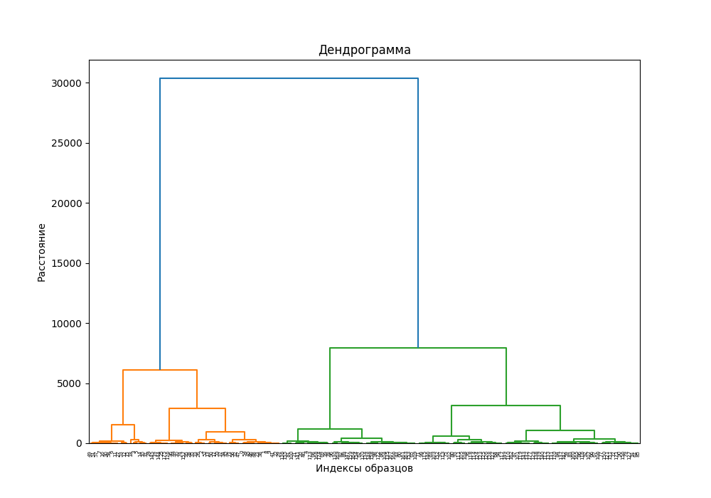

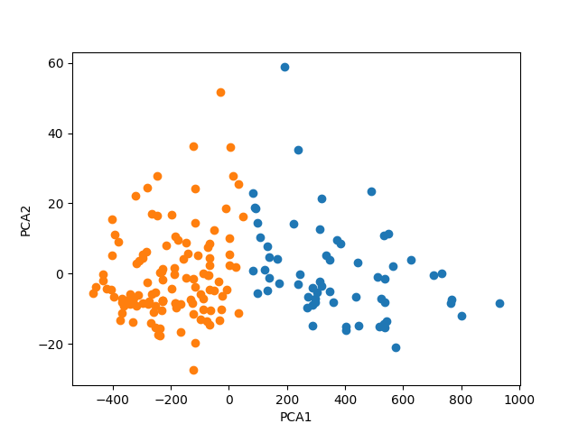

# EM
## Mall Customers dataset
### Библиотечная реализация
- Время: 0.027 секунд
- Среднее внутрикластерное расстояние: 34.390
- Среднее межкластерное расстояние: 43.800

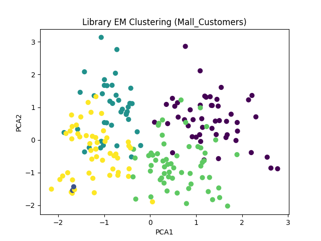

### Ручная реализация
- Время: 0.239 секунд
- Среднее внутрикластерное расстояние: 36.734
- Среднее межкластерное расстояние: 39.213

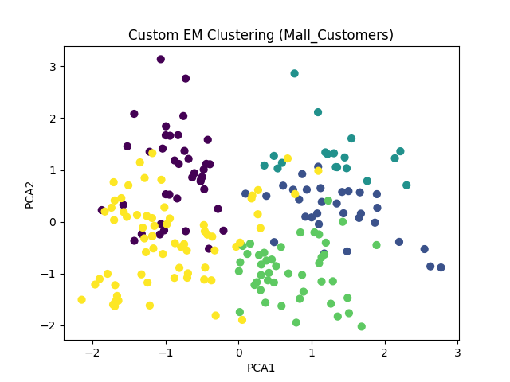

## wine-clustering dataset
### Библиотечная реализация
- Время: 0.018 секунд
- Среднее внутрикластерное расстояние: 273.663
- Среднее межкластерное расстояние: 176.943

### Ручная реализация
- Время: 0.066 секунд
- Среднее внутрикластерное расстояние: 273.663
- Среднее межкластерное расстояние: 176.943

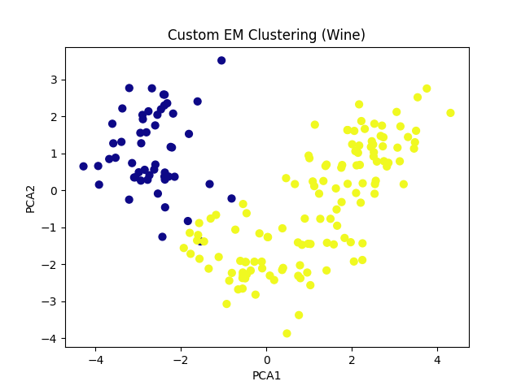

# DBSCAN
## Mall Customers dataset
### Библиотечная реализация
- Время: 0.002 секунд
- Среднее внутрикластерное расстояние: 57.367
- Среднее межкластерное расстояние: 19.097
- 

### Ручная реализация
- Время: 0.003 секунд
- Среднее внутрикластерное расстояние: 57.367
- Среднее межкластерное расстояние: 19.097

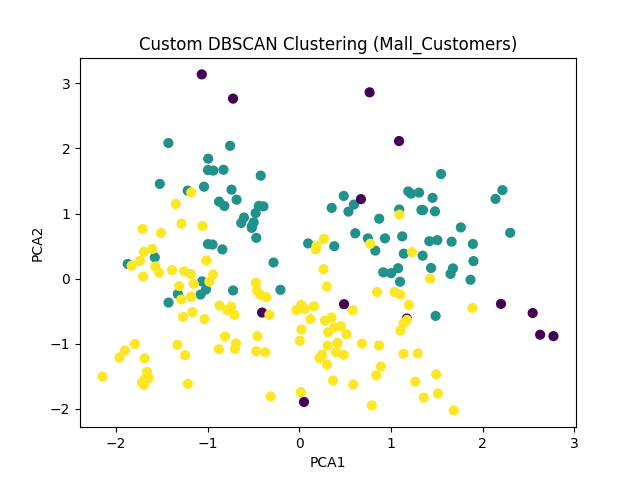

## wine-clustering dataset
### Библиотечная реализация
- Время: 0.003 секунд
- Среднее внутрикластерное расстояние: 352.637
- Среднее межкластерное расстояние: nan (один кластер)

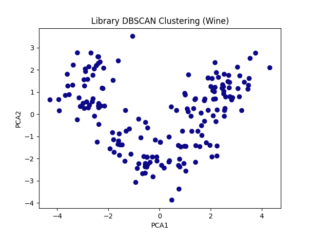

### Ручная реализация
- Время: 0.003 секунд
- Среднее внутрикластерное расстояние: 352.637
- Среднее межкластерное расстояние: nan (один кластер)

