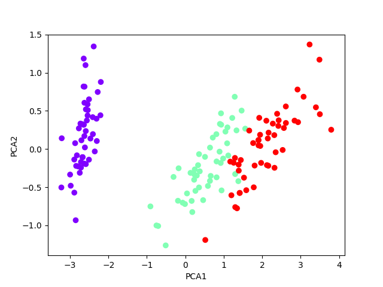
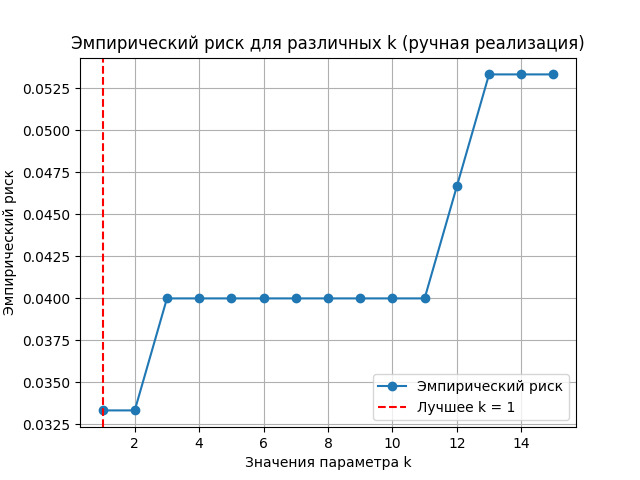
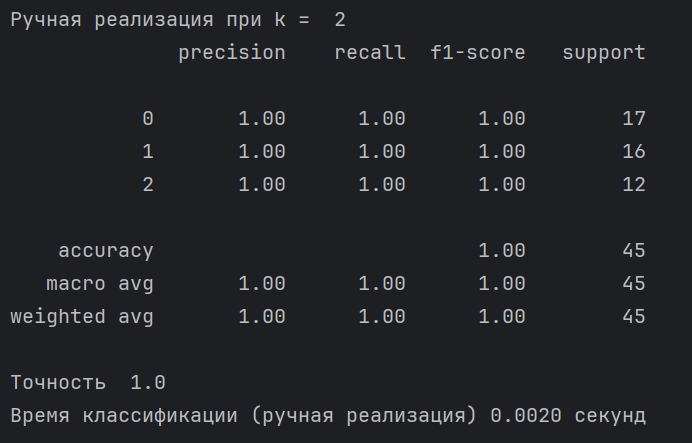
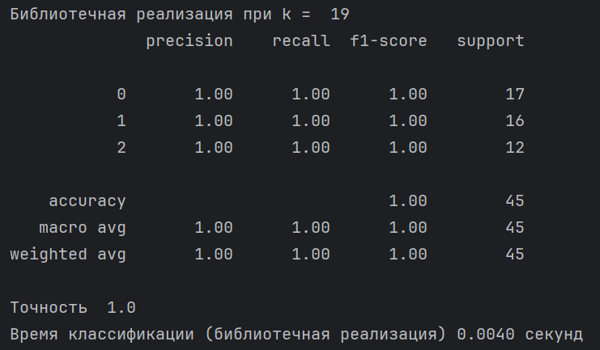

# KNN + LOO

В качестве датасета был выбран датасет ирисов https://www.kaggle.com/datasets/hemachandiranmurugan/iris-dataset

Был реализован алгоритм KNN с методом окна Парзена переменной ширины

Для подбора параметра k был применен метод Leave One Out

Для сранения с библиотечной реализацией датасет был разделен на тренировочную и тестовую выборки в соотношении 70 к 30 

## Ручная реализация 
График ошибки в зависимости от параметра k

В данном случае оптимально выбрать k = 2, чтобы не переобучить модель при k=1.

На тестовом наборе данных:

## Библиотечная реализация KNeighborsClassifier
График ошибки в зависимости от параметра k

В данном случае оптимально выбрать k = 19

На тестовом наборе данных:

### Выводы
По результатам на тестовой выборке можем заметить, что на данном датасете ручная реализация алгоритма KNN с методом окна Парзена переменной ширины и библиотечная реализация KNeighborsClassifier справились одинаково хорошо, но при этом ручной реализации потребовалось меньше времени
- Точность 1 vs 1
- Время 2мс vs 4мс