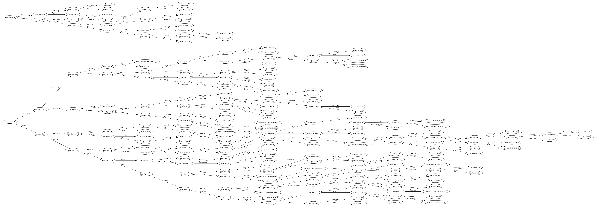

# Отчет по лабораторной работе №3. Логическая классификация

## Цель работы

В рамках лабораторной работы предстоит реализовать алгоритм построения бинарного решающего дерева и сравнить его с эталонной реализацией.

## Датасет

В качестве датасета был выбран [датасет](https://www.kaggle.com/datasets/yasserh/titanic-dataset), содержащий данные людей на Титанике, возраст, пол, стоимость билета, факт, выжил ли человек после столкновения с айсбергом или нет.

Данный датасет содержит категориальные, численные непрерывные признаки, а так же пропуски, что обуславливает его пригодность для тестирования на

## Подготовка данных
- Удалил бесполезные для обучения данные `PassengerId`, `Name`, `Ticket`, `Cabin`
- Преобразование категориальных признаков (features) в числовые, в частности, `Sex` и `Embarked`
- Провел разбиение выборки на трениировочную (для обучения), тестовую (для оценки качества) и контрольную (для пост-прунинга).

## Реализация алгоритмов

### 0. Критерии разбиения

```python
def _uncertainty_measure_criterion(y: np.ndarray) -> float:
    if len(y) == 0:
        return 0.0
    _, counts = np.unique(y, return_counts=True)
    class_probabilities = counts / len(y)
    return class_probabilities


CriterionT = Callable[[np.ndarray], float]


def entropy(y: np.ndarray) -> float:
    class_probabilities = _uncertainty_measure_criterion(y)
    return - np.sum(class_probabilities * np.log2(class_probabilities + 1e-6))


def gini(y: np.ndarray) -> float:
    class_probabilities = _uncertainty_measure_criterion(y)
    return np.sum(class_probabilities * (1 - class_probabilities))


def donskoy(y: np.ndarray) -> float:
    class_probabilities = _uncertainty_measure_criterion(y)
    return np.sum(class_probabilities * (class_probabilities - 1))


def mse(y: np.ndarray) -> float:
    return np.mean(y ** 2)


def information_gain(
        x: pd.DataFrame,
        y: np.ndarray,
        predicate: Predicate,
        criterion: CriterionT,
) -> float:
    uncertainty_measure = criterion(y)

    right_leaf_indices = apply_predicate_plural(x, predicate)
    left_leaf_indices = np.setdiff1d(np.arange(len(y)), right_leaf_indices)

    left_leaf, right_leaf = y[left_leaf_indices], y[right_leaf_indices]
    left_uncertainty, right_uncertainty = criterion(left_leaf), criterion(right_leaf)

    return uncertainty_measure - (
            + left_uncertainty * len(left_leaf) / len(y)
            + right_uncertainty * len(right_leaf) / len(y)
    )
```

### 1. Алгоритм построения дерева

Фрагмент: 

```python
class I3:
    root: LeafNode | InnerNode | None
    criterion: CriterionT
    feature_type: FeatureType

    def __init__(
            self,
            criterion: CriterionT,
            feature_type: FeatureType,
            feature_type_map: dict[str, FeatureType]
    ):
        self.criterion = criterion
        self.root = None
        self.feature_type = feature_type
        self.feature_type_map = feature_type_map

    def _build_i3_recursive(
            self,
            parent: InnerNode | None,
            x: pd.DataFrame,
            y: np.ndarray,
    ) -> LeafNode | InnerNode:
        if (
                np.unique(y).size > 1
                and
                (relevant_predicates := [
                    Predicate(name=column, value=unique_value, feature_type=self.feature_type_map[column])
                    for column in x.columns if len(unique_values := x[column].dropna().unique()) > 1
                    for unique_value in unique_values
                ])
        ):
            best_predicate = relevant_predicates[
                np.argmax(
                    [
                        information_gain(x, y, predicate, self.criterion)
                        for predicate in relevant_predicates
                    ]
                )
            ]
            right_leaf_indices = apply_predicate_plural(x, best_predicate)
            left_leaf_indices = np.setdiff1d(np.arange(len(y)), right_leaf_indices)
            if left_leaf_indices.size and right_leaf_indices.size:
                new_inner_node = InnerNode(
                    parent=parent,
                    predicate=best_predicate,
                    children=[],
                )
                perspective_left_leaf, perspective_right_leaf = y[left_leaf_indices], y[right_leaf_indices]

                new_inner_node.children = [
                    self._build_i3_recursive(new_inner_node, x.iloc[left_leaf_indices], perspective_left_leaf),
                    self._build_i3_recursive(new_inner_node, x.iloc[right_leaf_indices], perspective_right_leaf),
                ]
                return new_inner_node

        return LeafNode(
            parent=parent,
            value=self._node_value(y),
        )

    def fit(self, x: pd.DataFrame, y: np.ndarray):
        self.root = self._build_i3_recursive(None, x, y)
```

### Алгоритм редукции дерева (tree reduction)

Был реализован алгоритм пост-дерева на основе контрольной выборке

Фрагмент:

```python
class I3:
    ...
    def _post_pruning_recursive(self, node: LeafNode | InnerNode, X_ctrl: pd.DataFrame, y_ctrl: np.ndarray) -> None:
        if isinstance(node, LeafNode):
            return
        right_leaf_indices = apply_predicate_plural(X_ctrl, node.predicate)
        left_leaf_indices = np.setdiff1d(np.arange(len(y_ctrl)), right_leaf_indices)
        if not left_leaf_indices.size:
            node.children[0] = LeafNode(
                parent=node,
                value=self._node_value(y_ctrl),
            )

        if not right_leaf_indices.size:
            node.children[1] = LeafNode(
                parent=node,
                value=self._node_value(y_ctrl),
            )
        self._post_pruning_recursive(node.left_child, X_ctrl.iloc[left_leaf_indices], y_ctrl[left_leaf_indices])
        self._post_pruning_recursive(node.right_child, X_ctrl.iloc[right_leaf_indices], y_ctrl[right_leaf_indices])
        if (parent := node.parent) is None:
            return

        error_count_parent = np.sum(y_ctrl != self._predict_bulk(node, X_ctrl))
        error_count_left = np.sum(y_ctrl != self._predict_bulk(node.left_child, X_ctrl))
        error_count_right = np.sum(y_ctrl != self._predict_bulk(node.right_child, X_ctrl))

        values = np.unique(y_ctrl)
        if self.feature_type is FeatureType.CATEGORY:
            error_counts_just_value = [np.sum(y_ctrl != value) for value in values]
        else:
            error_counts_just_value = [mse(value - y_ctrl) for value in values]

        NODE_ERROR_IDX, LEFT_CHILD_ERROR_IDX, RIGHT_CHILD_ERROR_IDX, *UNIVERSAL_VALUE_ERROR_IDS = \
            list(range(3 + len(np.unique(y_ctrl))))

        errors = [error_count_parent, error_count_left, error_count_right, *error_counts_just_value]
        # because when errors count are equals, we should prefer to reduce tree complexity

        argmin_index = len(errors) - 1 - np.argmin(errors[::-1])

        if argmin_index != NODE_ERROR_IDX:
            child_idx = [child is node for child in parent.children].index(True)

        if argmin_index == LEFT_CHILD_ERROR_IDX:
            left_child = node.left_child
            parent.children[child_idx] = left_child
            left_child.parent = parent
        elif argmin_index == RIGHT_CHILD_ERROR_IDX:
            right_child = node.right_child
            parent.children[child_idx] = right_child
            right_child.parent = parent
        elif argmin_index in UNIVERSAL_VALUE_ERROR_IDS:
            parent.children[child_idx] = LeafNode(
                parent=parent,
                value=values[argmin_index - len([NODE_ERROR_IDX, LEFT_CHILD_ERROR_IDX, RIGHT_CHILD_ERROR_IDX])],
            )

    def post_pruning(
            self,
            X_ctrl: pd.DataFrame,
            y_ctrl: np.ndarray
    ) -> LeafNode | InnerNode:
        self._post_pruning_recursive(self.root, X_ctrl, y_ctrl)
        return self.root


```


## Эксперименты

### Классификация

Обучение проводилось с `Survided` в качестве целевой переменной.

#### Критерий Донского

- После обучения
    
    ```
                  precision    recall  f1-score   support
    
               0       0.80      0.84      0.82       168
               1       0.70      0.64      0.67       100
    
        accuracy                           0.76       268
       macro avg       0.75      0.74      0.74       268
    weighted avg       0.76      0.76      0.76       268

    ```
- После обрезки дерева:
    
    ```
                  precision    recall  f1-score   support
    
               0       0.82      0.85      0.83       168
               1       0.73      0.68      0.70       100
    
        accuracy                           0.79       268
       macro avg       0.77      0.77      0.77       268
    weighted avg       0.79      0.79      0.79       268
    
    ```

#### Критерий Джини

- После обучения:

    ```
                  precision    recall  f1-score   support
    
               0       0.81      0.83      0.82       168
               1       0.71      0.68      0.69       100
    
        accuracy                           0.78       268
       macro avg       0.76      0.76      0.76       268
    weighted avg       0.77      0.78      0.78       268
    ```

- После обрезки дерева:

    ```
                  precision    recall  f1-score   support
    
               0       0.84      0.85      0.84       168
               1       0.74      0.72      0.73       100
    
        accuracy                           0.80       268
       macro avg       0.79      0.79      0.79       268
    weighted avg       0.80      0.80      0.80       268
    ```

### Регрессия
Обучение проводилось с `Fare` в качестве целевой переменной.

- MSE после обучения - `2237.6387669497626`
- SE после обрезки дерева - `2382.0964417661194`.

Общая ошибка увеличилась после обрезки, но общая сложность дерева сильно уменьшилась*.

Здесь представлено дерево после обучения (ниже) и после обрезки (выше):



Под сложностью здесь подразумевается глубина дерева.

### Время работы

385 ms ± 33.9 ms per loop (mean ± std. dev. of 7 runs, 1 loop each)

## Сравнение с эталонной реализацией

В качестве эталонной реализации был взят алгоритм sklearn.tree.DecisionTreeClassifier

В результате его работы были получены следующие метрики качества классифкации:

```
              precision    recall  f1-score   support

           0       0.79      0.85      0.82       168
           1       0.72      0.63      0.67       100

    accuracy                           0.77       268
   macro avg       0.76      0.74      0.75       268
weighted avg       0.77      0.77      0.77       268
```
И такая скорость

1.21 ms ± 52.5 μs per loop (mean ± std. dev. of 7 runs, 1,000 loops each)

