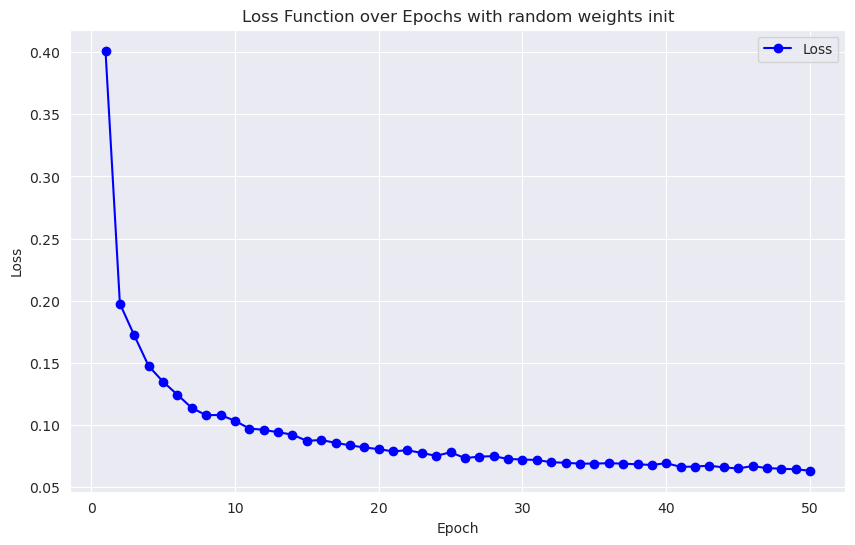
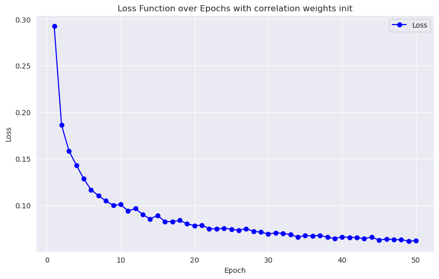
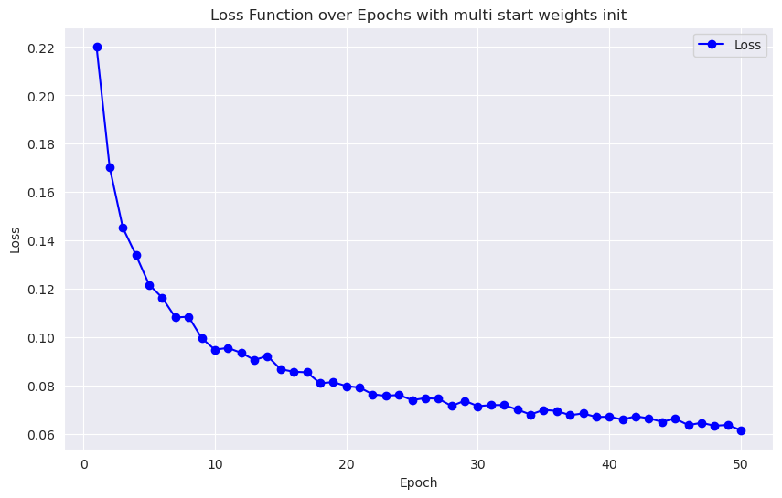

# Отчет по заданию: Реализация линейного классификатора

# Цель работы

В данной лабораторной работе реализован линейный классификатор, обучен методом стохастического градиентного спуска с инерцией с L2 регуляризацией и квадратичной функцией потерь.

## Подготовка данных

В качестве данных использовался датасет [`Rice-Gonen and Jasmine`](https://www.kaggle.com/datasets/seymasa/rice-dataset-gonenjasmine)

В качестве таргета был выбран столбец `Class`, имеющий 2 значения - `jasmine` и `Gonen`.

## 4. Реализация алгоритма
- Для обучения используется метод стохастического градиентного спуска с инерцией
- Используется L2 регуляризация

## 5. Эксперименты и результаты

При запуске реализованного алгоритма были получены следующие результаты

- с нулевыми начальными весами


```
  Classification report after training:
              precision    recall  f1-score   support

           0       0.98      0.98      0.98        57
           1       0.98      0.98      0.98        43

    accuracy                           0.98       100
   macro avg       0.98      0.98      0.98       100
weighted avg       0.98      0.98      0.98       100
```
  
- с малыми случайными малыми начальными весами




```
    Classification report after training:
                  precision    recall  f1-score   support
    
               0       0.98      0.98      0.98        57
               1       0.98      0.98      0.98        43
    
        accuracy                           0.98       100
       macro avg       0.98      0.98      0.98       100
    weighted avg       0.98      0.98      0.98       100
```

- с весами, инициализированными на основе коррелеляции между признаками и таргетом



```
    Classification report after training:
                  precision    recall  f1-score   support
    
               0       0.98      0.98      0.98        57
               1       0.98      0.98      0.98        43
    
        accuracy                           0.98       100
       macro avg       0.98      0.98      0.98       100
    weighted avg       0.98      0.98      0.98       100
```

- с весами, инициализированными методом мультизапусков



```
    Classification report after training:
                  precision    recall  f1-score   support
    
               0       0.98      0.98      0.98        57
               1       0.98      0.98      0.98        43
    
        accuracy                           0.98       100
       macro avg       0.98      0.98      0.98       100
    weighted avg       0.98      0.98      0.98       100
```

Время исполнения:

298 ms ± 11.3 ms per loop (mean ± std. dev. of 7 runs, 1 loop each)

### В качестве эталонного решения был выбран `sklearn.linear_model.SGDClassifier`

```
              precision    recall  f1-score   support

           0       0.98      1.00      0.99        57
           1       1.00      0.98      0.99        43

    accuracy                           0.99       100
   macro avg       0.99      0.99      0.99       100
weighted avg       0.99      0.99      0.99       100
```
Время исполнения:

549 μs ± 2.42 μs per loop (mean ± std. dev. of 7 runs, 1,000 loops each)